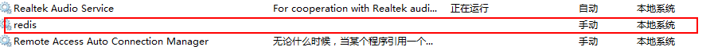

# [bat关闭服务(net,sc用法)](https://www.cnblogs.com/qlqwjy/p/8010598.html)

> 下面两个命令最好以管理员方式启动cmd窗口，否则出现权限问题
>

## 1、net用于打开没有被禁用的服务

NET命令是功能强大的以命令行方式执行的工具。

它包含了管理网络环境、服务、用户、登陆大部分重要的管理功能，关于这些完全可以写一篇20页以上的文档了，略去不表。

启动和关闭服务的时候，其语法是：

```bat
net start 服务
net stop 服务名
```

　　比如我启动我的svn server 服务，命令行中输入net start svn 即可，可以更进一步将你经常需要启动的服务整理成命令，用记事本保存成cmd后缀格式的文件，这样你双击就可以完成里边相应的命令，这个还是很方便的，只 需要设置好，后续使用的时候就很简单，提高工作效率还是不错的。

```bat
C:\Windows\system32>net/?
此命令的语法是:

NET
    [ ACCOUNTS | COMPUTER | CONFIG | CONTINUE | FILE | GROUP | HELP |
      HELPMSG | LOCALGROUP | PAUSE | SESSION | SHARE | START |
      STATISTICS | STOP | TIME | USE | USER | VIEW ]
```

　　注意:服务名是服务名称


## 2、用sc可打开被禁用的服务。(也可以查看服务状态)可以创建服务、删除服务、打开与关闭服务

sc是用于与服务控制管理器和服务进行通信的命令行程序，其语法是：

 

```bat
sc config 服务名 start= demand   //手动
sc config 服务名 start= auto    //自动
sc config 服务名 start= disabled //禁用
sc start 服务名　　开启服务
sc stop 服务名　　停止服务
sc query 服务名　　查看服务状态
sc delete 服务名  删除服务
sc qc 服务名   查看服务的配置信息
sc create scname binPath=xxx.exe　　创建服务
```

　　例如

```bat
C:\Windows\system32>sc create redis binPath=E:/Redis/redis-server.exe
[SC] CreateService 成功
```



当你安装了一个应用程序的时候，将其添加到windows服务中时，便可以这样去设置服务的启动规则，不过这个命令最好在命令行中使用。

以上就是为了开启和关闭服务自己找到的简单方法

如果整理得好的话，完全可以充当自己的电脑开机启动定制版脚本，包括打开哪些程序、文件、代码等等。

总结:

sc用法：

```bat
C:\Windows\system32>sc/?

错误:  未知命令

描述:
        SC 是用来与服务控制管理器和服务进行通信
        的命令行程序。
用法:
        sc <server> [command] [service name] <option1> <option2>.


        <server> 选项的格式为 "\\ServerName"
        可通过键入以下内容，获得有关命令的进一步帮助: "sc [comman
        命令:
          query-----------查询服务的状态，
                          或枚举服务类型的状态。
          queryex---------查询服务的扩展状态，
                          或枚举服务类型的状态。
          start-----------启动服务。
          pause-----------向服务发送 PAUSE 控制请求。
          interrogate-----向服务发送 INTERROGATE 控制请求。
          continue--------向服务发送 CONTINUE 控制请求。
          stop------------向服务发送 STOP 请求。
          config----------更改服务的配置(永久)。
          description-----更改服务的描述。
          failure---------更改服务失败时执行的操作。
          failureflag-----更改服务的失败操作标记。
          sidtype---------更改服务的服务 SID 类型。
          privs-----------更改服务的所需权限。
          managedaccount--更改服务以便将服务帐户密码
                          标记为由 LSA 管理。
          qc--------------查询服务的配置信息。
          qdescription----查询服务的描述。
          qfailure--------查询服务失败时执行的操作。
          qfailureflag----查询服务的失败操作标记。
          qsidtype--------查询服务的服务 SID 类型。
          qprivs----------查询服务的所需权限。
          qtriggerinfo----查询服务的触发器参数。
          qpreferrednode--查询服务的首选 NUMA 节点。
          qrunlevel-------查询服务的运行级别。
          qmanagedaccount-查询服务是否将帐户
                          与 LSA 管理的密码结合使用。
          qprotection-----查询服务的进程保护级别。
          delete----------(从注册表中)删除服务。
          create----------创建服务(并将其添加到注册表中)。
          control---------向服务发送控制。
          sdshow----------显示服务的安全描述符。
          sdset-----------设置服务的安全描述符。
          showsid---------显示与任意名称对应的服务 SID 字符串。
          triggerinfo-----配置服务的触发器参数。
          preferrednode---设置服务的首选 NUMA 节点。
          runlevel--------设置服务的运行级别。
          GetDisplayName--获取服务的 DisplayName。
          GetKeyName------获取服务的 ServiceKeyName。
          EnumDepend------枚举服务依赖关系。

        以下命令不要求使用服务名称:
        sc <server> <command> <option>
          boot------------(ok | bad) 指示是否应将上一次引导保存为
                          最近一次已知的正确引导配置
          Lock------------锁定服务数据库
          QueryLock-------查询 SCManager 数据库的 LockStatus
示例:
        sc start MyService
```


`sc config:用法`

```bat
C:\Users\liqiang>sc config MySQL57
描述:
        在注册表和服务数据库中修改服务项。
用法:
        sc <server> config [service name] <option1> <option2>...

选项:
注意: 选项名称包括等号。
      等号和值之间需要一个空格。
 type= <own|share|interact|kernel|filesys|rec|adapt>
 start= <boot|system|auto|demand|disabled|delayed-auto>
 error= <normal|severe|critical|ignore>
 binPath= <BinaryPathName to the .exe file>
 group= <LoadOrderGroup>
 tag= <yes|no>
 depend= <依存关系(以 / (斜杠) 分隔)>
 obj= <AccountName|ObjectName>
 DisplayName= <显示名称>
 password= <密码>
```

