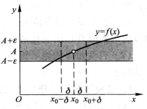

# 函数的极限

## 定义 1

 $ \quad $ 设函数 $ f(x) $ 在点 $ x_{0} $ 的某一去心邻域 内有定义. 如果存在常数 A, 对 于任意给定的正数 $ \varepsilon $ ( 不 论 它多 么小)，总 存在正 数 $ \delta, $ 使 得 当 $ x $ 满 足 不 等 式
$$
|f(x)-A|<\varepsilon
$$
那么常数 A 就叫做函数 $ f(x) $ 当 $ x \rightarrow x_{0} $ 时的极限,记作
$$
\lim _{x \rightarrow x_{0}} f(x)=A \quad \text { 或 } f(x) \rightarrow A\left(\text { 当 } x \rightarrow x_{0}\right)
$$

### 定义 1 可以简单地表述为

$ \lim _{x \rightarrow x_{0}} f(x)=A \Leftrightarrow \forall \varepsilon>0, \exists \delta>0, $ 当 $ 0<\left|x-x_{0}\right|<\delta $ 时 $ , $ 有 $ |f(x)-A|<\varepsilon $

函数 $ f(x) $ 当 $ x \rightarrow x_{0} $ 时的极限为 $ A $ 的几何解释如下 :任意给定一正数 $ \varepsilon, $ 作平 行于 $ x $ 轴的两条直线 $ y=A+\varepsilon $ 和 $ y=A-\varepsilon, $ 界于这两条直线之间是一横条区域. 根据定义,对于给定的 $ \varepsilon, $ 存在着点 $ x_{0} $ 的一个 $ \delta $ 邻域 $ \left(x_{0}-\delta, x_{0}+\delta\right), $ 当 $ y=f(x) $ 的图形上的点的横坐标 $ x $ 在邻域 $ \left(x_{0}-\delta, x_{0}+\delta\right) $ 内,但 $ x $
$ \neq x_{0} $ 时,这些点的纵坐标 $ f(x) $ 满足不等式
$$
|f(x)-A|<\varepsilon
$$
或
$$
A-\varepsilon<f(x)<A+\varepsilon
$$
亦即这些点落在上面所作的 横 条区域内

上述 $ x \rightarrow x_{0} $ 时函数 $ f(x) $ 的极 限概念中 $ , x $ 是既从 $ x_{0} $ 的左侧也从 $ x_{0} $ 的右侧趋于
$ x_{0} $ 的. 但有时只能或只需考虑 $ x $ 仅从 $ x_{0} $ 的左侧趋于 $ x_{0} $ ( 记作 $ x \rightarrow x_{0}^{-} $ ) 的情形,或 $ x $
仅从 $ x_{0} $ 的右侧趋于 $ x_{0} $ ( 记作 $ \left.x \rightarrow x_{0}^{+}\right) $ 的情形. 在 $ x \rightarrow x_{0}^{-} $ 的情形 $ , x $ 在 $ x_{0} $ 的左侧, $ x< $
$ f(x) \stackrel{\text { 当 } x \rightarrow x_{0} \text { 时的左极 } \text { 限 }, \text { ì作 }}{=} $
$$
\lim _{x \rightarrow x_{\overline{0}}} f(x)=A \quad \text { 或 } \quad f\left(x_{0}^{-}\right)=A
$$
类似地, 在 $ \lim _{x \rightarrow x_{0}} f(x)=A $ 的定 $ 乂 $ 中 $ , $ 把 $ 0<\left|x-x_{0}\right|<\delta $ 改为 $ x_{0}<x<x_{0}+\delta, $ 那 么 $ A $ 就叫 做函数 $ f(x) $ 当 $ x \rightarrow x_{0} $ 时的<u>右极限</u>, 记作
$$
\lim _{x \rightarrow x_{0} \atop x} f(x)=A \quad \text { 或 } \quad f\left(x_{0}^{+}\right)=A
$$
左极限与右极限统称为<u>单侧极限</u>。 根据 $ x \rightarrow x_{0} $ 时函数 $ f(x) $ 的极限的定义以及左极限和右极限的定义,容易让 明 : 函数 $ f(x) $ 当 $ x \rightarrow x_{0} $ 时极 限存在的充分必要条件是左极限及右极限各 自存在
并且相等，即
$$
f\left(x_{0}^{-}\right)=f\left(x_{0}^{+}\right)
$$
因此,即使 $ f\left(x_{0}^{-}\right) $ 和 $ f\left(x_{0}^{+}\right) $ 都存在,但若不相等 $ , $ 则 $ \lim _{x \rightarrow x_{0}} f(x) $ 也不存在.

### 2.自变量趋于无穷大时函数的极限

如果在$ x \rightarrow \infty $的过程中 ,对应的函数值 $ f(x) $ 无限接 近于确定的数值 A,那么 A 叫做函数 $ f(x) $ 当 $ x \rightarrow \infty $ 时的 极限. 精确地说,就是

## 定义 2

设函数 $ f(x) $ 当। $ x $ ।大于某一正数 时有定义. 如果存在常数 A, 对于任意给定的正数 $ \varepsilon $ (不论它多么小），总 存 在 着 正 数 X，使 得 当 x 满 足 不 等 式 $ |x|>X $ 时,对应的函数值 $ f(x) $ 都满足不等式
$$
|f(x)-A|<\varepsilon
$$
那么常数 A 就叫做函数 $ f(x) $ 当 $ x \rightarrow \infty $ 时的极限, 记作
$$
\lim _{x \rightarrow \infty} f(x)=A \quad \text { 或 } \quad f(x) \rightarrow A(\text { 当 } x \rightarrow \infty)
$$

### 定义 2 可简单地表达为

如果 $ x>0 $ 且.无限增大( 记作 $ x \rightarrow+\infty) $,那么只要把上面定义中的 | $ x \mid>X $ 改为$ x>X, $ 就 可 得 $ \lim _{x \rightarrow+\infty} f(x)=A $ 的 定 $ 乂 . $ 同 样 $ , $ 如 果 $ x<0 $
且 | x | 无 限增大（记作$ x \rightarrow-\infty) $,那么只要把 $ |x|>X $ 改为 $ x<-X, $ 便得 $ \lim _{x \rightarrow-\infty} f(x)=A $ 的定 义.
从几何上来说, $ \lim _{x \rightarrow \infty} f(x)=A $ 的意义是:作直线 $ y=A-\varepsilon $ 和 $ y=A+\varepsilon, $ 则总有一个正数 X 存在,使得当 $ x<-X $ 或 $ x>X $ 时, 函数 $ y=f(x) $ 的图形位于这两直线之间(图$ 1-25 $ ). 这时,直线 $ y=A $ 是函数 $ y=f(x) $ 的图形的水平渐近线.

## 二、函数极限的性质

### 定理 1（函数极限的唯一性） 

如果 $ \lim _{x \rightarrow x_{0}} f(x) $ 存在,那么这极限唯一。 

### 定理 2（函数极限的局部有界性）

如果 $ \lim _{x \rightarrow x_{0}} f(x)=A, $ 那么存在常数 $ M>0 $ 和 $ \delta $ $ >0, $ 使得 当 $ 0<\left|x-x_{0}\right|<\delta $ 时, 有 $ |f(x)| \leqslant M $

### 定理 3(函数极限的局部保号性)

如果 $ \lim _{x \rightarrow x_{0}} f(x)=A, $ 且 $ A>0 （ $ 或 $ \left.A<0\right), $ 那 么存在常数 $ \delta>0, $ 使得 当 $ 0<\left|x-x_{0}\right|<\delta $ 时 $ , $ 有 $ f(x)>0( $ 或 $ f(x)<0) $

### 定理3'

如果 $ \lim _{x \rightarrow x_{0}} f(x)=A(A \neq 0), $ 那么就存在着 $ x_{0} $ 的某一去心邻域 $ U\left(x_{0}\right), $
当 $ x \in U\left(x_{0}\right) $ 时,就有 $ |f(x)|>\frac{|A|}{2} $

由定理 3,易得以下推论：

###  推论 

如果在 $ x_{0} $ 的某去心邻域内 $ f(x) \geqslant 0( $ 或 $ f(x) \leqslant 0), $ 而且 $ \lim _{x \rightarrow x_{0}} f(x)=A, $ 那么$ A \geqslant 0( $ 或 $ A \leqslant 0) $

### 定理 4（函数极 限与数列极 限的关系）

如果 极 限 $ \lim _{x \rightarrow x_{0}} f(x) $ 存在 $ ,\left\{x_{n} \mid\right. $ 为 酉 数 $ f(x) $ 的定义域内任一收签于 $ x_{0} $ 的数列，且满足 $ : x_{n} \neq x_{0}\left(n \in \mathbf{N}_{+}\right), $ 那么相应的函数值数列 $ \left\{f\left(x_{n}\right)\right\} $ 必收签且 $ \lim _{n \rightarrow \infty} f\left(x_{n}\right)=\lim _{x \rightarrow x_{0}} f(x) $