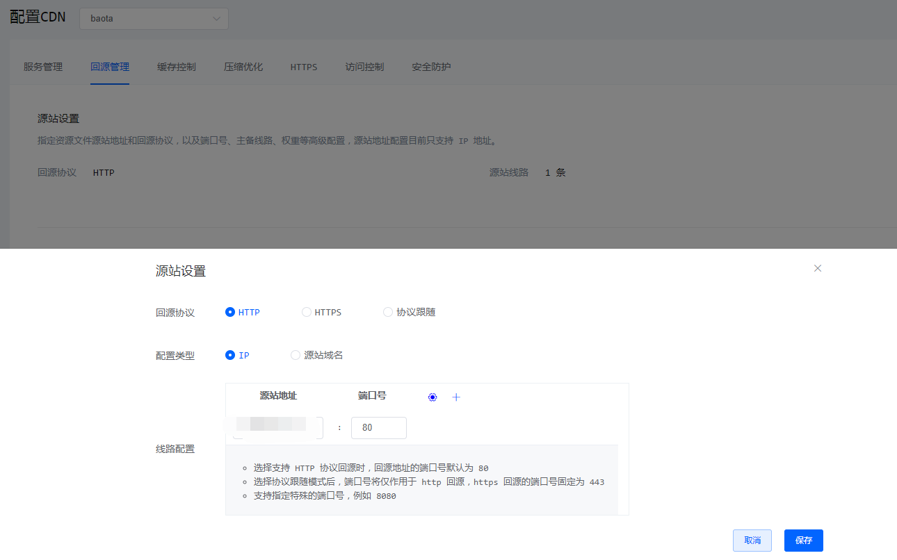
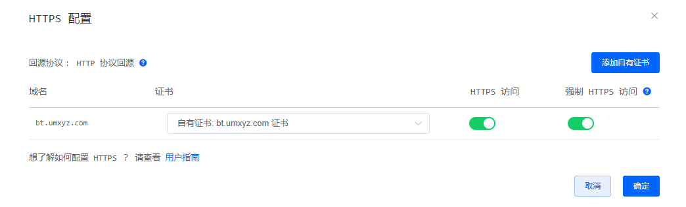
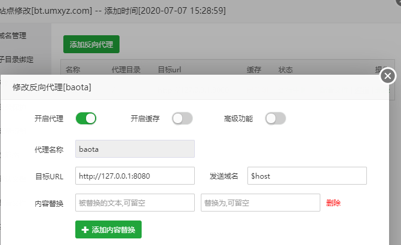
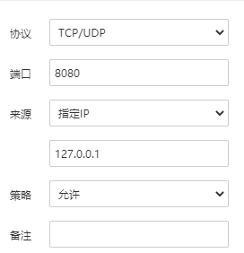

# 宝塔面板绑定域名套上CDN方式访问拯救你的VPS

## 一、准备域名

准备一个域名

## 二、新建网站

宝塔面板中新建一个站点。也不要什么php版本了，选择纯静态就可以了。域名，就是你准备好的域名

## 三、宝塔面板设置域名

在面板设置中填写你刚刚准备好的域名

## 四、CND端口

### cloudflare:

```
80
8080
8880
2052
2082
2086
2095
HTTPS ports supported by Cloudflare:
443
2053
2083
2087
2096
```

### Nodecache CDN

有三种回源方式，分别为:

#### 1、HTTP 回源

默认采用 HTTP 协议回源，此时回源地址的端口号默认为 80。

#### 2、HTTPS 回源

也可以选择 HTTPS 协议回源，选择 HTTPS 协议回源时，端口号会变为 443 端口。

#### 3、协议跟随

当启用该特性时，回源协议始终会和客户端访问 CDN 的协议保持一致，即客户端用 HTTP 协议访问 CDN，那么 CDN 回源时也会用 HTTP 协议进行回源，同样，若采用 HTTPS 访问，那么回源也是 HTTPS。

#### *注意事项*

> - 特别地，回源地址的端口号配置将仅作用于回源协议为 HTTP 的情况，默认 为 80 端口；当然你也可以自定义为其他值，例如 8080 或 8443。
> - 当回源协议为 HTTPS 时，端口号则始终固定为 443，且目前暂时不支持修改此固定值；
> - 若之前选择 HTTPS 协议回源 且自定义设置过端口号的用户需要注意，切换到 `协议跟随` 模式下时，自定义的端口号将仅作用于回源协议为 HTTP 的情况。

## 五、修改端口

我们需要把端口改为8080，宝塔面板修改端口，就是在面板设置中

## 六：接入CDN

上面的都做好之后，我们现在可以把域名接入CDN中了。如图：





## 七、设置反-代

这一步很重要，在刚刚的新建的网站里面设置一个反代。
目标URL:`http://127.0.0.1:8080` ，具体看图:



## 七、设置防火墙

禁止访问8080端口



