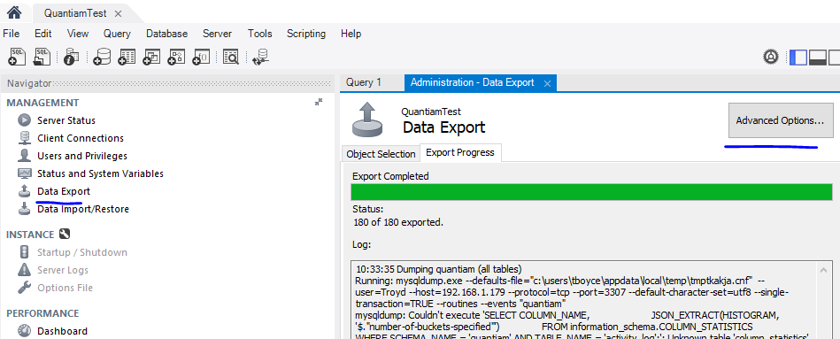
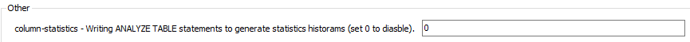
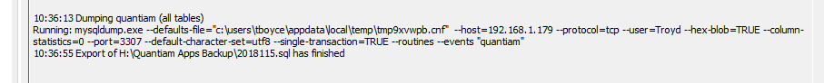

# Workbench禁用MySQL8中的列统计

从**MySQL 8开始**`column-statistics`，默认情况下启用该标志。

因此，如果尝试使用**MySQL Workbench** 8.0.12 转储某些表，则会收到以下错误消息：

> 14:50:22转储db（table_name）运行：mysqldump.exe --defaults-file =“ c：\ users \ username \ appdata \ local \ temp \ tmpvu0mxn.cnf” --user = db_user --host = db_host- -protocol = tcp --port = 1337 --default-character-set = utf8 --skip-triggers“ db_name”“ table_name” mysqldump：无法执行'SELECT COLUMN_NAME，JSON_EXTRACT（HISTOGRAM，'$。'number-of -buckets-specified“”）从information_schema.COLUMN_STATISTICS，其中SCHEMA_NAME ='db_name'和TABLE_NAME ='table_name';'：information_schema中的未知表'COLUMN_STATISTICS'（1109）
>
> 操作失败，退出代码为2 14:50:24 C：\ path \ to \ my \ dump的导出已完成，出现1个错误

MySQL（Workbench）8中有什么方法可以`column-statistics`永久禁用？

------

## 最简单的解决方法

使用**Mysql Workbench 8.0时**

- 打开“数据导出”选项卡
- 单击高级选项 [](https://i.stack.imgur.com/ZKjXe.png)
- 在其他标题下，将列统计信息设置为0 [](https://i.stack.imgur.com/QUMrG.png)
- 再次导出[](https://i.stack.imgur.com/sIDmx.png)


### 解决方法1

一个烦人的解决方法是通过以下方式手动完成：

```sql
mysqldump --column-statistics=0 --host=...
```

------

### 解决方法2

1. 重命名mysqldump
2. 创建一个**外壳脚本**（或在Windows上批处理）
3. 使用`--column-statistics=0`此脚本中的参数调用重命名的mysqldump
4. 将其另存为mysqldump

------

### 解决方法3

1. 下载**MySQL 5.7**
2. 解压mysqldump
3. 使用这个mysqldump

例如在MySQL Workbench中：编辑/首选项... /管理/ mysqldump工具的路径