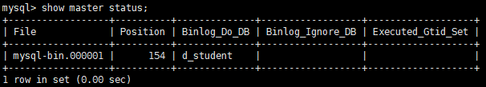

# MySQL配置远程连接和主从同步

## 配置主从同步

需要两台机器，我的机器一台是CVM，另一台就是物理机。

同步机制：Mysql的主从同步以二进制日志为桥梁，Master使用二进制日志来记录数据库的变动情况，包括增删改表和数据，Slave通过读取和执行该日志文件来保持和Master数据一致。Master和每一个Slave都必须配置一个唯一的ID号server-id，相同的server-id将会导致slave无法正常工作。

### 1主库授权给从库

```shell
# 授权给一个从库用户
GRANT REPLICATION SLAVE ON *.* to 'slaveuser'@'%' identified by 'xxxxxx';
```

### 2在从库中创建要备份的数据库和表

主从复制都是对数据库而言，因此只要是对主库进行变更，从库都可以复制一份操作。如果在配置主从同步后创建的表，则从库也会自动建表。但是，假如你要同步的表在主库上已经存在而从库没有，则需要在从库中手动创建同一张表。

```shell
# 在主库上查询建表语句，并copy到从库创建表
SHOW CREATE TABLE t_student;
```

### 3配置主库

root用户配置以下四项
server-id = 1   # master端的ID号，需要与从库有差别
log_bin = /var/log/mysql/mysql-bin.log # 同步的日志路径及文件名，需要有写入权限
binlog_do_db = d_student  # 要同步的数据库名
\#binlog_ignore_db = include_database_name # 不同步的数据库名

```shell
# 配置完成后重启服务
service mysql restart
# 重启完成后，查看主服务器当前二进制日志名和偏移量
show master status;
```

这个操作的目的是为了在从数据库启动后，从这个点开始进行数据的恢复。



可以看到真正同步的文件是mysql-bin.000001，这是因为上述配置的文件不存在。

### 4配置从库

有两种方法，一是通过配置文件，二是通过SQL语句。

无论哪种方法，都要确认从库配置文件中server-id与主库不相同。

```shell
mysql -u root -p
# root用户通过SQL语句配置从库
CHANGE MASTER TO 
MASTER_HOST='XX.XX.XX.XX',
MASTER_PORT=3306,
MASTER_USER='slaveuser',
MASTER_PASSWORD='xxxxxx',
MASTER_LOG_FILE='mysql-bin.000001';
# 启动slave进程
start slave;
# 查看slave状态
show slave status \G;
```

状态中Slave_IO_Running和Slave_SQL_Running都为"Yes"才表明配置成功。若有失败，查看mysql日志定位。

配置成功以后，主库写数据库，从库则会自动备份，至此，mysql的主从同步配置完成。实际工程项目中，往往要求主从复制，读写分离，主库用于写，从库用于读。为应对高并发，还可以将常用数据写入redis来缓mysql的压力。

CHANGE MASTER TO 
MASTER_HOST='34.96.231.76',
MASTER_PORT=3306,
MASTER_USER='remote',
MASTER_PASSWORD='emN5OTkxMTAy',
MASTER_LOG_FILE='mysql-bin.000027';