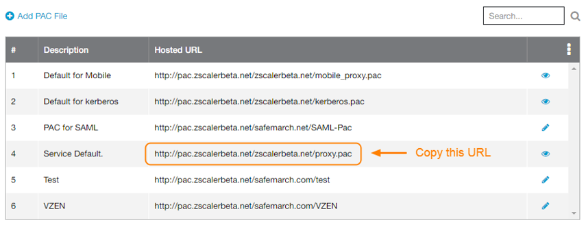
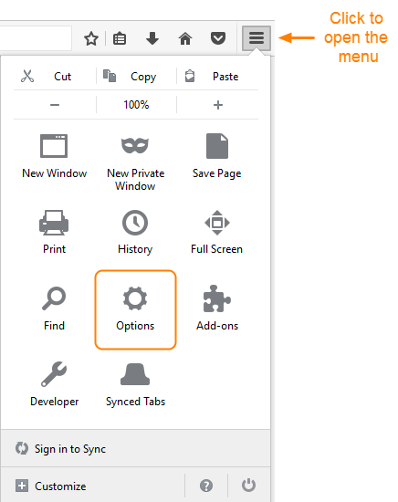
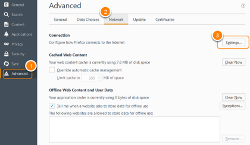
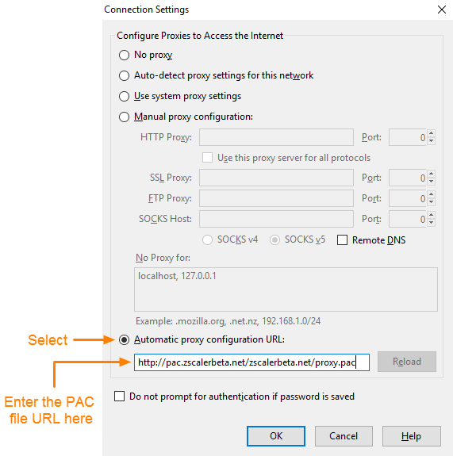

# Firefox配置PAC文件

## 查看默认的PAC文件

如果提供了PAC文件URL，请跳过前两个步骤。

1. 转到 **管理** > **托管PAC文件**。

2. 将Web的默认PAC文件的URL复制到剪贴板。

   参见图像。

   

3. 打开Firefox并打开菜单，然后单击 **选项**。 出现“ **选项”**窗口。
   

4. 单击 **高级**，然后单击 **网络**。在 **网络** 选项卡，单击 **设置...**。 出现“ **连接设置”**窗口。

5. 选择 **自动代理配置URL，** 然后粘贴在步骤2中复制的PAC文件URL

   

6. 单击 **确定** 保存配置。