[toc]

# [CNN基本原理+独特价值+实际应用](https://easyai.tech/ai-definition/cnn/)

> *卷积神经网络 — CNN 最擅长的就是图片的处理。它受到人类视觉神经系统的启发。*
>
> *CNN 有2大特点：*
>
> 能够有效的将大数据量的图片降维成小数据量
>
> 能够有效的保留图片特征，符合图片处理的原则
>
> *目前 CNN 已经得到了广泛的应用，比如：人脸识别、自动驾驶、美图秀秀、安防等很多领域。*

## CNN 解决了什么问题？

在 CNN 出现之前，图像对于人工智能来说是一个难题，有2个原因：

1. 图像需要处理的数据量太大，导致成本很高，效率很低
2. 图像在数字化的过程中很难保留原有的特征，导致图像处理的准确率不高

下面就详细说明一下这2个问题：

## 需要处理的数据量太大

图像是由像素构成的，每个像素又是由颜色构成的。

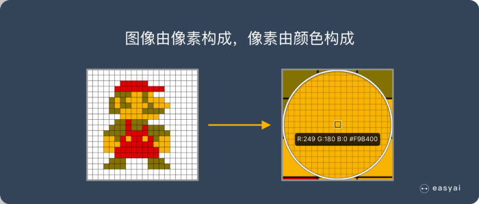

现在随随便便一张图片都是 1000×1000 像素以上的， 每个像素都有RGB 3个参数来表示颜色信息。

假如我们处理一张 1000×1000 像素的图片，我们就需要处理3百万个参数！

1000×1000×3=3,000,000

这么大量的数据处理起来是非常消耗资源的，而且这只是一张不算太大的图片！

**卷积神经网络 — CNN 解决的第一个问题就是「将复杂问题简化」，把大量参数降维成少量参数，再做处理。**

**更重要的是：我们在大部分场景下，降维并不会影响结果。比如1000像素的图片缩小成200像素，并不影响肉眼认出来图片中是一只猫还是一只狗，机器也是如此。**

## 保留图像特征

图片数字化的传统方式我们简化一下，就类似下图的过程：

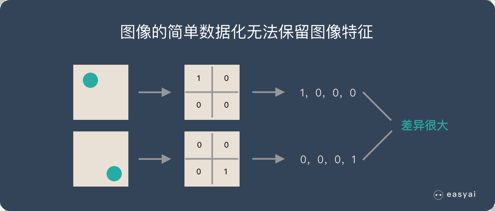

假如有圆形是1，没有圆形是0，那么圆形的位置不同就会产生完全不同的数据表达。但是从视觉的角度来看，**图像的内容（本质）并没有发生变化，只是位置发生了变化**。

所以当我们移动图像中的物体，用传统的方式的得出来的参数会差异很大！这是不符合图像处理的要求的。

**而 CNN 解决了这个问题，他用类似视觉的方式保留了图像的特征，当图像做翻转，旋转或者变换位置时，它也能有效的识别出来是类似的图像。**

那么卷积神经网络是如何实现的呢？在我们了解 CNN 原理之前，先来看看人类的视觉原理是什么？

## 人类的视觉原理

深度学习的许多研究成果，离不开对大脑认知原理的研究，尤其是视觉原理的研究。

1981 年的诺贝尔医学奖，颁发给了 David Hubel（出生于加拿大的美国神经生物学家） 和TorstenWiesel，以及 Roger Sperry。前两位的主要贡献，是“**发现了视觉系统的信息处理**”，可视皮层是分级的。

人类的视觉原理如下：从原始信号摄入开始（瞳孔摄入像素 Pixels），接着做初步处理（大脑皮层某些细胞发现边缘和方向），然后抽象（大脑判定，眼前的物体的形状，是圆形的），然后进一步抽象（大脑进一步判定该物体是只气球）。下面是人脑进行人脸识别的一个示例：

对于不同的物体，人类视觉也是通过这样逐层分级，来进行认知的：

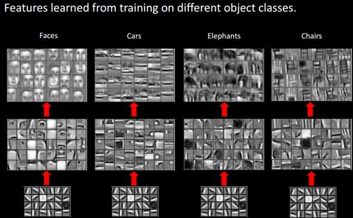

我们可以看到，在最底层特征基本上是类似的，就是各种边缘，越往上，越能提取出此类物体的一些特征（轮子、眼睛、躯干等），到最上层，不同的高级特征最终组合成相应的图像，从而能够让人类准确的区分不同的物体。

那么我们可以很自然的想到：可以不可以模仿人类大脑的这个特点，构造多层的神经网络，较低层的识别初级的图像特征，若干底层特征组成更上一层特征，最终通过多个层级的组合，最终在顶层做出分类呢？

**答案是肯定的，这也是许多深度学习算法（包括CNN）的灵感来源。**

## 卷积神经网络-CNN 的基本原理

### 典型的 CNN 由3个部分构成：

1. 卷积层
2. 池化层
3. 全连接层

如果简单来描述的话：

卷积层负责提取图像中的局部特征；池化层用来大幅降低参数量级(降维)；全连接层类似传统神经网络的部分，用来输出想要的结果。

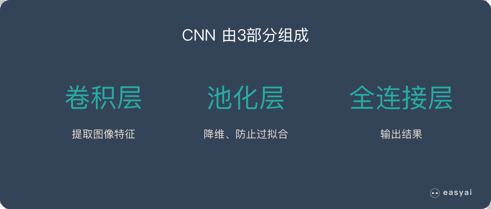

下面的原理解释为了通俗易懂，忽略了很多技术细节，如果大家对详细的原理感兴趣，可以看这个视频《[卷积神经网络基础](https://www.bilibili.com/video/av28733156/?p=3)》。

## 卷积 — — 提取特征

卷积层的运算过程如下图，用一个卷积核扫完整张图片：

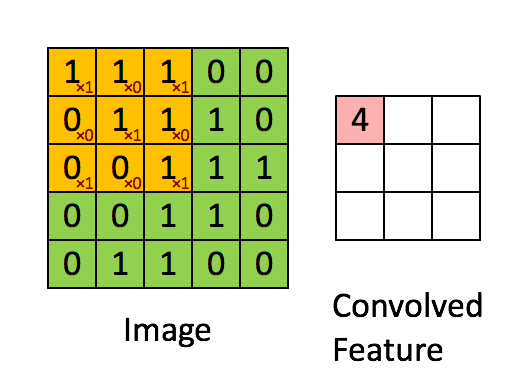

这个过程我们可以理解为我们使用一个过滤器（卷积核）来过滤图像的各个小区域，从而得到这些小区域的特征值。

在具体应用中，往往有多个卷积核，可以认为，每个卷积核代表了一种图像模式，如果某个图像块与此卷积核卷积出的值大，则认为此图像块十分接近于此卷积核。如果我们设计了6个卷积核，可以理解：我们认为这个图像上有6种底层纹理模式，也就是我们用6中基础模式就能描绘出一副图像。以下就是25种不同的卷积核的示例：

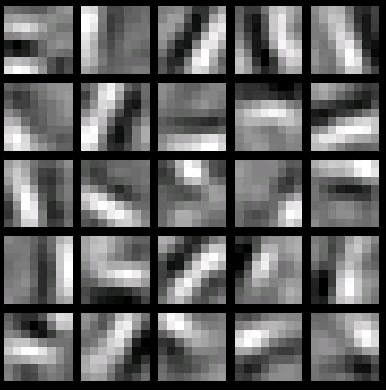

**总结：卷积层的通过卷积核的过滤提取出图片中局部的特征，跟上面提到的人类视觉的特征提取类似。**

## 池化层（下采样） — — 数据降维，避免过拟合

池化层简单说就是下采样，他可以大大降低数据的维度。其过程如下：

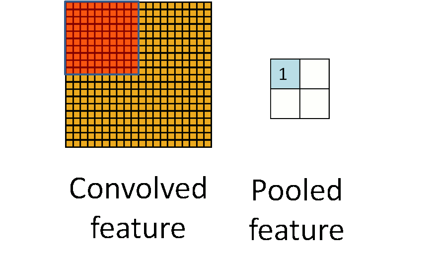

上图中，我们可以看到，原始图片是20×20的，我们对其进行下采样，采样窗口为10×10，最终将其下采样成为一个2×2大小的特征图。

之所以这么做的原因，是因为即使做完了卷积，图像仍然很大（因为卷积核比较小），所以为了降低数据维度，就进行下采样。

**总结：池化层相比卷积层可以更有效的降低数据维度，这么做不但可以大大减少运算量，还可以有效的避免过拟合。**

## 全连接层 — — 输出结果

这个部分就是最后一步了，经过卷积层和池化层处理过的数据输入到全连接层，得到最终想要的结果。

经过卷积层和池化层降维过的数据，全连接层才能”跑得动”，不然数据量太大，计算成本高，效率低下。

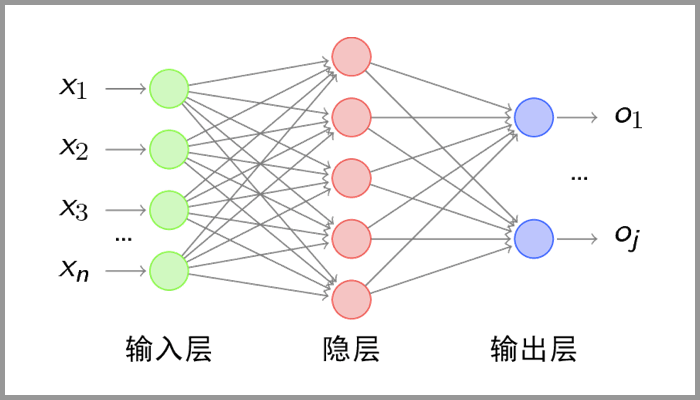

典型的 CNN 并非只是上面提到的3层结构，而是多层结构，例如 LeNet-5 的结构就如下图所示：

#### 卷积层 — 池化层- 卷积层 — 池化层 — 卷积层 — 全连接层

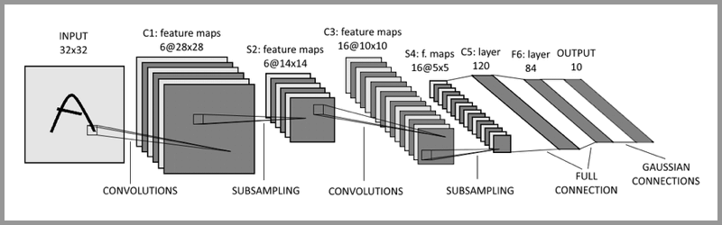

在了解了 CNN 的基本原理后，我们重点说一下 CNN 的实际应用有哪些。

## CNN 有哪些实际应用？

卷积神经网络 — CNN 很擅长处理图像。而视频是图像的叠加，所以同样擅长处理视频内容。下面给大家列一些比较成熟的应用：

### 图像分类、检索

图像分类是比较基础的应用，他可以节省大量的人工成本，将图像进行有效的分类。对于一些特定领域的图片，分类的准确率可以达到 95%+，已经算是一个可用性很高的应用了。

典型场景：图像搜索…

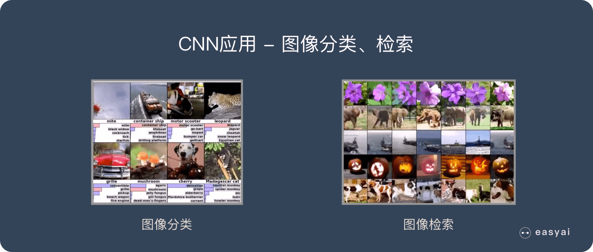

#### 目标定位检测

可以在图像中定位目标，并确定目标的位置及大小。

典型场景：自动驾驶、安防、医疗…

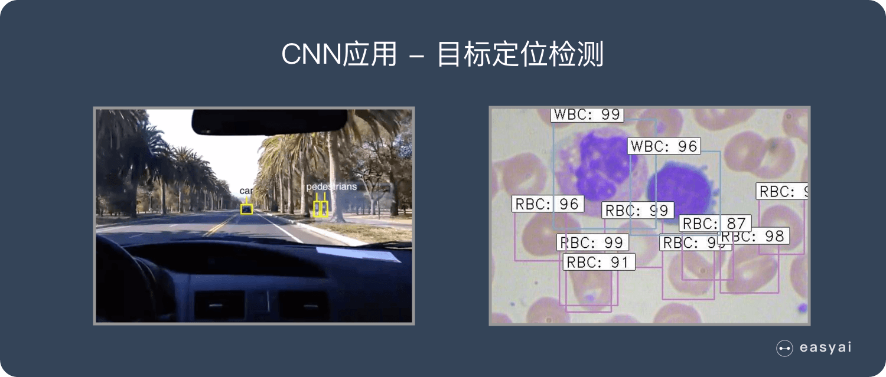

#### 目标分割

简单理解就是一个像素级的分类。

他可以对前景和背景进行像素级的区分、再高级一点还可以识别出目标并且对目标进行分类。

典型场景：美图秀秀、视频后期加工、图像生成…

#### 人脸识别

人脸识别已经是一个非常普及的应用了，在很多领域都有广泛的应用。

典型场景：安防、金融、生活…

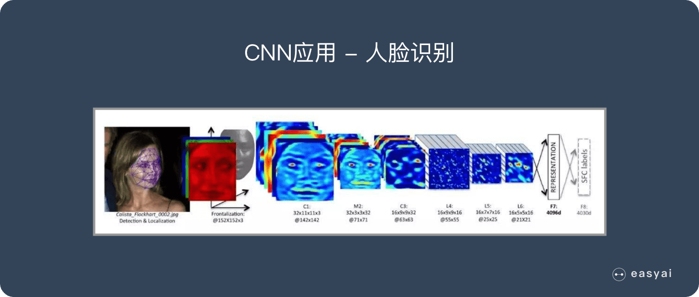

#### 骨骼识别

骨骼识别是可以识别身体的关键骨骼，以及追踪骨骼的动作。

典型场景：安防、电影、图像视频生成、游戏…

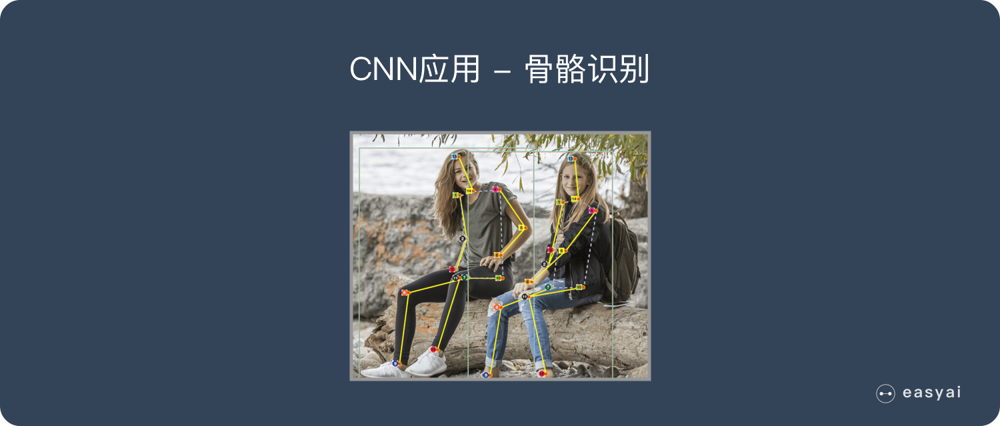

## 总结

今天我们介绍了 CNN 的价值、基本原理和应用场景，简单总结如下：

### CNN 的价值：

1. 能够将大数据量的图片有效的降维成小数据量(并不影响结果)
2. 能够保留图片的特征，类似人类的视觉原理

### CNN 的基本原理：

1. 卷积层 — 主要作用是保留图片的特征
2. 池化层 — 主要作用是把数据降维，可以有效的避免过拟合
3. 全连接层 — 根据不同任务输出我们想要的结果

### CNN 的实际应用：

1. 图片分类、检索
2. 目标定位检测
3. 目标分割
4. 人脸识别
5. 骨骼识别