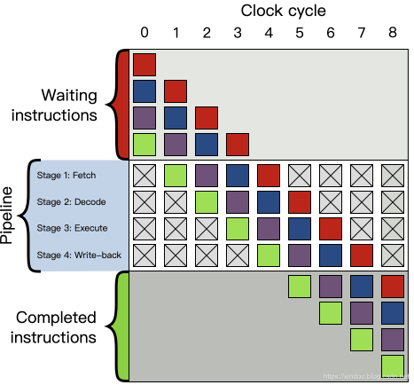
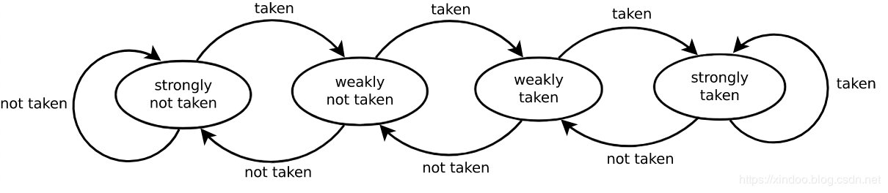

# [CPU分支预测对性能影响有多大](https://blog.csdn.net/xindoo/article/category/9061749)

来源于[stackoverflow](https://stackoverflow.com/)上的一个问题[为什么处理有序数组比处理无需数组快](https://stackoverflow.com/questions/11227809/why-is-it-faster-to-process-a-sorted-array-than-an-unsorted-array)，原文中已经有了一些探讨，这里我们首先来复现下结果，然后再解释下为什么！

我们有如下两段代码，代码看起来都是差不多的，实际上逻辑也是一样的，都是统计数组中小于THRESHOLD数的个数，唯一的区别是一个是在无序数组中统计，另一个是在有序数组中统计。如果两个数组数据源是一致的（数组大小、数据都是一致的），只是一个无序一个有序，你觉得两个函数的性能差距会有多大？

```java
    public static void countUnsortedArr() {
        int cnt = 0;
        for (int i = 0; i < MAX_LENGTH; i++) {
            if (arr[i] < THRESHLOD) {
                cnt++;
            }
        }
    }

    public static void countSortedArr() {
        int cnt = 0;
        for (int i = 0; i < MAX_LENGTH; i++) {
            if (arrSotred[i] < THRESHLOD) {
                cnt++;
            }
        }
    }
```

直觉上，两段代码的逻辑完全一样，因为数据源一致统计结果也是一致的，所以性能上不会有什么差异，但真的是这样吗？我们用OpenJdk中的基准测试工具[JMH](http://openjdk.java.net/projects/code-tools/jmh/)来测试下。

### 测试环境

> MacBook Pro (13-inch, 2017)
> CPU: 2.5 GHz Intel Core i7
> JMH version: 1.21
> VM version: JDK 11, Java HotSpot™ 64-Bit Server VM, 11+28
> 测试方式：预热一轮，然后对每个函数做三轮的压测，每轮都是10s

结果如下，SCore表示执行一次这个函所需要的微秒数，数值越小性能越高。

```log
Benchmark                              Mode  Cnt      Score      Error  Units
BranchPredictionTest.countSortedArr    avgt    3   5212.052 ± 7848.382  us/op
BranchPredictionTest.countUnsortedArr  avgt    3  31854.238 ± 5393.947  us/op
```

是不是很出乎意料，明显有序数组中统计快的多，性能差距足足有 **6倍** 。而且经过我多次测试，这个性能差距非常稳定。是不是感觉不符合逻辑，大多数程序猿都是用高级语言编写代码，其实语言本身就封装了很多底层的细节，事实上，CPU对分支跳转指令是有优化的，这就是我们标题中提到的CPU分支预测。在详细分支预测前先申明一句，本文目标不是讲清楚分支预测，而是告诉你分支预测对性能的影响，想了解更多关于CPU分支预测的内容，文末列出了几篇参考资料。

要说分支预测，还得提到现代CPU的指令流水线模式。如上图所示，现代CPU为了提升指令的吞吐率，将单个指令切分成多个阶段，大致分为__取指(fetch)，译码(decode)，执行(execute)，回写(write-back)__，一条指令不必等上一条完全执行完成就可以开始执行了，就好比工厂中的流水线，可以大大提升指令执行的吞吐率。现代CPU实际上不止4个阶段，像intel和arm的处理器基本上都有十多个阶段，流水线吞吐率的优势更加明显。

但理想很美好，显示很骨干。不是说所有的指令多可以再上一条指令执行完成前就开始执行，可能这条指令会依赖上一条指令的执行结果。为了应对这种数据依赖情况下导致到吞吐率下降，CPU的设计者提出了好多优化方式，比如[指令冒险](https://en.wikipedia.org/wiki/Hazard_(computer_architecture)),[指令乱序执行](https://en.wikipedia.org/wiki/Out-of-order_execution),[预测](https://en.wikipedia.org/wiki/Speculative_execution)，我们今天提到的__分支预测__就属于“预测”的一种。

分支预测的思路也很简单，既然依赖的数据还没算出来，那我就猜一个结果，然后提前开始执行指令，当然也不是随机猜测，现代CPU的预测思路是看前几次预测的结果，就好比前天下雨、昨天也下雨，那我可以简单粗暴的认为今天也下雨，具体细节见文末参考资料。思路很简单，但效果却出奇的好，从Wikipedia的数据我们可以知道现代CPU的分支预测准确率可以到90%以上。

既然准确率不是100%，就意味着有失败的时候。如果CPU发现预测错误会把所有预测之后的指令执行结果全部抛弃，然后从预测分支那重新开始执行，相当于很多指令白跑了，预测失败的代价很高，正常一条指令执行需要10-20个指令周期，预测失败的话可能额外多出30-40个指令周期。 回到我们上面的测试代码，我准备的数据是100w个从0-100w之间的数，然后统计小于50w的数的个数。无序的情况下相当于会有50%的可能性分支预测失败，有序情况下100w次预测只会有一次失败，分支预测失败就是产生性能差距的原因。

## 性能优化

知道了原因，如何优化性能？既然有序数组最快，是不是我们直接将数组排序，然后做遍历就行？别忘了，额外做排序带来的性能损失远超过分支预测失败带来的性能损失。既然提升分支预测成功率的方式行不通我们就干脆直接干掉会导致分支预测的逻辑，How?

### 优化1

对于我这个简单的统计逻辑，可以直接用位运算来完成。位运算看着复杂，但其实思路很简单，就是将整数的符号位直接转化成0和1，再加到cnt上。没有了if小于判断，生成的指令里也就没有了jmp指令，从而避免CPU分支预测错误导致的性能消耗。
代码如下：

```java
    @Benchmark
    public static void count1() {
        int cnt = 0;
        for (int i = 0; i < MAX_LENGTH; i++) {
            cnt += (-~(THRESHLOD-arr[i]) >> 31);
        }
    }
```

### 优化2

既然我都对位运算标了优化1，那肯定还有优化2，事实上用 `? :` 三目运算符也能优化性能。

```java
    public static void count2() {
        int cnt = 0;
        for (int i = 0; i < MAX_LENGTH; i++) {
            cnt += arr[i] < THRESHLOD ? 1 : 0;
        }
    }
```

我们把四种方式放一起再看一下性能差距，位运算毫无疑问是最快的，使用`?:`三目运算符的方式也相当快，和有序数据统计差不多，可以确定三目运算符也成功避免了分支预测错误代码来的性能损失。

```shell
Benchmark                              Mode  Cnt      Score       Error  Units
BranchPredictionTest.count1            avgt    3   3807.000 ± 16265.107  us/op
BranchPredictionTest.count2            avgt    3   4706.082 ± 19757.705  us/op
BranchPredictionTest.countSortedArr    avgt    3   4458.783 ±   107.975  us/op
BranchPredictionTest.countUnsortedArr  avgt    3  30719.090 ±  4517.611  us/op
```

#### `?:`三目运算为什么这么快?

`?:`表达式里有有小于判断，为什么就没有分支跳转了？这个问题我也疑惑了好久，后来我用C语言代码生成了`if`和`?:`逻辑的汇编代码，终于发现了其中的不同。

##### C代码

```c
int fun1(int x)
{
    int cnt = 0;
    if (x < 0)
    {
        cnt += 1;
    }
    return cnt;
}

int fun2(int x)
{
    int cnt = 0;
    cnt  += x > 0 ? 1 : 0;
    return cnt;
}
```

##### 汇编代码

```
	.section	__TEXT,__text,regular,pure_instructions
	.build_version macos, 10, 14
	.globl	_fun1                   ## -- Begin function fun1
	.p2align	4, 0x90
_fun1:                                  ## @fun1
	.cfi_startproc
## %bb.0:
	pushq	%rbp
	.cfi_def_cfa_offset 16
	.cfi_offset %rbp, -16
	movq	%rsp, %rbp
	.cfi_def_cfa_register %rbp
	movl	%edi, -4(%rbp)
	movl	$0, -8(%rbp)
	cmpl	$0, -4(%rbp)
	jge	LBB0_2     ## 如果cmpl指令判断的结果是大于等于，就跳转到LBB0_2代码块  
## %bb.1:
	movl	-8(%rbp), %eax
	addl	$1, %eax
	movl	%eax, -8(%rbp)
LBB0_2:
	movl	-8(%rbp), %eax
	popq	%rbp
	retq
	.cfi_endproc
                                        ## -- End function
	.globl	_fun2                   ## -- Begin function fun2
	.p2align	4, 0x90
	
	
_fun2:                                  ## @fun2
	.cfi_startproc
## %bb.0:
	pushq	%rbp
	.cfi_def_cfa_offset 16
	.cfi_offset %rbp, -16
	movq	%rsp, %rbp
	.cfi_def_cfa_register %rbp
	xorl	%eax, %eax
	movl	%edi, -4(%rbp)
	movl	$0, -8(%rbp)
	movl	-4(%rbp), %edi
	cmpl	$0, %edi
	movl	$1, %edi
	cmovll	%edi, %eax
	addl	-8(%rbp), %eax
	movl	%eax, -8(%rbp)
	movl	-8(%rbp), %eax
	popq	%rbp
	retq
	.cfi_endproc
                                        ## -- End function

.subsections_via_symbols
```

从汇编代码可以看出，fun2中没有`jge`指令(jump when greater or equal)，这是一个典型的跳转指令，它会根据`cmpl`指令的结果来跳转到某个代码块，上文已经提到了，CPU只有在跳转指令时才会做分支预测。而`?:`的实现完全不同，虽然也有`cmpl`指令，后面跟的是`cmovll`指令，这个指令会根据cmp的结果把值放到%eax寄存器中，后续所有的指令都是串行执行的，完全没有跳转指令，所以不会出现分支预测失败导致的性能损失。

和我之前想象的不太一样，**跳转指令不是大小比较产生的，而是像if for这种逻辑分叉产生的，条件跳转只是依赖大小比较的结果而已。**

## 完整基准测试代码：

```java
@BenchmarkMode(Mode.AverageTime)
@OutputTimeUnit(TimeUnit.MICROSECONDS)
@State(Scope.Thread)
@Fork(3)
@Warmup(iterations = 1)
@Measurement(iterations = 3)
public class BranchPredictionTest {
    private static Random random = new Random();
    private static int MAX_LENGTH = 10_000_000;
    private static int[] arr;
    private static int[] arrSotred;
    private static int THRESHLOD = MAX_LENGTH >> 1;

    @Setup
    public static void init() {
        arr = new int[MAX_LENGTH];
        for (int i = 0; i < MAX_LENGTH; i++) {
            arr[i] = random.nextInt(MAX_LENGTH);
        }
        arrSotred = Arrays.copyOf(arr, arr.length);
        Arrays.sort(arrSotred);
    }

    @Benchmark
    public static void countUnsortedArr() {
        int cnt = 0;
        for (int i = 0; i < MAX_LENGTH; i++) {
            if (arr[i] < THRESHLOD) {
                cnt++;
            }
        }
    }

    @Benchmark
    public static void countSortedArr() {
        int cnt = 0;
        for (int i = 0; i < MAX_LENGTH; i++) {
            if (arrSotred[i] < THRESHLOD) {
                cnt++;
            }
        }
    }

    public static void main(String[] args) throws RunnerException {
        Options opt = new OptionsBuilder()
                .include(BranchPredictionTest.class.getSimpleName())
                .forks(1)
                .build();
        new Runner(opt).run();
    }
}
```

## 结语

CPU分支预测本身是为了提升流水线下避免流水线等待的手段，其实本质上是利用了[局部性原理](https://blog.csdn.net/xindoo/article/details/97525694)，因为局部性的存在，大多数情况下这个技术本身给性能带来的是正向的(要不然它今天也不会存在了)，所以我们大多数情况下都不需要关注它的存在，还是放心大胆的写代码吧，不要因为我们这篇博客就把所有的`if`改成`?:`三目运算，可能对代码可读性的影响远大于性能提升的收益。再次强调下，我今天只是构造了一个极端的数据来验证其性能差异，因为局部性的存在大多数情况下分支预测都是对的。

最后，我还发现如果把上面基准测试中所有的小于号改成大于号，所有的性能差异就都消失了，实际测试结果如下。想不通，看起来是没有分支预测了，有知道的大佬解释下吗？

```shell
Benchmark                              Mode  Cnt     Score      Error  Units
BranchPredictionTest.count1            avgt    3  3354.059 ± 3995.160  us/op
BranchPredictionTest.count2            avgt    3  4047.069 ± 2285.700  us/op
BranchPredictionTest.countSortedArr    avgt    3  5732.614 ± 6491.716  us/op
BranchPredictionTest.countUnsortedArr  avgt    3  5251.890 ±   64.813  us/op
```

## 参考资料

1. [维基百科指令流水线](https://en.wikipedia.org/wiki/Instruction_pipelining)
2. [维基百科分支预测](https://en.wikipedia.org/wiki/Branch_predictor)
3. [CPU分支预测](https://www.cnblogs.com/TaigaCon/p/7791303.html)
4. [局部性原理](https://blog.csdn.net/xindoo/article/details/97525694)

