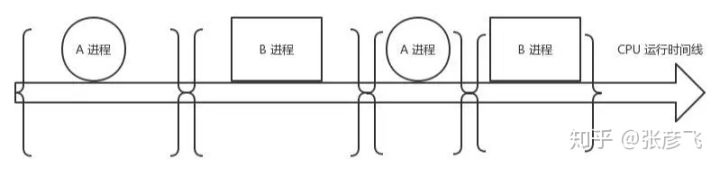
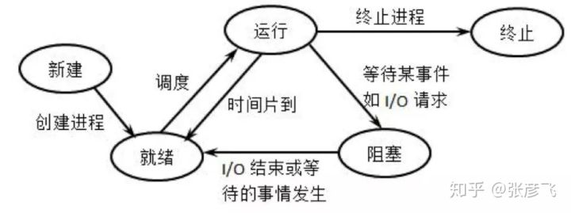

# 进程/线程上下文切换会用掉你多少CPU？

- 进程是操作系统的伟大发明之一，对应用程序屏蔽了CPU调度、内存管理等硬件细节，而抽象出一个进程的概念，让应用程序专心于实现自己的业务逻辑既可，而且在有限的CPU上可以“同时”进行许多个任务。但是它为用户带来方便的同时，也引入了一些额外的开销。如下图，在进程运行中间的时间里，虽然CPU也在忙于干活，但是却没有完成任何的用户工作，这就是进程机制带来的额外开销。

  图1 进程上下文切换

  在进程A切换到进程B的过程中，先保存A进程的上下文，以便于等A恢复运行的时候，能够知道A进程的下一条指令是啥。然后将要运行的B进程的上下文恢复到寄存器中。这个过程被称为上下文切换。上下文切换开销在进程不多、切换不频繁的应用场景下问题不大。但是现在Linux操作系统被用到了高并发的网络程序后端服务器。在单机支持成千上万个用户请求的时候，这个开销就得拿出来说道说道了。因为用户进程在请求Redis、Mysql数据等网络IO阻塞掉的时候，或者在进程时间片到了，都会引发上下文切换。

  图2 进程状态转化图

  ## 一个简单的进程上下文切换开销测试实验

  废话不多说，我们先用个实验测试一下，到底一次上下文切换需要多长的CPU时间！实验方法是创建两个进程并在它们之间传送一个令牌。其中一个进程在读取令牌时就会引起阻塞。另一个进程发送令牌后等待其返回时也处于阻塞状态。如此往返传送一定的次数，然后统计他们的平均单次切换时间开销。
  具体的实验代码参见[test04](https://www.jianshu.com/p/be3250786a91)

  ```php
  # gcc main.c -o main
  # ./main./main
  Before Context Switch Time1565352257 s, 774767 us
  After Context SWitch Time1565352257 s, 842852 us
  ```

  每次执行的时间会有差异，多次运行后**平均每次上下文切换耗时3.5us左右**。当然了这个数字因机器而异，而且建议在实机上测试。

  前面我们测试系统调用的时候，最低值是200ns。可见，上下文切换开销要比系统调用的开销要大。系统调用只是在进程内将用户态切换到内核态，然后再切回来，而上下文切换可是直接从进程A切换到了进程B。显然这个上下文切换需要完成的工作量更大。

  ## 进程上下文切换开销都有哪些

  那么上下文切换的时候，CPU的开销都具体有哪些呢？开销分成两种，一种是直接开销、一种是间接开销。

  直接开销就是在切换时，cpu必须做的事情，包括：

  - 1、切换页表全局目录

  - 2、切换内核态堆栈

  - 3、切换硬件上下文（进程恢复前，必须装入寄存器的数据统称为硬件上下文）

  - - ip(instruction pointer)：指向当前执行指令的下一条指令
    - bp(base pointer): 用于存放执行中的函数对应的栈帧的栈底地址
    - sp(stack poinger): 用于存放执行中的函数对应的栈帧的栈顶地址
    - cr3:页目录基址寄存器，保存页目录表的物理地址
    - ......

  

  - 4、刷新TLB
  - 5、系统调度器的代码执行

  间接开销主要指的是虽然切换到一个新进程后，由于各种缓存并不热，速度运行会慢一些。如果进程始终都在一个CPU上调度还好一些，如果跨CPU的话，之前热起来的TLB、L1、L2、L3因为运行的进程已经变了，所以以局部性原理cache起来的代码、数据也都没有用了，导致新进程穿透到内存的IO会变多。 其实我们上面的实验并没有很好地测量到这种情况，所以实际的上下文切换开销可能比3.5us要大。

  想了解更详细操作过程的同学请参考《深入理解Linux内核》中的第三章和第九章。

  ## 一个更为专业的测试工具-lmbench

  lmbench用于评价系统综合性能的多平台开源benchmark，能够测试包括文档读写、内存操作、进程创建销毁开销、网络等性能。使用方法简单，但就是跑有点慢，感兴趣的同学可以自己试一试。
  这个工具的优势是是进行了多组实验，每组2个进程、8个、16个。每个进程使用的数据大小也在变，充分模拟cache miss造成的影响。我用他测了一下结果如下：

  ```shell
  -------------------------------------------------------------------------
  Host                 OS  2p/0K 2p/16K 2p/64K 8p/16K 8p/64K 16p/16K 16p/64K  
                           ctxsw  ctxsw  ctxsw ctxsw  ctxsw   ctxsw   ctxsw  
  --------- ------------- ------ ------ ------ ------ ------ ------- -------  
  bjzw_46_7 Linux 2.6.32- 2.7800 2.7800 2.7000 4.3800 4.0400 4.75000 5.48000
  ```

  lmbench显示的进程上下文切换耗时从2.7us到5.48之间。

  ## 线程上下文切换耗时

  前面我们测试了进程上下文切换的开销，我们再继续在Linux测试一下线程。看看究竟比进程能不能快一些，快的话能快多少。

  在Linux下其实本并没有线程，只是为了迎合开发者口味，搞了个轻量级进程出来就叫做了线程。轻量级进程和进程一样，都有自己独立的task_struct进程描述符，也都有自己独立的pid。从操作系统视角看，调度上和进程没有什么区别，都是在等待队列的双向链表里选择一个task_struct切到运行态而已。只不过轻量级进程和普通进程的区别是可以共享同一内存地址空间、代码段、全局变量、同一打开文件集合而已。

  > 同一进程下的线程之所有getpid()看到的pid是一样的，其实task_struct里还有一个tgid字段。 对于多线程程序来说，getpid()系统调用获取的实际上是这个tgid，因此隶属同一进程的多线程看起来PID相同。

  我们用一个实验来测试一下[test06](https://www.jianshu.com/p/0d90b92000c0)。其原理和进程测试差不多，创建了20个线程，在线程之间通过管道来传递信号。接到信号就唤醒，然后再传递信号给下一个线程，自己睡眠。 这个实验里单独考虑了给管道传递信号的额外开销，并在第一步就统计了出来。

  ```css
  # gcc -lpthread main.c -o main
  0.508250  
  4.363495
  ```

  每次实验结果会有一些差异，上面的结果是取了多次的结果之后然后平均的，大约每次线程切换开销大约是3.8us左右。**从上下文切换的耗时上来看，Linux线程（轻量级进程）其实和进程差别不太大**。

  ## Linux相关命令

  既然我们知道了上下文切换比较的消耗CPU时间，那么我们通过什么工具可以查看一下Linux里究竟在发生多少切换呢？如果上下文切换已经影响到了系统整体性能，我们有没有办法把有问题的进程揪出来，并把它优化掉呢？

  ```shell
  # vmstat 1  
  procs -----------memory---------- ---swap-- -----io---- --system-- -----cpu-----  
   r  b   swpd   free   buff  cache   si   so    bi    bo   in   cs us sy id wa st  
   2  0      0 595504   5724 190884    0    0   295   297    0    0 14  6 75  0  4  
   5  0      0 593016   5732 193288    0    0     0    92 19889 29104 20  6 67  0  7  
   3  0      0 591292   5732 195476    0    0     0     0 20151 28487 20  6 66  0  8  
   4  0      0 589296   5732 196800    0    0   116   384 19326 27693 20  7 67  0  7  
   4  0      0 586956   5740 199496    0    0   216    24 18321 24018 22  8 62  0  8
  ```

  或者是

  ```bash
  # sar -w 1  
  proc/s  
       Total number of tasks created per second.  
  cswch/s  
       Total number of context switches per second.  
  11:19:20 AM    proc/s   cswch/s  
  11:19:21 AM    110.28  23468.22  
  11:19:22 AM    128.85  33910.58  
  11:19:23 AM     47.52  40733.66  
  11:19:24 AM     35.85  30972.64  
  11:19:25 AM     47.62  24951.43  
  11:19:26 AM     47.52  42950.50  
  ......
  ```

  上图的环境是一台生产环境机器，配置是8核8G的KVM虚机，环境是在nginx+fpm的，fpm数量为1000，平均每秒处理的用户接口请求大约100左右。其中**cs列**表示的就是在1s内系统发生的上下文切换次数，大约1s切换次数都达到4W次了。粗略估算一下，每核大约每秒需要切换5K次，则1s内需要花将近20ms在上下文切换上。要知道这是虚机，本身在虚拟化上还会有一些额外开销，而且还要真正消耗CPU在用户接口逻辑处理、系统调用内核逻辑处理、以及网络连接的处理以及软中断，所以20ms的开销实际上不低了。

  那么进一步，我们看下到底是哪些进程导致了频繁的上下文切换？

  ```bash
  # pidstat -w 1  
  11:07:56 AM       PID   cswch/s nvcswch/s  Command
  11:07:56 AM     32316      4.00      0.00  php-fpm  
  11:07:56 AM     32508    160.00     34.00  php-fpm  
  11:07:56 AM     32726    131.00      8.00  php-fpm  
  ......
  ```

  由于fpm是同步阻塞的模式，每当请求Redis、Memcache、Mysql的时候就会阻塞导致cswch/s自愿上下文切换，而只有时间片到了之后才会触发nvcswch/s非自愿切换。可见fpm进程大部分的切换都是自愿的、非自愿的比较少。

  如果想查看具体某个进程的上下文切换总情况，可以在/proc接口下直接看，不过这个是总值。

  ```shell
  grep ctxt /proc/32583/status  
  voluntary_ctxt_switches:        573066  
  nonvoluntary_ctxt_switches:     89260
  ```

  ## 本节结论

  上下文切换具体做哪些事情我们没有必要记，只需要记住一个结论既可，测得作者开发机**上下文切换的开销大约是2.7-5.48us左右**，你自己的机器可以用我提供的代码或工具进行一番测试。
  lmbench相对更准确一些，因为考虑了切换后Cache miss导致的额外开销。

  ## 参考文献

  - [进程上下文切换，残酷的性能杀手](https://links.jianshu.com/go?to=https%3A%2F%2Fwww.cnblogs.com%2Femperor_zark%2Farchive%2F2012%2F12%2F11%2Fcontext_switch_1.html)
	- [测试上下文切换开销](https://links.jianshu.com/go?to=https%3A%2F%2Focelot1985-163-com.iteye.com%2Fblog%2F1029949)
  - [进程上下文切换导致Load过高](https://links.jianshu.com/go?to=http%3A%2F%2Fwww.361way.com%2Flinux-context-switch%2F5131.html)
  - [CPU上下文切换的次数和时间](https://links.jianshu.com/go?to=https%3A%2F%2Fiamzhongyong.iteye.com%2Fblog%2F1895728)
  - [Linux操作系统测试工具](https://links.jianshu.com/go?to=http%3A%2F%2Fcfdtesting.com%2F879156.html)
  - [lmbench官方文档](https://links.jianshu.com/go?to=http%3A%2F%2Fwww.bitmover.com%2Flmbench%2Flmbench.html)
  - [lmbench安装与使用](https://links.jianshu.com/go?to=http%3A%2F%2Fwww.itboth.com%2Fd%2FrU7FnmEzmYR3%2Flinux-build)
  
  - https://links.jianshu.com/go?to=http%3A%2F%2Fwww.itboth.com%2Fd%2FrU7FnmEzmYR3%2Flinux-build)