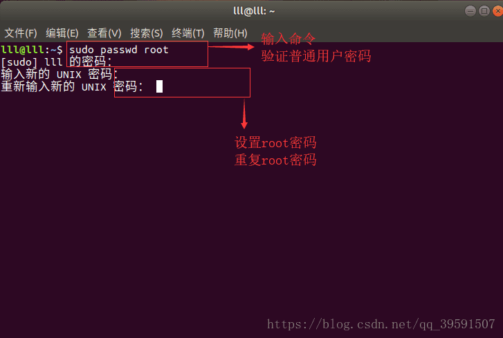
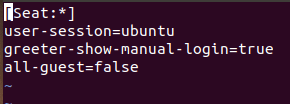
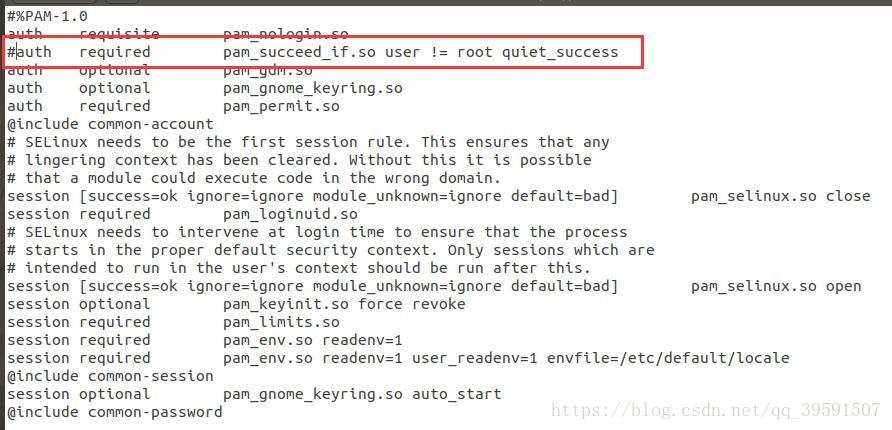
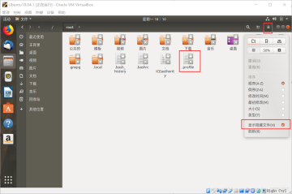

# Ubuntu root用户登录图形界面

Ubuntu18.04.1开发团队为了Ubuntu18.04.1系统的安全，默认root不能登录图形界面，普通用户需要使用root权限时，只能通过sudo [命令]  [参数] 临时使用root权限，或是使用su root切换到root用户权限下进行操作

那么，怎么使用root登录图形界面呢？

## 1.为root设置初始密码

（1）普通用户登录系统，打开终端，输入命令：sudo passwd root(使用root权限为root更改密码)

（2）设置root密码；

（3）重复root密码；



## 2.修改文件 

（1）使用sudo chmod 777 /usr/share/lightdm/lightdm.conf.d/50-ubuntu.conf修改文件权限为777(默认为只读)；(因为Ubuntu18.xx更新了文件名)

（2）打开文件，在文件尾加入两行：

```shell
greeter-show-manual-login=true
all-guest=false
```



## 3.进入/etc/pam.d文件夹下，修改gdm-autologin和gdm-passwd(有的文件名可能是gdm-password，请仔细排查)文件内容(首先修改文件权限，参考步骤2的操作)

gdm-autologin文件注释掉auth required pam_success_if.so user!=root quiet_success这一行

gdm-passwd文件注释掉auth required pam_success_if.so user!=root quiet_success这一行

注释需要只需要在这一行前加#auth required ... ...即：

\#auth required pam_success_if.so user!=root quiet_success



## 4.修改/root/.profile文件

进入/root目录下，显示没有任何文件，因为root目录下文件为隐藏文件，要修改文件，两种方法：

a.终端使用命令vim /root/.profile

可能遇到的问题：

文件权限问题，参考步骤2；

vim命令找不到，刚安装的Ubuntu系统没有vim，使用vi命令或安装vim(具体略)；

b.如图：



最后一行修改为：

> tty -s&&mesg n || true

## 5.重启系统，使用root用户和密码登录系统