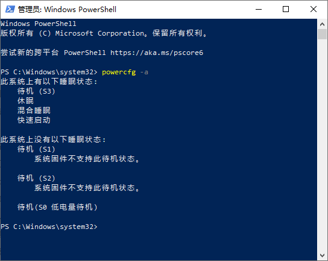

# win10无法进入睡眠模式

Win + R：输入`regedit`，启动注册表编辑器，

然后在 `HKEY_LOCAL_MACHINE\SYSTEM\CurrentControlSet\Control\Power`目录下，找到“CsEnabled”键值，将默认的“1”修改为“0”，重启即可生效。
1. 
   Windows10专业版系统，请参见以下步骤：
   
   1. Windows+r，输入：`gpedit.msc`
   
   2. 依次打开：“计算机配置”—“管理模板“—“系统”—“电源管理“—“睡眠设置”
   
   3. 在右侧找到“睡眠时允许待机(S1-S3)（接通电源）”以及“睡眠时允许待机(S1-S3)（使用电池）”。
   
   4. 双击，将这两个选项均设置为“未配置”即可
   
   Windows10家庭版系统，请参见以下步骤：
   
   1. Windows+x，打开控制面板
   
   2. 定位路径：控制面板\硬件和声音\电源选项\
   
   3. 点击“更改计算机睡眠时间”，根据您的需要来设置。

2. 输入`powercfg -requests` 查看什么装置阻止睡眠，分别网上寻找对应解决办法
   
   我遇到过打印机和声卡驱动阻止睡眠
   
   解决打印机：
   
   治本：查看每台打印机有无队列
   
   治标：打印机服务print spooler关闭
   
   声卡采用的以下方法，也是可以解决一切的通用方法
   
   修改以下命令让系统忽略那些阻止睡眠的程序
   
   `powercfg -REQUESTSOVERRIDE DRIVER "High Definition Audio Device(**引号内**填入阻止你睡眠的程序)" SYSTEM`
   
   由于我是chrome在播放视频不能睡眠，所以chrome也忽略了：
   
   `powercfg -REQUESTSOVERRIDE PROCESS chrome.exe SYSTEM`
   
   查看已忽略程序命令：

3. **首先本方法不是网上所谓修改电源设置一类的。**
   
   先介绍一下电源选项，ACPI(Advanced Configuration and Power Interface)在运行中有以下几种模式：
   
   > S0 正常。
   > S1 CPU停止工作。唤醒时间：0秒。
   > S2 CPU关闭。唤醒时间：0.1秒。
   > S3 除了内存外的部件都停止工作。唤醒时间：0.5秒。
   > S4 内存信息写入硬盘，所有部件停止工作。唤醒时间：30秒。（休眠状态）
   > S5 关闭。
   
   执行命令`powercfg -a`会打印如下结果：
   
   很多顽固的笔记本盒盖不休眠，就是这里的**S3模式不支持**有关系！！！

我的笔记本是**XPS9570**。
   首先我检查BIOS，BIOS开启了对S3的支持的（**默认，应该所有笔记本都是这样**）。
   那么就是系统层面的问题了，我查阅了微软的文档：

   1. https://msdn.microsoft.com/zh-cn/library/windows/hardware/mt637220(v=vs.85).aspx
   2. [https://msdn.microsoft.com/zh-cn/library/windows/hardware/mt282186%28v=vs.85%29.aspx?f=255&MSPPError=-2147217396](https://msdn.microsoft.com/zh-cn/library/windows/hardware/mt282186(v=vs.85).aspx?f=255&MSPPError=-2147217396)

   从上面两个网页可以发现win10的默认睡眠策略是：
S0 -> Connected Standby(系统层面的待机，类似于智能手机锁屏) -> S3(睡眠) -> S4(休眠)

   而我的笔记本竟然不支持S3，这是为何？查阅Dell的论坛，发现有类似的帖子讲到这个：[https://www.dell.com/community/Windows-10/XPS13-%E6%97%A0%E6%B3%95%E5%BC%80%E5%90%AFS3%E6%B7%B7%E5%90%88%E7%9D%A1%E7%9C%A0%E5%BE%85%E6%9C%BA%E7%8A%B6%E6%80%81/td-p/5288044](https://www.dell.com/community/Windows-10/XPS13-无法开启S3混合睡眠待机状态/td-p/5288044)

   这竟然是新款XPS笔记本的默认策略，Dell的电源驱动管理会默认的关闭S3并开启CS，这简直太蠢了，**难道我电脑盒盖之后不能放到包里？**

那么只要恢复系统层面关闭CS并打开S3即可。
   要禁用CS(Connected Standby)请执行以下步骤：

   1. 在运行中执行：`regedit`，启动注册表编辑器。
   2. 然后在 `HKLM\System\CurrentControlSet\Control\Power\`目录下，找到“CsEabled”键值，将默认的“1”修改为“0”。
   3. 重启电脑，即可生效。

至此我的XPS已经可以正常休眠了！！

   附加一个CS的说明：https://www.zhihu.com/question/23014590/answer/474864577
   CS是新特性，为了能够超快速唤醒，但是需要硬件、驱动共同配合，所以只有在SP4体验较好，而Dell不自量力的也打开这个，却没有实力去调教。

   不过我最后还是选择打开了CS，因为体验真的不错，除了盒盖风扇仍然运行，直到温度降低到适当的水平。不过偶尔无法进入睡眠（CS），令人不爽。