# H.264和H.265（HEVC）深度解析及对比

# 一、什么是H.265

H.265是ITU-TVCEG继H.264之后所制定的新的视频编码标准。H.265标准围绕着现有的视频编码标准H.264，保留原来的某些技术，同时对一些相关的技术加以改进。

新技术使用先进的技术用以改善码流、编码质量、延时和算法复杂度之间的关系，达到最优化设置。具体的研究内容包括：提高压缩效率、提高鲁棒性和错误恢复能力、减少实时的时延、减少信道获取时间和随机接入时延、降低复杂度等。H264由于算法优化，可以低于1Mbps的速度实现标清数字图像传送；H265则可以实现利用1~2Mbps的传输速度传送720P（分辨率1280*720）普通高清音视频传送。

H.265旨在在有限带宽下传输更高质量的网络视频，仅需原先的一半带宽即可播放相同质量的视频。这也意味着，我们的智能手机、平板机等移动设备将能够直接在线播放1080p的全高清视频。H.265标准也同时支持4K(4096×2160)和8K(8192×4320)超高清视频。可以说，H.265标准让网络视频跟上了显示屏“高分辨率化”的脚步。

# 二、什么是H.264

H.264，同时也是MPEG-4第十部分，是由ITU-T视频编码专家组（VCEG）和ISO/IEC动态图像专家组（MPEG）联合组成的联合视频组（JVT，Joint Video Team）提出的高度压缩数字视频编解码器标准。这个标准通常被称之为H.264/AVC（或者AVC/H.264或者H.264/MPEG-4AVC或MPEG-4/H.264 AVC）而明确的说明它两方面的开发者。

H.264最大的优势是具有很高的数据压缩比率，在同等图像质量的条件下，H.264的压缩比是MPEG-2的2倍以上，是MPEG-4的1.5～2倍。举个例子，原始文件的大小如果为88GB，采用MPEG-2压缩标准压缩后变成3.5GB，压缩比为25∶1，而采用H.264压缩标准压缩后变为879MB，从88GB到879MB，H.264的压缩比达到惊人的102∶1。低码率（Low Bit Rate）对H.264的高的压缩比起到了重要的作用，和MPEG-2和MPEG-4ASP等压缩技术相比，H.264压缩技术将大大节省用户的下载时间和数据流量收费。尤其值得一提的是，H.264在具有高压缩比的同时还拥有高质量流畅的图像，正因为如此，经过H.264压缩的视频数据，在网络传输过程中所需要的带宽更少，也更加经济。

针对H.264编码格式，根据不同分辨率，推荐其对应的码率配置关系如下图所示：

宽屏 ：

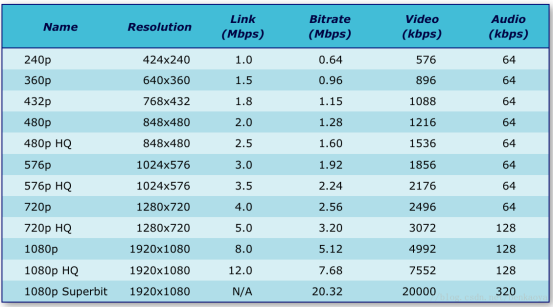

非宽屏 ：

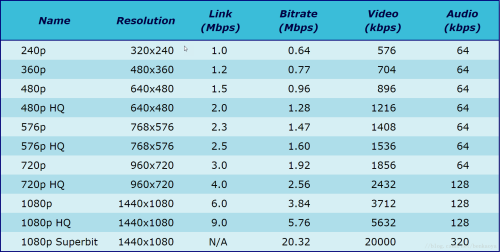

# 三、H.265与H.264有何不同

在讨论H.265有哪些提升和优点之前，我们不妨先来了解一下H.264。H.264也称作MPEG-4AVC(Advanced Video Coding，高级视频编码)，是一种视频压缩标准，同时也是一种被广泛使用的高精度视频的录制、压缩和发布格式。H.264因其是蓝光光盘的一种编解码标准而著名，所有蓝光播放器都必须能解码H.264。更重要的是，因为苹果公司当初毅然决然抛弃了Adobe的VP6编码，选择了H.264，这个标准也就随着数亿台iPad和iPhone走入了千家万户，成为了目前视频编码领域的绝对霸主，占有超过80%的份额。H.264也被广泛用于网络流媒体数据、各种高清晰度电视广播以及卫星电视广播等领域。H.264相较于以前的编码标准有着一些新特性，如多参考帧的运动补偿、变块尺寸运动补偿、帧内预测编码等，通过利用这些新特性，H.264比其他编码标准有着更高的视频质量和更低的码率，也因此受到了人们的认可，而被广泛应用。

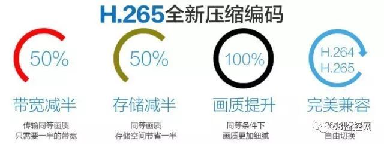

H.265/HEVC的编码架构大致上和H.264/AVC的架构相似，也主要包含：帧内预测(intra prediction)、帧间预测(inter prediction)、转换(transform)、量化(quantization)、去区块滤波器(deblocking filter)、熵编码(entropy coding)等模块。但在HEVC编码架构中，整体被分为了三个基本单位，分別是：编码单位(coding unit，CU)、预测单位(predict unit，PU)和转换单位(transform unit，TU)。

# 四、H.265为何优于H.264

比起H.264/AVC，H.265/HEVC提供了更多不同的工具来降低码率，以编码单位来说， 最小的8x8到最大的64x64。信息量不多的区域(颜色变化不明显，比如车体的红色部分和地面的灰色部分)划分的宏块较大，编码后的码字较少，而细节多的地方(轮胎)划分的宏块就相应的小和多一些，编码后的码字较多，这样就相当于对图像进行了有重点的编码，从而降低了整体的码率，编码效率就相应提高了。同时，H.265的帧内预测模式支持33种方向(H.264只支持8种)，并且提供了更好的运动补偿处理和矢量预测方法。

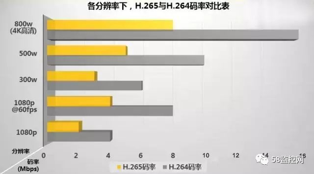

反复的质量比较测试已经表明，在相同的图象质量下，相比于H.264，通过H.265编码的视频码流大小比H.264减少大约39-44%。由于质量控制的测定方法不同，这个数据也会有相应的变化。通过主观视觉测试得出的数据显示，在码率减少51-74%的情况下，H.265编码视频的质量还能与H.264编码视频近似甚至更好，其本质上说是比预期的信噪比(PSNR)要好。这些主观视觉测试的评判标准覆盖了许多学科，包括心理学和人眼视觉特性等，视频样本非常广泛，虽然它们不能作为最终结论，但这也是非常鼓舞人心的结果。

目前的HEVC标准共有三种模式：Main、Main10和Main Still Picture。Main模式支持8bit色深(即红绿蓝三色各有256个色度，共1670万色)，Main10模式支持10bit色深，将会用于超高清电视(UHDTV)上。前两者都将色度采样格式限制为4：2：0。预期将在2014年对标准有所扩展，将会支持4：2：2和4：4：4采样格式(即提供了更高的色彩还原度)和多视图编码(例如3D立体视频编码)。

事实上，H.265和H.264标准在各种功能上有一些重叠。例如，H.264标准中的Hi10P部分就支持10bit色深的视频。另一个，H.264的部分(Hi444PP)还可以支持4：4：4色度抽样和14比特色深。在这种情况下，H.265和H.264的区别就体现在前者可以使用更少的带宽来提供同样的功能，其代价就是设备计算能力：H.265编码的视频需要更多的计算能力来解码。目前已经有支持H.265解码的芯片发布了——美国博通公司(Broadcom)在今年1月初的CES大展上发布了一款Brahma BCM 7445芯片，它是一个采用28纳米工艺的四核处理器，可以同时转码四个1080P视频数据流或解析分辨率为4096×2160的H.265编码超高清视频。

H.265标准的诞生是在有限带宽下传输更高质量的网络视频。对于大多数专业人士来说，H.265编码标准并不陌生，其是ITU-TVCEG继H.264之后所制定的视频编码标准。H.265标准主要是围绕着现有的视频编码标准H.264，在保留了原有的某些技术外，增加了能够改善码流、编码质量、延时及算法复杂度之间的关系等相关的技术。H.265研究的主要内容包括，提高压缩效率、提高鲁棒性和错误恢复能力、减少实时的时延、减少信道获取时间和随机接入时延、降低复杂度。

延伸阅读：综合布线常见名词大全

# 五、H.264和H.265技术下视频存储如何计算

## 1、h.264技术硬盘容量的计算

说到计算，我们要拿什么来计算呢?除了摄像头数目、需要录像的时间外，还有一个重要的数值：码率! 一般情况下，分辨率越大，码流呢也就越大，比如我们常用到的130W的摄像头，码流是2MB/S，也就是2048kbps。然后知道了码流、时间、通道数，我们就可以直接套用公式计算了。

公式如下： 码率×3600×24÷8÷1024÷1024=1D（一天）

码流表

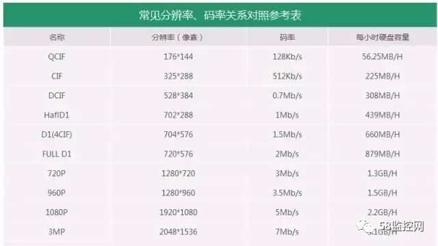

应为码流是以秒为计量的，所以我们的容量也要用秒来换算，3600呢，就是1小时，24就是一天24小时，8呢，就是字节，1024是应为码流是以MB为单位的，所以要换算G就要除以1024，换成T 还要再除1024。果就是1天。甲方需要存储多久，再乘以天数就OK了。

以上为H.264的计算方式，那么我们来看一下H.265技术的应用。

## 2、H.256技术的硬盘存储计算

举例：

H.264技术下，4个300W存储一个月大概是：60G*4*30=7.2T

H.265技术下，4个300W存储一个月大概是：30G*4*30=3.6T

下面的图更直接

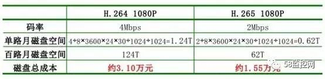

这还是存储的，我们再来看看带宽。以往H.264如果要远程观看1个130W像素的高清画面，就需要6M的上行带宽，而H.265下，4M网络就可以看一个300W的高清画面。2个200W画面。

所以说，降低的成本不只是硬盘存储的，当然还有交换机。

b，支持H.265的设备怎么用？

是不是我用老的摄像机接到H.265的录像机上，也能存储减半？不是的，对于网络摄像机和录像机来说，要双方都支持H.265技术才可以。

如果有一方支持，另一方不支持呢？放心，和其他技术设备一样的，向下兼容，也就是说除了存储减半不能实现，其他功能都是正常使用的。

c，H.265存储怎么计算？

普通的摄像机一天大概21G，是不是直接除以2就可以了呢？其实不然。更简洁的方法来了！

200W≈20G

300W≈30G

400W≈40G

其实H.265 就是压缩了码流。

转自：https://www.sohu.com/a/224199309_825275

数字视频的超高清潮流奔腾向前，帧率从30 fps向60fps、120fps甚至240fps进发，与此同时，物理媒介日薄西山，内容正通过有形无形的网络在世界各个角落的终端设备上传递。高度密集的数据给带宽和存储带来巨大挑战，当前主流的H.264开始不敷应用，而新一代视频编码标准H.265似乎成为了数字4K时代的“救世主”。
　　H.265又称为HEVC(全称High Efficiency Video Coding，高效率视频编码，本文统称为H.265)，是ITU-T H.264/MPEG-4 AVC标准的继任者。2004年由ISO/IEC Moving Picture Experts Group(MPEG)和ITU-T Video Coding Experts Group(VCEG)作为ISO/IEC 23008-2 MPEG-H Part 2或称作ITU-T H.265开始制定。第一版的HEVC/H.265视频压缩标准在2013年4月13日被接受为国际电信联盟(ITU-T)的正式标准。 

  理论上H.265比H.264效率提高30-50%(尤其是在更高的分辨率情形下)，但真的只是这么简单吗？

 

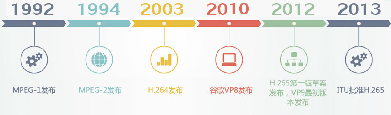

**H.265的改变**

    H.265重新利用了H.264中定义的很多概念。两者都是基于块的视频编码技术，所以它们有着相同的根源，和相近的编码方式，包括：

　　1、以宏块来细分图片，并最终以块来细分。

　　2、使用帧内压缩技术减少空间冗余。

　　3、使用帧内压缩技术减少时间冗余（运动估计和补偿）。

　　4、使用转换和量化来进行残留数据压缩。

　　5、使用熵编码减少残留和运动矢量传输和信号发送中的最后冗余。

　　事实上，视频编解码从MPEG-1诞生至今都没有根本性改进，H.265也只是H.264在一些关键性能上的更强进化以及简单化。

 

当你考虑“只是在普通互联网上传输4K内容，还是要实现最好的图像质量”之时，就要先厘清“更多的压缩”和“更好的压缩”这两个概念。如果只是更多的压缩，4K和超高清不一定要保证比今天的1080p或HD做到更好的图片质量。更好的压缩则意味着更聪明的压缩，面对同样的原始素材，更好的压缩会以更好的方式，在不牺牲质量的情况下令数据量减少。更多的压缩很容易，而更好的压缩需要更多的思考和更好的技术，通过更智能的算法来处理图像，在维持质量的同时保持更低的比特率，这正是H.265所要做的。

　　如何实现更好的压缩，举例来讲，我们通常会发现在很多的图像素材里，如视像会议或者电影的很多场景中，每一帧上的大部分内容并没有改变太多，视像会议中一般只有讲话者的头在动(甚至只有嘴唇在动)，而背景一般是不动的，在这种情况下，我们的做法不是对每一帧的每一个像素编码，而是对最初的帧编码，然后仅对发生改变的部分进行编码。

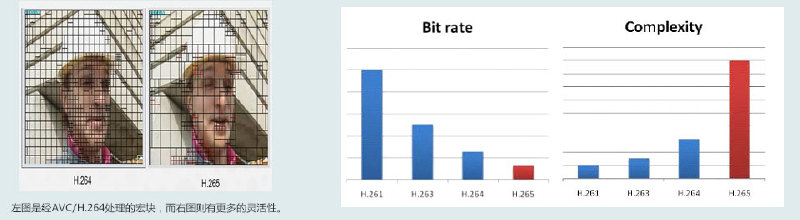

H.265正从以下几个方面向着“更好的压缩”迈进。

图像分区

　　H.265将图像划分为“树编码单元（coding tree blocks, CTU）”，而不是像H.264那样的16×16的宏块。根据不同的编码设置，树编码块的尺寸可以被设置为64×64或有限的32×32或16×16。很多研究都展示出更大的树编码块可以提供更高的压缩效率（同样也需要更高的编码速度）。每个树编码块可以被递归分割，利用四叉树结构，分割为32×32、16×16、8×8的子区域，下图就是一个64×64树编码块的分区示例。每个图像进一步被区分为特殊的树编码块组，称之为切割（Slices）和拼贴（Tiles）。编码树单元是H.264的基本编码单位，如同H.264的宏块。编码树单元可向下分区编码单元（Coding Unit，CU）、预测单元（Prediction Unit，PU）及转换单元（Transform Unit，TU）。

　　每个编码树单元内包含1个亮度与2个色度编码树块，以及记录额外信息的语法元素。一般来说影片大多是以YUV 4:2:0色彩采样进行压缩，因此以16 x 16的编码树单元为例，其中会包含1个16 x 16的亮度编码树区块，以及2个8 x 8的色度编码树区块。

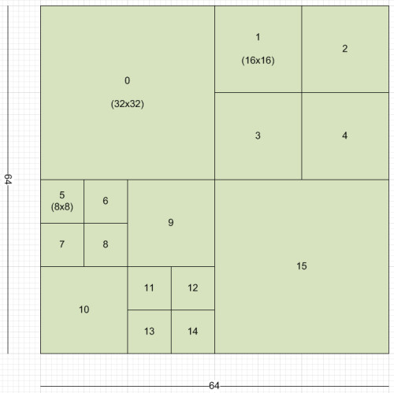

编码单元是H.265基本的预测单元。通常，较小的编码单元被用在细节区域（例如边界等），而较大的编码单元被用在可预测的平面区域。

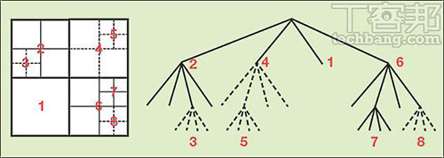

**转换尺寸**

　　每个编码单元可以四叉树的方式递归分割为转换单元。与H.264主要以4×4转换，偶尔以8×8转换所不同的是，H.265有若干种转换尺寸：32×32、16×16、8×8和4×4。从数学的角度来看，更大的转换单元可以更好地编码静态信号，而更小的转换单元可以更好地编码更小的“脉冲”信号。

**预测单元**

　　在转换和量化之前，首先是预测阶段（包括帧内预测和帧间预测）。

　　一个编码单元可以使用以下八种预测模式中的一种进行预测。

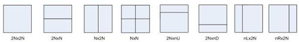

即使一个编码单元包含一个、两个或四个预测单元，也可以使用专门的帧间或帧内预测技术对其进行预测，此外内编码的编码单元只能使用2N×2N或N×N的平方划分。间编码的编码单元可以使用平方和非对称的方式划分。

　　帧内预测：HEVC有35个不同的帧内预测模式（包括9个AVC里已有的），包括DC模式、平面（Planar）模式和33个方向的模式。帧内预测可以遵循变换单元的分割树，所以预测模式可以应用于4×4、8×8、16×16和32×32的变换单元。

帧间预测：针对运动向量预测，H.265有两个参考表：L0和L1。每一个都拥有16个参照项，但是唯一图片的最大数量是8。H.265运动估计要比H.264更加复杂。它使用列表索引，有两个主要的预测模式：合并和高级运动向量（Merge and Advanced MV.）。

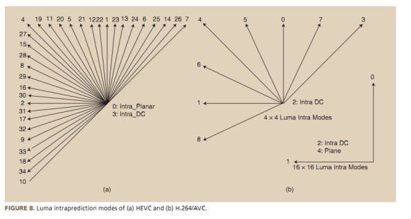

　　在编码的过程，预测单元是进行预测的基本单元，变换单元是进行变换和量化的基本单元。这三个单元的分离，使得变换、预测和编码各个处理环节更加灵活，

**去块化**

　　与H.264在4×4块上实现去块化所不同的是，HEVC的只能在8×8网格上实现去块。这就能允许去块的并行处理（没有滤波器重叠）。首先去块的是画面里的所有垂直边缘，紧接着是所有水平边缘。与H.264采用一样的滤波器。

　　采样点自适应偏移（Sample Adaptive Offset）

　　去块之后还有第二个可选的滤波器，叫做采样点自适应偏移。它类似于去块滤波器，应用在预测循环里，结果存储在参考帧列表里。这个滤波器的目标是修订错误预测、编码漂移等，并应用自适应进行偏移。

**并行处理**

　　由于HEVC的解码要比AVC复杂很多，所以一些技术已经允许实现并行解码。最重要的为拼贴和波前（Tiles and Wavefront）。图像被分成树编码单元的矩形网格（Tiles）。当前芯片架构已经从单核性能逐渐往多核并行方向发展，因此为了适应并行化程度非常高的芯片实现， H.265 引入了很多并行运算的优化思路。

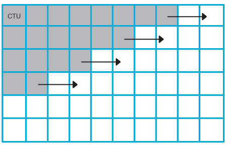

总而言之，HEVC将传统基于块的视频编码模式推向更高的效率水平，总结一下就是：

　　-可变量的尺寸转换（从4×4 到32×32）

　　-四叉树结构的预测区域（从64×64到4×4）

　　-基于候选清单的运动向量预测。

　　-多种帧内预测模式。

　　-更精准的运动补偿滤波器。

　　-优化的去块、采样点自适应偏移滤波器等。

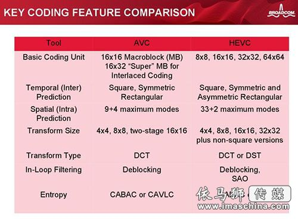关键编码特征比较

与之前从H.261到H.264的其他标准相比，H.265的显著改善不仅表现在帧间压缩领域，还表现在帧内压缩方面。由于可变量的尺寸转换，H.265在块压缩方面有很大的改善，但是增加压缩效率的同时也带来了一些新挑战。

　　视频编码是一个复杂的问题，对于内容的依赖性很高。众所周知，有静态背景的和高亮的低动态场景可以比高动态、黑场的图片进行更多的压缩。所以对于像H.264这样的现代化编解码器来说首要解决的是最困难的场景/情境。例如，有细节的关键帧、高动态的“勾边（crisp）”图像、黑暗区域的慢动态、噪声/纹理等。

　　H.265在帧内编码方面效率更高，所以细节区域可以被编码得更好，在平滑区域和渐变区域也是如此。与H.264相比，H.265的运动估计和压缩更有效，而且在伪影出现前可以在更低的比特率上操作。好消息是，H.265产生的伪影更加“平滑”，质量的降低也非常协调，即便对非常激进的分辨率/比特率编码时，也观感良好。

　　然而，正如硬币的两面，当处理黑暗区域的慢动态和噪声/纹理两种问题时，H.265的优势也会变成弱势。黑暗区域和噪声/纹理要求更精确的高频保留和更小的色阶变化。这通常被称之为编码的心理优化。

　　由于H.264使用小的转换，可以轻松将量化误差变成特征/细节，虽然与原始内容不同，但是感觉上“近似”。接近原生频率范围的误差生成可以通过小的边界转换来阻止，因此也更加可控。而更大转换的H.265要使用这种方式则会更加复杂。

　　H.265编码视频的存储依然是个问题，即使蓝光光盘协会正在寻求一个能够在蓝光光盘上存储4K视频的解决方案。只有至少达到100GB容量的光碟才能存储H.264编码的蓝光4K电影。而另一方面，即使H.265编码和芯片部件已经准备就绪，但是仍然缺少支持4K内容的存储和重放解决方案，并且能够兼容现有的蓝光标准。这也是H.265发展中的一个主要挑战。

当你考虑“只是在普通互联网上传输4K内容，还是要实现最好的图像质量”之时，就要先厘清“更多的压缩”和“更好的压缩”这两个概念。如果只是更多的压缩，4K和超高清不一定要保证比今天的1080p或HD做到更好的图片质量。更好的压缩则意味着更聪明的压缩，面对同样的原始素材，更好的压缩会以更好的方式，在不牺牲质量的情况下令数据量减少。更多的压缩很容易，而更好的压缩需要更多的思考和更好的技术，通过更智能的算法来处理图像，在维持质量的同时保持更低的比特率，这正是H.265所要做的。

　　如何实现更好的压缩，举例来讲，我们通常会发现在很多的图像素材里，如视像会议或者电影的很多场景中，每一帧上的大部分内容并没有改变太多，视像会议中一般只有讲话者的头在动(甚至只有嘴唇在动)，而背景一般是不动的，在这种情况下，我们的做法不是对每一帧的每一个像素编码，而是对最初的帧编码，然后仅对发生改变的部分进行编码。

在H.265大步向前的同时，谷歌VP8的继任者VP9也已推出，同样在VP8的基础上号称编码效率提高50%，支持8K内容。VP9是一个开源和免费的规格，是WebM架构的一部分。谷歌已经在Chrome浏览器和YouTube中整合支持VP9。

　　与H.265在表面上类似，它同样可以抓取64×64个超级块。但265不同的是，它不一定是平方形式的，所以它可以以64×32或4×8的块来采样，实现更大的效益。但另一方面，它只有10个预测模式来重建它们。

　　两者都很大程度上简化了现有这些格式，尽管实现了相近的文件尺寸，有初步的报告认为，H.265有更高的图像质量，而VP9对于流媒体来说更加可靠。H.265更大的预测模型实现了边缘可视化，而VP9实施更严格的编码规则，似乎可以让流媒体更加连贯和可靠。

　　H.265与VP9的比较有一点类似于HDMI与DisplayPort的比较。后者以版权免费的方式去争取一席空间，但是前者的无处不在的应用意味着它会有更广泛的行业支持。这也是之前H.264轻松打败VP8的原因。

　　与此同时，第三个压缩格式也在规划之中，Xiph.Org基金会开发了“Daala”，虽然它还比较遥远，但是Xiph称其将是性能超越H.265和VP9的新一代规格。

高像素数量导致需要更复杂的编解码器来最小化带宽需求。持续连接PC或TV，平滑处理4K信号的最小码流是20Mbit/s，例如Netflix要求用户的互联网连接至少提供持续的25Mbit/s带宽量。20到25Mbit/s代表带宽的巨大改善，原生的、非压缩的4K视频需要在60Mbit/s的带宽上才会有好的表现。

　　对于大多数的行业应用来说，H.265就是解决这一问题的答案之一，但是也要付出一定代价：显著增加的算法复杂性据说需要10倍目前2K部署所用H.264编解码器的计算能力来支撑，而提供这种能力所需的硅也远非一个简单的商品条目。

　　很多制造商希望在上游芯片和IC技术供应商的努力之下，解决成本和功能不平衡的问题，让H.265快速取代H264。就目前来看，H.265在广电领域已经有比较好的发展，但是否也会成为专业应用领域的主流规范还存有疑问。因为安防监控领域等专业领域不仅受制于上述挑战，而且还要看终端用户。对于项目化的专业用户和需要监控的一般消费者而言，平安城市、交通检测和银行监控这类专业用户需要更加稳定和可靠的系统。他们中大多数已经在使用现有的技术，对于是否采用H.265还心存犹豫，这就需要更长的验证周期。

　　另一方面，中小企业和家庭、商店用户等消费者需要低安装成本，因此更加倾向于采用新技术。基于这个原因，H.265可能首先在中小企业应用中获得成功，并在消费者市场获得认可。如果H.265标准快速成熟，其压缩效率比H.264提升50%，它就能够节省20%的投资，保证更高的性能和更替的网络和系统建设成本。