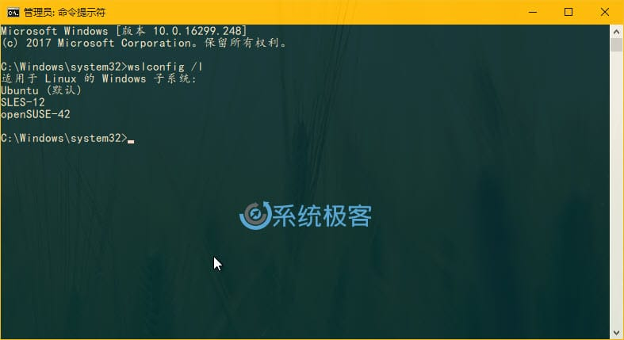
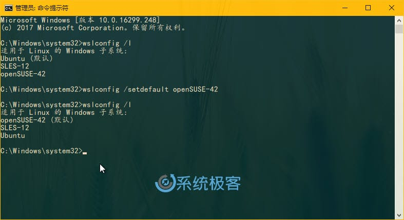
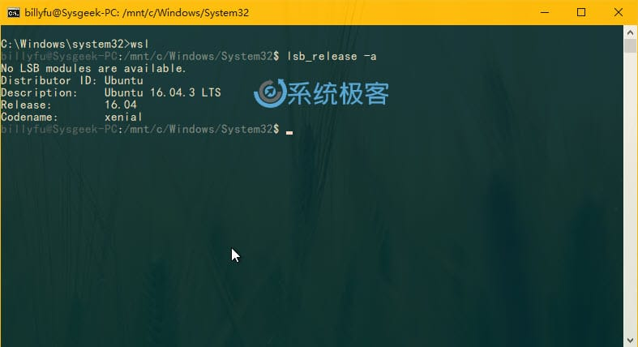
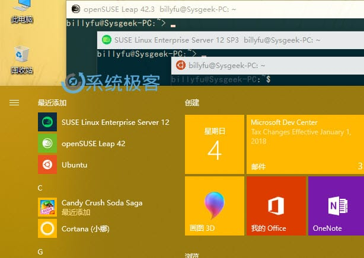
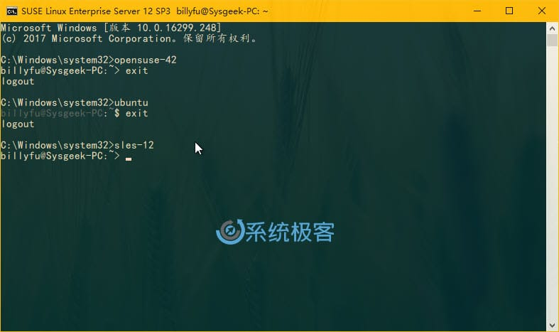
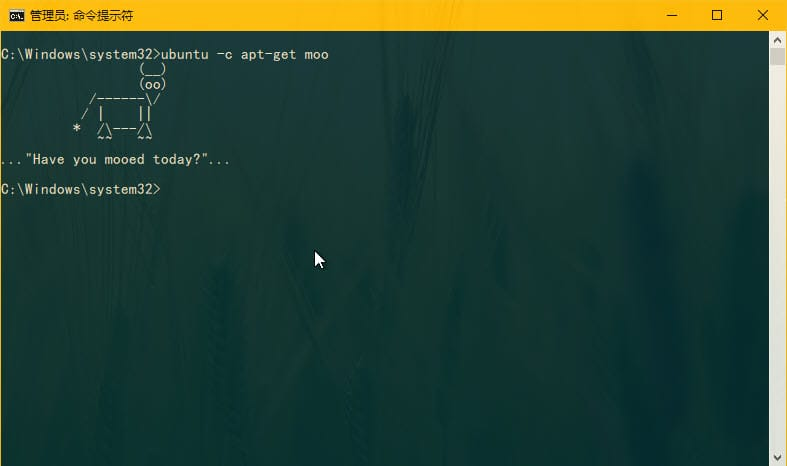

# WSL默认Linux版本

在 Windows 10 中安装好不同 Linux 发行版后就可以立即运行多个 Linux 环境。但当你使用 Wsl.exe 或 Bash.exe 命令来启动 Shell 时，或者从 Windows 10 的其它位置运行 wsl [command] 或 bash -c [command] 命令时，WSL 将使用默认的 Linux 环境，这也就是为什么推荐大家在安装多个 Linux 发行版后要设置默认环境的主要原因。

## Windows 10如何设置默认Linux发行版

使用 wslconfig.exe 命令行工具可以直接管理 Windows Subsystem for Linux（WSL）默认运行的 Linux 发行版。

> 该命令可以直接在「命令提示符」和 Windows PowerShell 中使用。

要查看当前 Windows 10 PC 中已安装的 Linux 发行版，可以执行如下命令：

```
wslconfig /l
```



在返回结果中以（默认）结尾标示出的即为当前系统的默认 Linux 环境。

要更改默认的 Linux 发行版，请运行以下命令，其中 Name 是 Linux 发行版的名称：

```
wslconfig /setdefault Name
```

例如要将我默认环境由 Ubuntu 切换为 openSUSE Leap 42 由可以执行如下命令：

```
wslconfig /setdefault openSUSE-42
```



设置好之后当你再运行 wsl 或 bash 命令时，则会打开已选择好的 Linux 发行版。当使用 wsl [command] 或 bash -c [command] 运行单个命令时，也会使用默认的 Linux 发行版。



## 如何运行多个Linux发行版

在 Windows 10 中安装好多套 Linux 发行版之后，即便没将它设置为默认的 Linux 环境，也可以启动使用。例如，用户可以直接在「开始」菜单中找到启动 Ubuntu、openSUSE Leap 和 SUSE Linux Enterprise Server 系统的快捷方式，并同时运行三套独立的环境。



如果你没在 Microsoft Store 中选择将 Linux 发行版的快捷方式固定到「开始」菜单，也只需要使用其命令名称即可从命令行或快捷方式启动 Linux 发行版。以下启动三个 Linux 发行版所需的命令：

- Ubuntu: ubuntu
- openSUSE Leap 42: opensuse-42
- SUSE Linux Enterprise Server 12: sles-12

例如，即使 Ubuntu 是你的默认环境，仍然可以通过运行 opensuse-42 命令从任何地方启动 openSUSE。



以上指定 Linux 发行版本的快捷命令也可以使用与 bash.exe 一样的 -c 开关，只需使用下面的命令结果即可：

```
distro-command -c command
```

其中 distro-command 与用于启动 Linu x发行版的命令相同，command 是要运行的 Linux 命令。例如：

