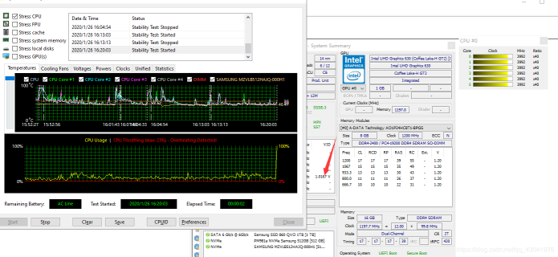

# XTU 设置教程 自动化 睡眠 休眠 

## 原理

先将XTU服务改为 `自动运行` 而不是 `自动运行（延迟）`


#XTU查看降压参数id代码: `powershell` 运行


```shell
&'C:\Program Files (x86)\Intel\Intel(R) Extreme Tuning Utility\Client\XTUCli.exe' -i all
```


`Kill_XTU_Service.bat`


> 这个bat会在每次系统休眠或睡眠时启动
> 把xtu的GUI app跟service关掉
> 作用是防止在系统关机过低电压时offset给cpu造成错误
> 这样可以防止休眠或睡眠失败直接重开机


`XTU_cli_1.bat` 跟 `XTU_cli_2.bat`


这两个会在系统从休眠或睡眠唤醒时启动


两个档案除了降压数值以外是一样的


用两个降压设定来解决xtu显示有降但是实际没降的情况


`xml`


任务计划程序


`XTU_cli_1.bat` 跟 `XTU_cli_2.bat`会隔一分钟启动


这样电压设定就一定会改变

xtu就不会显示有降 实际没降


## 确认/验证您的降压没有持续


如果您不在乎，并想直接转到有关如何正确设置降压以使其即使在恢复后也能正常工作的指南，则可以跳过本节。这仅对当前通过脚本进行降压设置的用户有用。


1. 启动`HWInfo`或XTU并监视系统空闲时报告的最低核心电压。对于i5，该值应约为0.6 + V。
2. 启动XTU应用并施加降压（假设内核上为-100mV）
3. 空转时监视`HWInfo`或XTU中的核心电压。本质上，该数字应比步骤1中的数字低100mV。这证明了正确施加了降压
4. 现在休眠系统，然后恢复它
5. 重复步骤1。您会发现，即使XTU和HWInfo“认为”施加了降压，所报告的CPU核心电压仍在0.6 + V范围内（对于i5），表示未施加降压。“重新施加”降压的唯一方法是进入XTU应用程序并选择一个不同的UV电压，然后施加它。


## 正确设置降压的指南


脚本/任务所做的主要事情如下：


1. `Kill_XTU_Service.bat`每次使系统进入睡眠/休眠状态时都会由任务启动。这将杀死性能程序（XTU GUI应用程序）以及XTU服务。之所以需要这样做，是因为如果不将其杀死，恢复将导致完全重启。
2. `XTU.bat`-这些是适用略有不同`undervolts`的CPU，GPU和高速缓存相同的批处理文件。每当系统从睡眠/休眠状态恢复时，它们都是通过计划任务启动的。批处理文件将启动XTU服务，等待几秒钟，然后运行两个批处理文件。
3. 计划任务（XML文件）被设置为在适当的时间启动上述批处理文件。`XTU.bat`分别在15S的延迟后启动。如果批处理文件的电压设置过高，这将给您时间手动停止或取消这些任务。


因为这两个降压批处理文件都已运行，所以两个“降压”批处理文件之一将被“占用”并应用，因为它与XTU服务仍认为处于活动状态的以前的XTU设置不同。这与连续的恢复保持交替，以确保在从休眠状态恢复后的1-2分钟内施加降压。


**文件和安装**


1. 将所有脚本文件放在以下位置：`C:\Program Files (x86)\Intel\Intel(R) Extreme Tuning Utility\`。如果选择其他位置，则需要在导入后相应地编辑XML文件或计划的任务。
3. 编辑批处理文件，然后将CPU，GPU和缓存降压设置设置为适合您的数字。这些数字必须精确到批处理文件中的小数位数。最初设置降压和压力测试以确保稳定性时，您可以从XTU GUI应用程序中找出正确的数字。
4. 从任务计划程序中导入每个XML任务。
5. 脚本：Kill XTU Service.xml

```xml
<?xml version="1.0" encoding="UTF-16"?>
<Task version="1.4" xmlns="http://schemas.microsoft.com/windows/2004/02/mit/task">
  <RegistrationInfo>
    <Date>2015-11-07T01:07:23.873461</Date>
    <Author>CoveredInBees</Author>
    <URI>\Kill XTU Service</URI>
  </RegistrationInfo>
  <Triggers>
    <EventTrigger>
      <Enabled>true</Enabled>
      <Subscription>&lt;QueryList&gt;&lt;Query Id="0" Path="System"&gt;&lt;Select Path="System"&gt;*[System[Provider[@Name='Microsoft-Windows-Kernel-Power'] and EventID=506]]&lt;/Select&gt;&lt;/Query&gt;&lt;/QueryList&gt;</Subscription>
    </EventTrigger>
  </Triggers>
  <Principals>
    <Principal id="Author">
      <UserId>S-1-5-21-914081481-3165072986-1236086892-1001</UserId>
      <LogonType>Password</LogonType>
      <RunLevel>HighestAvailable</RunLevel>
    </Principal>
  </Principals>
  <Settings>
    <MultipleInstancesPolicy>IgnoreNew</MultipleInstancesPolicy>
    <DisallowStartIfOnBatteries>false</DisallowStartIfOnBatteries>
    <StopIfGoingOnBatteries>true</StopIfGoingOnBatteries>
    <AllowHardTerminate>true</AllowHardTerminate>
    <StartWhenAvailable>false</StartWhenAvailable>
    <RunOnlyIfNetworkAvailable>false</RunOnlyIfNetworkAvailable>
    <IdleSettings>
      <StopOnIdleEnd>true</StopOnIdleEnd>
      <RestartOnIdle>false</RestartOnIdle>
    </IdleSettings>
    <AllowStartOnDemand>true</AllowStartOnDemand>
    <Enabled>true</Enabled>
    <Hidden>false</Hidden>
    <RunOnlyIfIdle>false</RunOnlyIfIdle>
    <DisallowStartOnRemoteAppSession>false</DisallowStartOnRemoteAppSession>
    <UseUnifiedSchedulingEngine>true</UseUnifiedSchedulingEngine>
    <WakeToRun>false</WakeToRun>
    <ExecutionTimeLimit>PT1H</ExecutionTimeLimit>
    <Priority>7</Priority>
  </Settings>
  <Actions Context="Author">
    <Exec>
      <Command>C:\Program Files (x86)\Intel\Intel(R) Extreme Tuning Utility\Kill_XTU_Service.bat</Command>
    </Exec>
  </Actions>
</Task>
```

6. 脚本：Kill_XTU_Service.bat

```shell
@echo off
taskkill /F /IM "perftune.exe"
sc stop XTU3SERVICE
exit
```

7. 脚本：XTU.xml

```xml
<?xml version="1.0" encoding="UTF-16"?>
<Task version="1.4" xmlns="http://schemas.microsoft.com/windows/2004/02/mit/task">
  <RegistrationInfo>
    <Date>2020-02-14T04:32:37.066186</Date>
    <Author>CoveredInBees</Author>
    <Description>Run Batch script to set XTU parameters for undervolt</Description>
    <URI>\XTU</URI>
  </RegistrationInfo>
  <Triggers>
    <EventTrigger>
      <ExecutionTimeLimit>PT30M</ExecutionTimeLimit>
      <Enabled>true</Enabled>
      <Subscription>&lt;QueryList&gt;&lt;Query Id="0" Path="System"&gt;&lt;Select Path="System"&gt;*[System[Provider[@Name='Microsoft-Windows-Power-Troubleshooter'] and EventID=1]]&lt;/Select&gt;&lt;/Query&gt;&lt;/QueryList&gt;</Subscription>
      <Delay>PT15S</Delay>
    </EventTrigger>
  </Triggers>
  <Principals>
    <Principal id="Author">
      <UserId>S-1-5-21-914081481-3165072986-1236086892-1001</UserId>
      <LogonType>Password</LogonType>
      <RunLevel>HighestAvailable</RunLevel>
    </Principal>
  </Principals>
  <Settings>
    <MultipleInstancesPolicy>IgnoreNew</MultipleInstancesPolicy>
    <DisallowStartIfOnBatteries>false</DisallowStartIfOnBatteries>
    <StopIfGoingOnBatteries>true</StopIfGoingOnBatteries>
    <AllowHardTerminate>true</AllowHardTerminate>
    <StartWhenAvailable>true</StartWhenAvailable>
    <RunOnlyIfNetworkAvailable>false</RunOnlyIfNetworkAvailable>
    <IdleSettings>
      <StopOnIdleEnd>true</StopOnIdleEnd>
      <RestartOnIdle>false</RestartOnIdle>
    </IdleSettings>
    <AllowStartOnDemand>true</AllowStartOnDemand>
    <Enabled>true</Enabled>
    <Hidden>true</Hidden>
    <RunOnlyIfIdle>false</RunOnlyIfIdle>
    <DisallowStartOnRemoteAppSession>false</DisallowStartOnRemoteAppSession>
    <UseUnifiedSchedulingEngine>true</UseUnifiedSchedulingEngine>
    <WakeToRun>false</WakeToRun>
    <ExecutionTimeLimit>PT1H</ExecutionTimeLimit>
    <Priority>7</Priority>
    <RestartOnFailure>
      <Interval>PT1M</Interval>
      <Count>3</Count>
    </RestartOnFailure>
  </Settings>
  <Actions Context="Author">
    <Exec>
      <Command>"C:\Program Files (x86)\Intel\Intel(R) Extreme Tuning Utility\XTU.bat"</Command>
    </Exec>
  </Actions>
</Task>
```


9. 脚本：XTU.bat

```shell
@echo off
taskkill /F /IM "perftune.exe"
timeout 1
sc stop XTU3SERVICE
timeout 1
sc start XTU3SERVICE
timeout 1
rem the frist time to editor
"C:\Program Files (x86)\Intel\Intel(R) Extreme Tuning Utility\Client\XTUCli.exe" -t -id 48 -v 45.00000000000
"C:\Program Files (x86)\Intel\Intel(R) Extreme Tuning Utility\Client\XTUCli.exe" -t -id 47 -v 90.00000000000
"C:\Program Files (x86)\Intel\Intel(R) Extreme Tuning Utility\Client\XTUCli.exe" -t -id 49 -v 1
"C:\Program Files (x86)\Intel\Intel(R) Extreme Tuning Utility\Client\XTUCli.exe" -t -id 66 -v 28
"C:\Program Files (x86)\Intel\Intel(R) Extreme Tuning Utility\Client\XTUCli.exe" -t -id 34 -v 0.00000000000
"C:\Program Files (x86)\Intel\Intel(R) Extreme Tuning Utility\Client\XTUCli.exe" -t -id 102 -v 140.00000000000
"C:\Program Files (x86)\Intel\Intel(R) Extreme Tuning Utility\Client\XTUCli.exe" -t -id 83 -v 0.00000000000
"C:\Program Files (x86)\Intel\Intel(R) Extreme Tuning Utility\Client\XTUCli.exe" -t -id 104 -v 30.00000000000
"C:\Program Files (x86)\Intel\Intel(R) Extreme Tuning Utility\Client\XTUCli.exe" -t -id 79 -v 0.00000000000
"C:\Program Files (x86)\Intel\Intel(R) Extreme Tuning Utility\Client\XTUCli.exe" -t -id 106 -v 140.00000000000
"C:\Program Files (x86)\Intel\Intel(R) Extreme Tuning Utility\Client\XTUCli.exe" -t -id 105 -v 30.00000000000
"C:\Program Files (x86)\Intel\Intel(R) Extreme Tuning Utility\Client\XTUCli.exe" -t -id 100 -v 0.00000000000
"C:\Program Files (x86)\Intel\Intel(R) Extreme Tuning Utility\Client\XTUCli.exe" -t -id 114 -v 0.00000000000
timeout 15
taskkill /F /IM "perftune.exe"
rem sc stop XTU3SERVICE
timeout 1
sc start XTU3SERVICE
timeout 1
rem the second time to editor
"C:\Program Files (x86)\Intel\Intel(R) Extreme Tuning Utility\Client\XTUCli.exe" -t -id 48 -v 48.00000000000
"C:\Program Files (x86)\Intel\Intel(R) Extreme Tuning Utility\Client\XTUCli.exe" -t -id 47 -v 60.00000000000
"C:\Program Files (x86)\Intel\Intel(R) Extreme Tuning Utility\Client\XTUCli.exe" -t -id 49 -v 1
"C:\Program Files (x86)\Intel\Intel(R) Extreme Tuning Utility\Client\XTUCli.exe" -t -id 66 -v 16
"C:\Program Files (x86)\Intel\Intel(R) Extreme Tuning Utility\Client\XTUCli.exe" -t -id 34 -v -30.00000000000
"C:\Program Files (x86)\Intel\Intel(R) Extreme Tuning Utility\Client\XTUCli.exe" -t -id 102 -v 85.00000000000
"C:\Program Files (x86)\Intel\Intel(R) Extreme Tuning Utility\Client\XTUCli.exe" -t -id 83 -v -30.00000000000
"C:\Program Files (x86)\Intel\Intel(R) Extreme Tuning Utility\Client\XTUCli.exe" -t -id 104 -v 22.00000000000
"C:\Program Files (x86)\Intel\Intel(R) Extreme Tuning Utility\Client\XTUCli.exe" -t -id 79 -v -30.00000000000
"C:\Program Files (x86)\Intel\Intel(R) Extreme Tuning Utility\Client\XTUCli.exe" -t -id 106 -v 85.00000000000
"C:\Program Files (x86)\Intel\Intel(R) Extreme Tuning Utility\Client\XTUCli.exe" -t -id 105 -v 22.00000000000
"C:\Program Files (x86)\Intel\Intel(R) Extreme Tuning Utility\Client\XTUCli.exe" -t -id 100 -v -30.00000000000
"C:\Program Files (x86)\Intel\Intel(R) Extreme Tuning Utility\Client\XTUCli.exe" -t -id 114 -v 3.00000000000
exit
```


引用：
> 1.  [https://www.reddit.com/r/Surface/comments/3y1pk2/psa_your_undervolt_is_likely_not_sticking/](https://www.reddit.com/r/Surface/comments/3y1pk2/psa_your_undervolt_is_likely_not_sticking/)
> 2.  [https://www.ptt.cc/bbs/WindowsPhone/M.1450937658.A.233.html](https://www.ptt.cc/bbs/WindowsPhone/M.1450937658.A.233.html)

