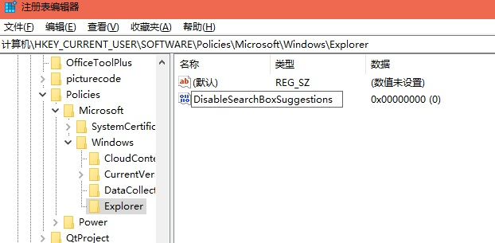
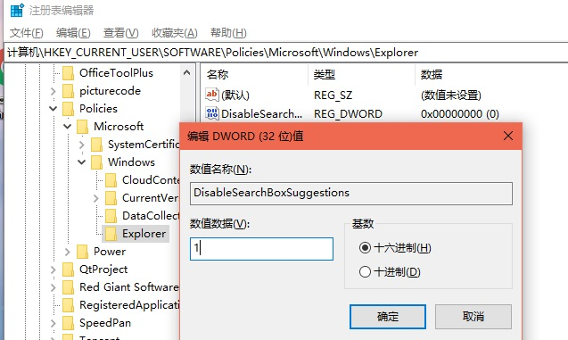

# 搜索中禁用 Bing

## 在 Windows 10 开始菜单和搜索中禁用必应

1. 创建一个注册表备份。

2. 通过在 Windows 搜索中键入 `regedit` 或通过其他方式打开注册表编辑器。

3. 按下 Enter。

4. 在注册表编辑器中，导航到以下位置：

   ```shell
   HKEY_CURRENT_USER\SOFTWARE\Policies\Microsoft\Windows\Explorer
   ```

5. 如果 "Explorer" 文件夹不存在，则请右键单击 Windows 文件夹并创建该项。 

   

6. 默认情况下，Explorer 文件夹为空，因此需要在右侧创建新的 DWORD（32 位）值——DisableSearchBoxSuggestions

   

7. 将值设置为 "1"，以禁用 "Bing" 的搜索和广告。

   

8. 关闭注册表编辑器并重新启动电脑或手动结束任务管理器中的 "搜索" 进程。

9. 如果希望恢复 Bing 搜索，请再次打开注册表编辑器并删除上述注册表值。