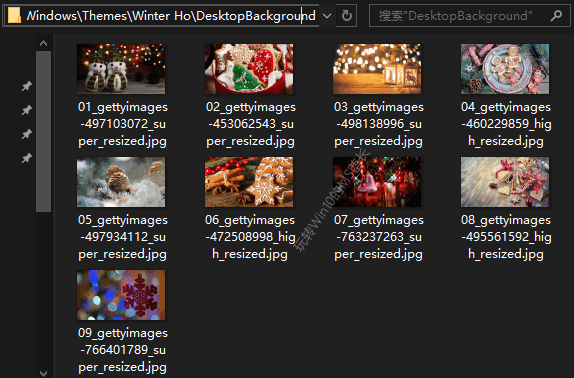

# win10主题的壁纸保存位置

> C:\Users\你的用户名\AppData\Local\Microsoft\Windows\Themes

在Themes目录下即可看到你启用过的主题目录。例如《Winter Holiday Glow》主题的目录 Winter Ho 。

打开 Winter Ho 目录下的 DesktopBackground 目录，就可以看到《Winter Holiday Glow》主题所包含的9 张壁纸了。如图：

