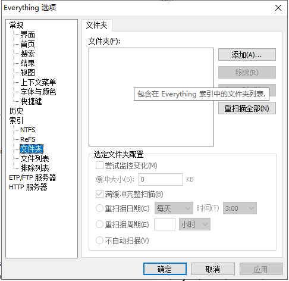
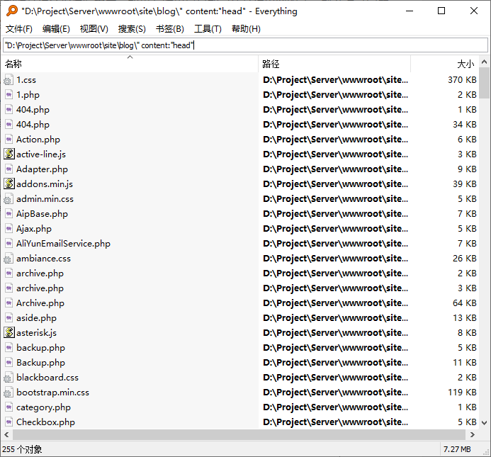

# [如何用好Everything软件的搜索功能?](https://www.everythingsearch.cn/484.html)

Everything是一款非常优秀的文件搜索软件，但是普通用户只是通过它来进行文件名的搜索。其实该软件还隐藏了很多的搜索功能，用户只要熟练的使用这些功能，就可以快速查询到自己需要的文件内容。

## 搜索非NTFS格式文件

Everything软件在默认情况下只能对NTFS格式的文件进行搜索，但是由于现在的U盘、存储卡等设备都采用的是FAT32、exFAT这样的格式，因此在默认状态下就无法对这些文件进行搜索。其实只需要经过相关的设置，就能很方便地解决这一难题。

首先运行最新版本的Everything，点击“工具”菜单中的“选项”命令。在弹出的设置窗口点击左侧的“索引”项目下的“文件夹”命令，接着在右侧窗口中点击“添加”按钮，在弹出的列表中选择相关设备的磁盘盘符即可（图1）。

设置完成以后，点击“应用”按钮退出设置窗口，从此以后Everything软件就可以对FAT32、NTFS、exFAT格式的文件进行搜索。

## 对文件中的内容进行搜索

Everything软件默认只能对文件名称进行搜索，如果有时用户只能记住文件内容的话，那么通过它就不能完成搜索操作。其实Everything软件里面带有一个名为“content:”的参数，通过这个参数用户就可以进行文件内容的搜索操作。

由于现在用户经常使用ANSI和UNICODE两种不同的编码方式标准，因此这个参数的搜索规则是：”搜索路径” ansicontent:”搜索关键词”，或者”搜索路径” utf16content:”搜索关键词”。比如我们要在E盘的ABC这个文件夹目录中搜索“黑客”这个关键词，那么就输入”E:abc” utf16content:”黑客”这一行命令，或者”E:abc” ansicontent:”黑客”这一行命令即可（图2）。

需要提醒大家的是，无论是搜索路径还是关键词，都必须使用英文的双引号进行设置操作。