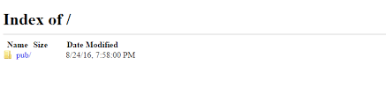
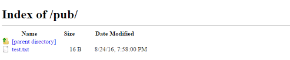

# Ubuntu vsftpd搭建和匿名下载

FTP，短为文件传输协议，是曾经广泛地用于在客户端和服务器之间移动文件的网络协议。它已经被取代了传送文件的速度更快，更安全，更方便的方式。许多休闲网民希望下载...

## 介绍

FTP，文件传输协议的简称，是一种广泛用于在客户端和服务器之间移动文件的网络协议。 它已经被更快，更安全，更方便的传递文件的方式所取代。 许多休闲网民希望直接从他们的Web浏览器下载`https`和命令行用户更有可能使用的安全协议，如`scp`或[SFTP](https://www.howtoing.com/how-to-use-sftp-to-securely-transfer-files-with-a-remote-server/) 。

FTP通常用于支持具有非常特定需求的传统应用程序和工作流程。 如果您可以选择使用什么协议，请考虑探索更现代的选项。 当你需要FTP时，vsftpd是一个很好的选择。 vsftpd针对安全性，性能和稳定性进行了优化，针对其他FTP服务器中出现的许多安全问题提供了强大的保护，是许多Linux发行版的默认设置。

在本教程中，我们将向您展示如何为匿名的FTP下载站点设置vsftpd，以便广泛分发公共文件。 而不是用FTP来管理这些文件，本地用户使用`sudo`权限预计将使用`scp` ， `sFTP` ，或自己选择的任何其他安全协议传输和维护文件。

## 先决条件

要遵循本教程，您将需要：

- **一个Ubuntu 服务器与非root用户`sudo`权限** ：您可以了解更多关于如何建立一个用户利用这些权限在我们[与Ubuntu 的初始服务器安装](https://www.howtoing.com/initial-server-setup-with-ubuntu-16-04/)指南。

一旦你有了服务器，你就可以开始。

### 环境，先关防火墙

------

```bash
systemctl status firewalld
systemctl disable firewalld
systemctl stop firewalld
setenforce 0
```

### 第1步 - 安装启用vsftpd

我们将通过更新我们的软件包列表和安装启动`vsftpd`守护进程：

```
sudo apt update
sudo apt install vsftpd
sudo systemctl start vsftpd
sudo systemctl enable vsftpd
```

### 第2步 -  **创建用户（可用已有用户登录）** 和 防火墙

```bash
sudo useradd -m test
```


首先檢查目前防火牆是否已經開啟, 執行以下指令:

```bash
sudo ufw status
```


防火牆預設是關閉, 會輸出:

`Status: inactive`

如果防火牆已經開啟了, 會輸出 active:

`Status: active`

如果需要關閉防火牆, 執行以下指令:

`Disabling the Firewall`

```bash
sudo ufw disable
Firewall stopped and disabled on system startup
```


關閉防火牆後, 要再次開啟防火牆, 執行以下指令開啟:

```bash
sudo ufw enable
```


這時會出現以下詢問句:

```bash
Command may disrupt existing ssh connections. Proceed with operation (y|n)?
```


按 “y” 確認後, 防火牆會開啟, 並有以下輸出:

`Firewall is active and enabled on system startup`

## 第3步 - 为文件准备空间

首先，我们计划在主机上的文件，请使用我们将创建目录`-p`标志创建中间目录。 目录结构将允许您将所有FTP目录保存在一起，稍后添加需要身份验证的其他文件夹：

```bash
sudo mkdir -p /home/ftp/pub
```

接下来，我们将设置目录权限`nobody:nogroup` 。 稍后，我们将配置FTP服务器以将所有文件显示为由ftp用户和组拥有。

```bash
sudo chown nobody:nogroup /home/ftp/pub
```

最后，我们将在目录中创建一个文件以供稍后测试。

```bash
 echo "vsftpd test file" | sudo tee /home/ftp/pub/test.txt
```

有了这个示例文件，我们准备好配置vsftpd守护进程。

## 第4步 - 配置匿名访问

我们建立了用户与`sudo`权限，以保持宽向公众发行的文件。 要做到这一点，我们将配置`vsftpd`允许匿名下载。 我们将期待文件管理员使用`scp` ， `sftp`或任何其他安全的方法来维持文件，所以我们不会允许通过FTP上传文件。

配置文件包含vsftpd的一些配置选项。

我们将从已经设置的更改开始：

```bash
sudo nano /etc/vsftpd.conf
```

找到以下值并对其进行编辑，使它们与以下值匹配：

/etc/vsftpd.conf

```bash
. . .
# Allow anonymous FTP? (Disabled by default).
anonymous_enable=YES
#

We’ll set the local_enable setting to “NO” because we’re not going to allow users with local accounts to upload files via FTP. The comment in the configuration file can be a little confusing, too, because the line is uncommented by default. 
# Uncomment this to allow local users to log in.
local_enable=NO
. . .
```

除了更改现有设置外，我们还将添加一些其他配置。

**注意：**您可以了解全方位的选择`man vsftpd.conf`命令。

将这些设置添加到配置文件。 它们不依赖于顺序，因此您可以将它们放在文件中的任何位置。

```bash
#
# Point users at the directory we created earlier.
anon_root=/home/ftp/
#
# Stop prompting for a password on the command line.
no_anon_password=YES
#
# Show the user and group as ftp:ftp, regardless of the owner.
hide_ids=YES
#
# Limit the range of ports that can be used for passive FTP
pasv_min_port=40000
pasv_max_port=40200
```

或配置文件

```bash
# Example config file /etc/vsftpd.conf
#
# The default compiled in settings are fairly paranoid. This sample file
# loosens things up a bit, to make the ftp daemon more usable.
# Please see vsftpd.conf.5 for all compiled in defaults.
#
# READ THIS: This example file is NOT an exhaustive list of vsftpd options.
# Please read the vsftpd.conf.5 manual page to get a full idea of vsftpd's
# capabilities.
#
#
# Run standalone?  vsftpd can run either from an inetd or as a standalone
# daemon started from an initscript.
listen=NO
#
# This directive enables listening on IPv6 sockets. By default, listening
# on the IPv6 "any" address (::) will accept connections from both IPv6
# and IPv4 clients. It is not necessary to listen on *both* IPv4 and IPv6
# sockets. If you want that (perhaps because you want to listen on specific
# addresses) then you must run two copies of vsftpd with two configuration
# files.
listen_ipv6=YES
#
# Allow anonymous FTP? (Disabled by default).
anonymous_enable=YES
#
# Uncomment this to allow local users to log in.
local_enable=YES
#
# Uncomment this to enable any form of FTP write command.
write_enable=YES
#
# Default umask for local users is 077. You may wish to change this to 022,
# if your users expect that (022 is used by most other ftpd's)
local_umask=022
#
# Uncomment this to allow the anonymous FTP user to upload files. This only
# has an effect if the above global write enable is activated. Also, you will
# obviously need to create a directory writable by the FTP user.
anon_upload_enable=NO
#
# Uncomment this if you want the anonymous FTP user to be able to create
# new directories.
anon_mkdir_write_enable=NO
#
# Activate directory messages - messages given to remote users when they
# go into a certain directory.
dirmessage_enable=YES
#
# If enabled, vsftpd will display directory listings with the time
# in  your  local  time  zone.  The default is to display GMT. The
# times returned by the MDTM FTP command are also affected by this
# option.
use_localtime=YES
#
# Activate logging of uploads/downloads.
xferlog_enable=YES
#
# Make sure PORT transfer connections originate from port 20 (ftp-data).
connect_from_port_20=YES
#
# If you want, you can arrange for uploaded anonymous files to be owned by
# a different user. Note! Using "root" for uploaded files is not
# recommended!
#chown_uploads=YES
#chown_username=whoever
#
# You may override where the log file goes if you like. The default is shown
# below.
xferlog_file=/var/log/vsftpd.log
#
# If you want, you can have your log file in standard ftpd xferlog format.
# Note that the default log file location is /var/log/xferlog in this case.
xferlog_std_format=YES
#
# You may change the default value for timing out an idle session.
#idle_session_timeout=600
#
# You may change the default value for timing out a data connection.
#data_connection_timeout=120
#
# It is recommended that you define on your system a unique user which the
# ftp server can use as a totally isolated and unprivileged user.
#nopriv_user=ftpsecure
#
# Enable this and the server will recognise asynchronous ABOR requests. Not
# recommended for security (the code is non-trivial). Not enabling it,
# however, may confuse older FTP clients.
#async_abor_enable=YES
#
# By default the server will pretend to allow ASCII mode but in fact ignore
# the request. Turn on the below options to have the server actually do ASCII
# mangling on files when in ASCII mode.
# Beware that on some FTP servers, ASCII support allows a denial of service
# attack (DoS) via the command "SIZE /big/file" in ASCII mode. vsftpd
# predicted this attack and has always been safe, reporting the size of the
# raw file.
# ASCII mangling is a horrible feature of the protocol.
#ascii_upload_enable=YES
#ascii_download_enable=YES
#
# You may fully customise the login banner string:
#ftpd_banner=Welcome to blah FTP service.
#
# You may specify a file of disallowed anonymous e-mail addresses. Apparently
# useful for combatting certain DoS attacks.
#deny_email_enable=YES
# (default follows)
#banned_email_file=/etc/vsftpd.banned_emails
#
# You may restrict local users to their home directories.  See the FAQ for
# the possible risks in this before using chroot_local_user or
# chroot_list_enable below.
#chroot_local_user=YES
#
# You may specify an explicit list of local users to chroot() to their home
# directory. If chroot_local_user is YES, then this list becomes a list of
# users to NOT chroot().
# (Warning! chroot'ing can be very dangerous. If using chroot, make sure that
# the user does not have write access to the top level directory within the
# chroot)
chroot_local_user=YES
chroot_list_enable=NO
# (default follows)
chroot_list_file=/etc/vsftpd.chroot_list
#
# You may activate the "-R" option to the builtin ls. This is disabled by
# default to avoid remote users being able to cause excessive I/O on large
# sites. However, some broken FTP clients such as "ncftp" and "mirror" assume
# the presence of the "-R" option, so there is a strong case for enabling it.
#ls_recurse_enable=YES
#
# Customization
#
# Some of vsftpd's settings don't fit the filesystem layout by
# default.
#
# This option should be the name of a directory which is empty.  Also, the
# directory should not be writable by the ftp user. This directory is used
# as a secure chroot() jail at times vsftpd does not require filesystem
# access.
secure_chroot_dir=/var/run/vsftpd/empty
#
# This string is the name of the PAM service vsftpd will use.
pam_service_name=vsftpd
#
# This option specifies the location of the RSA certificate to use for SSL
# encrypted connections.
rsa_cert_file=/etc/ssl/certs/ssl-cert-snakeoil.pem
rsa_private_key_file=/etc/ssl/private/ssl-cert-snakeoil.key
ssl_enable=NO

#
# Uncomment this to indicate that vsftpd use a utf8 filesystem.
#utf8_filesystem=YES

allow_writeable_chroot=YES

#设置匿名用户的登录目录
anon_root=/home/disk1/ftp/pub

#打开匿名用户删除和重命名的权限（如需要，需自己添加）
anon_other_write_enable=NO

#ftp_username=ftpuser
no_anon_password=YES
#userlist_enable=YES
#tcp_wrappers=YES

# Show the user and group as ftp:ftp, regardless of the owner.
hide_ids=YES
#
# Limit the range of ports that can be used for passive FTP
pasv_min_port=40000
pasv_max_port=40200

pasv_enable=Yes

#local_root=/home/disk1/ftp/pub

```


**注：**如果您使用的是UFW，这些设置工作原样。 如果您使用[iptables的](https://www.howtoing.com/iptables-essentials-common-firewall-rules-and-commands/) ，你可能需要添加规则来打开你的指定端口`pasv_min_port`和`pasv_max_port` 。

一旦添加，保存并关闭文件。 然后，使用以下命令重新启动守护程序：

```bash
sudo systemctl restart vsftpd
```

`systemctl`不显示所有服务管理命令的结果，所以如果你想确保你已经成功了，请使用以下命令：

```bash
sudo systemctl status vsftpd
```

如果最后一行说明如下，您已成功：

```bash
OutputAug 17 17:49:10 vsftpd systemd[1]: Starting vsftpd FTP server...
Aug 17 17:49:10 vsftpd systemd[1]: Started vsftpd FTP server.
```

现在我们准备测试我们的工作。

## 第5步 - 测试匿名访问

从网络浏览器输入ftp：//后跟*您的*服务器的IP地址。

FTP：// 203.0.113.0

如果按预期的一切，你应该看到`pub`目录：



你也应该能够点击进入`pub` ，看到`test.txt` ，然后右键单击要保存文件。



您还可以从命令行进行测试，这将提供更多有关您的配置的反馈。 我们将ftp到在被动模式下的服务器上，这是`-p`很多命令行客户标志。 被动模式允许用户避免更改本地防火墙配置，以允许服务器和客户端连接。

**注：**本机Windows命令行FTP客户端， `ftp.exe` ，不支持被动模式的。 Windows用户可能想寻找到另一个Windows FTP客户端，如[WinSCP赋予](https://winscp.net/eng/docs/commandline) 。

```bash
ftp -p 203.0.113.0
```

当提示输入用户名时，您可以输入“ftp”或“anonymous”。 它们是等效的，所以我们将使用较短的“ftp”：

```bash
Connected to 203.0.113.0.
220 (vsftpd 3.0.3)
Name (203.0.113.0:21:sammy): ftp
```

按Enter键后，您应该会收到以下信息：

```bash
Output
230 Login successful.
Remote system type is UNIX.
Using binary mode to transfer files.
ftp>
```

确保被动模式正常工作：

```bash
ls
Output227 Entering Passive Mode (45,55,187,171,156,74).
150 Here comes the directory listing.
drwxr-xr-x    2 ftp      ftp          4096 Aug 17 19:30 pub
226 Directory send OK.
```

由于匿名用户，你应该能够将文件的传输到本地机器上`get`命令：

```bash
cd pub
get test.txt
Outputftp> get test.txt
227 Entering Passive Mode (45,55,187,171,156,73).
150 Opening BINARY mode data connection for test.txt (14 bytes).
226 Transfer complete.
16 bytes received in 0.0121 seconds (1325 bytes/s)
```

此输出表明您已成功下载文件，如果愿意，您可以看一下它在本地文件系统上。

我们还想确保匿名用户不会填充我们的文件系统，所以要测试，我们将右转，尝试将相同的文件放回服务器，但使用一个新的名称：

```bash
put test.txt upload.txt
Output227 Entering Passive Mode (104,236,10,192,168,254).
550 Permission denied.
```

现在我们已经确认了这一点，我们将退出监视器，为下一步做准备：

```bash
bye
```

现在我们已经确认匿名连接正常工作，我们将关注当用户尝试连接时会发生什么。

## 第6步 - 尝试以用户身份连接

您可能还需要确保你*不能*作为一个用户使用本地帐户连接，因为这设置不加密的登录凭据。 当提示您登录时，不要输入“ftp”或“anonymous”，请尝试使用sudo用户：

```bash
ftp -p 203.0.113.0
OutputConnected to 203.0.113.0:21.
220 (vsFTPd 3.0.3)
Name (203.0.113.0:21:your_user)
530 This FTP server is anonymous only.
ftp: Login failed.
ftp>
```

这些测试确认您仅将系统设置为匿名下载。

## 第7步-查看ftp状态，如果开启失败，可能是21端口没开

```bash
sudo service vsftpd status #查看状态
#查看ufw防火墙是否开启，默认不启动；
ufw status   #查看防火墙状态 开启状态status：active
#如果未开启，则开启
ufw enable
#开启21，20端口
ufw allow 21/tcp
ufw allow 20/tcp
```

## 结论

在本教程中，我们介绍了如何仅为匿名下载配置vsftpd。 这使我们能够支持遗留应用程序无法使用更现代的协议或广泛发布的FTP网址，这将是难以更新。 要了解更多关于维护文件， [如何使用SFTP安全传输文件与远程服务器](https://www.howtoing.com/how-to-use-sftp-to-securely-transfer-files-with-a-remote-server/)可以指导你。

