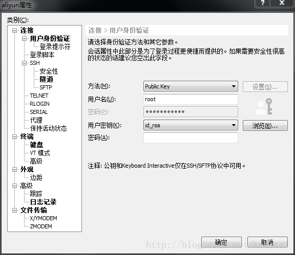

# ssh私钥登录

## 生成公私钥对

我们使用ssh-keygen生成公私钥对，ssh-kengen是安装git时默认安装的组件，在windows上可以通过gitbash使用。

```shell
ssh-keygen -t rsa
ssh-keygen -t dsa
```

`-t`选项用于标识不同的非对称加密类型，回车生成相关文件即可，如果没有特殊需求，默认回车即可。生成的公私钥对默认保存在`~/.ssh/`目录。

```shell
id_dsa      id_dsa.pub  id_rsa      id_rsa.pub
```

公钥是以pub结尾的文件

## 上载公钥到ssh服务器

如果使用RSA加密方式，就上传`id_rsa.pub`，如果使用DSA则上传`id_dsa.pub`，上传到一个临时的目录。
然后将公钥文件中的内容导入`authorized_keys`。

```shell
cat id_rsa.pub >> ~/.ssh/authorized_keys
```

.ssh文件夹 权限700 文件600

## ssh客户端通过私钥登录

### linux

通过指定私钥路径进行登录

```shell
ssh -i ~/.ssh/id_rsa root 192.168.2.22
```

通过配置默认的私钥路径shell

```shell
nano /etc/ssh/ssh_config
#去掉前面的注释即可
IdentityFile ~/.ssh/id_rsa
```

### windows



```shell
#	$OpenBSD: sshd_config,v 1.103 2018/04/09 20:41:22 tj Exp $

# This is the sshd server system-wide configuration file.  See
# sshd_config(5) for more information.

# This sshd was compiled with PATH=/usr/bin:/bin:/usr/sbin:/sbin

# The strategy used for options in the default sshd_config shipped with
# OpenSSH is to specify options with their default value where
# possible, but leave them commented.  Uncommented options override the
# default value.

Port 22
#AddressFamily any
#ListenAddress 0.0.0.0
#ListenAddress ::

#HostKey /etc/ssh/ssh_host_rsa_key
#HostKey /etc/ssh/ssh_host_ecdsa_key
#HostKey /etc/ssh/ssh_host_ed25519_key

# Ciphers and keying
#RekeyLimit default none

# Logging
#SyslogFacility AUTH
#LogLevel INFO

# Authentication:

#LoginGraceTime 2m
PermitRootLogin yes
#StrictModes yes
#MaxAuthTries 6
#MaxSessions 10

PubkeyAuthentication yes

# Expect .ssh/authorized_keys2 to be disregarded by default in future.
#AuthorizedKeysFile	.ssh/authorized_keys .ssh/authorized_keys2

#AuthorizedPrincipalsFile none

#AuthorizedKeysCommand none
#AuthorizedKeysCommandUser nobody

# For this to work you will also need host keys in /etc/ssh/ssh_known_hosts
#HostbasedAuthentication no
# Change to yes if you don't trust ~/.ssh/known_hosts for
# HostbasedAuthentication
#IgnoreUserKnownHosts no
# Don't read the user's ~/.rhosts and ~/.shosts files
#IgnoreRhosts yes

# To disable tunneled clear text passwords, change to no here!
PasswordAuthentication no
#PermitEmptyPasswords no

# Change to yes to enable challenge-response passwords (beware issues with
# some PAM modules and threads)
ChallengeResponseAuthentication no

# Kerberos options
#KerberosAuthentication no
#KerberosOrLocalPasswd yes
#KerberosTicketCleanup yes
#KerberosGetAFSToken no

# GSSAPI options
#GSSAPIAuthentication no
#GSSAPICleanupCredentials yes
#GSSAPIStrictAcceptorCheck yes
#GSSAPIKeyExchange no

# Set this to 'yes' to enable PAM authentication, account processing,
# and session processing. If this is enabled, PAM authentication will
# be allowed through the ChallengeResponseAuthentication and
# PasswordAuthentication.  Depending on your PAM configuration,
# PAM authentication via ChallengeResponseAuthentication may bypass
# the setting of "PermitRootLogin without-password".
# If you just want the PAM account and session checks to run without
# PAM authentication, then enable this but set PasswordAuthentication
# and ChallengeResponseAuthentication to 'no'.
UsePAM yes

#AllowAgentForwarding yes
#AllowTcpForwarding yes
#GatewayPorts no
X11Forwarding yes
#X11DisplayOffset 10
#X11UseLocalhost yes
#PermitTTY yes
PrintMotd no
#PrintLastLog yes
#TCPKeepAlive yes
#PermitUserEnvironment no
#Compression delayed
#ClientAliveInterval 0
#ClientAliveCountMax 3
#UseDNS no
#PidFile /var/run/sshd.pid
#MaxStartups 10:30:100
#PermitTunnel no
#ChrootDirectory none
#VersionAddendum none

# no default banner path
#Banner none

# Allow client to pass locale environment variables
AcceptEnv LANG LC_*

# override default of no subsystems
Subsystem	sftp	/usr/lib/openssh/sftp-server

# Example of overriding settings on a per-user basis
#Match User anoncvs
#	X11Forwarding no
#	AllowTcpForwarding no
#	PermitTTY no
#	ForceCommand cvs server
ClientAliveInterval 120
```

