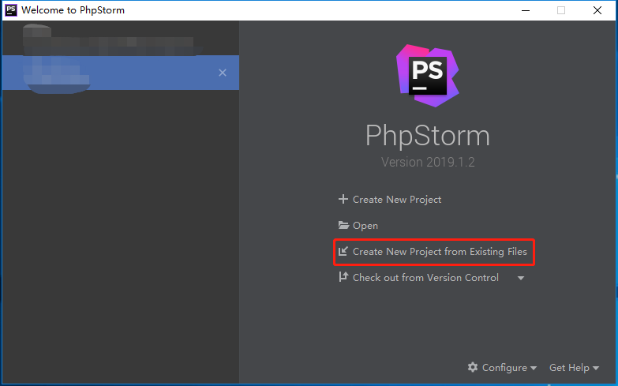
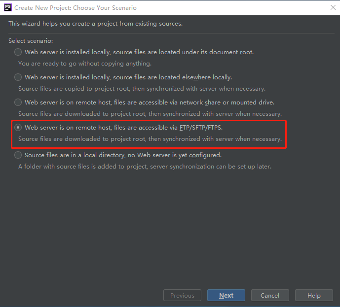
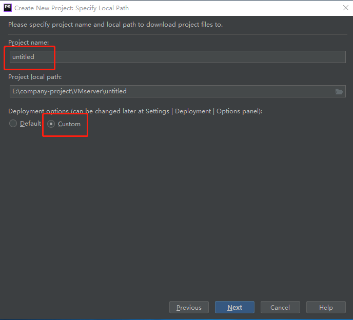
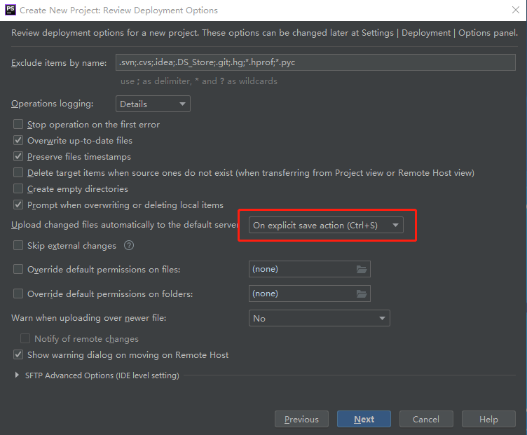
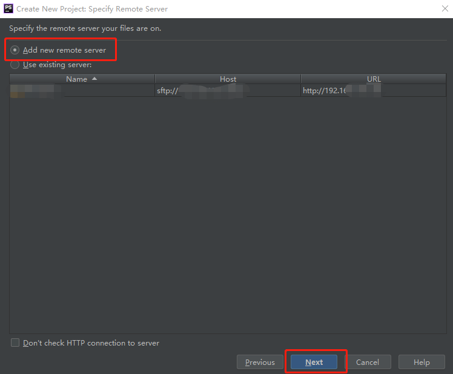
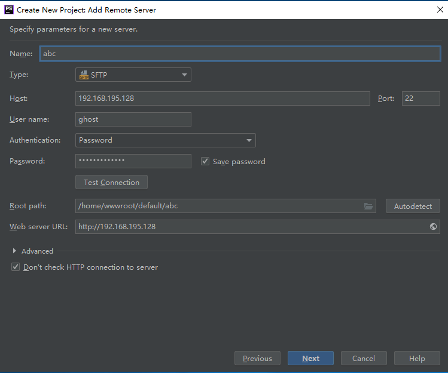

> 一般情况，开发者多使用Windows系统，PHPStorm、VSCode等软件让我们离不开Windows，但是，但是多数开发者更倾向于在Linux上部署环境。那么这一份教程就诞生了。（MacOS用户可以绕行）

## 远程部署代码

打开PHPStorm，选择`Create New Project from Existing Files`

选择从远程服务器ftp同步项目

输入项目名，并选择要同步到本地的项目路径

自动上传操作选择如下，当你Ctrl+S时，PHPStorm会帮你上传当前修改的文件到服务器。这样会相当方便。

选择新建远程服务器

填写项目名，`Type`选择`SFTP`，填写服务器IP、用户名、密码以及远程项目所在的路径。

直接点finish，PHPStorm会自动同步远程服务器的代码。