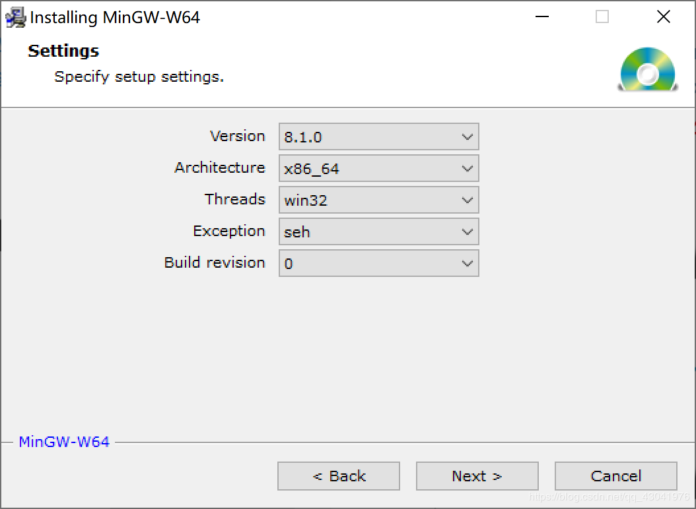
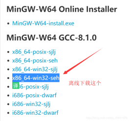
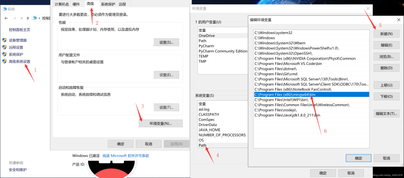
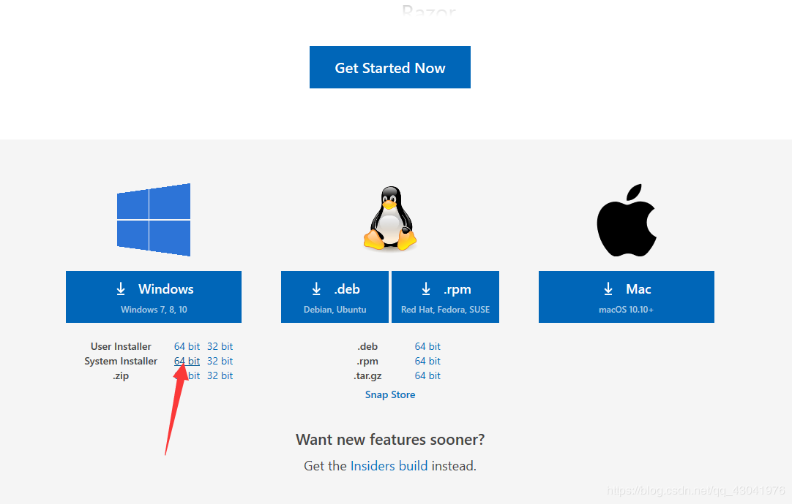
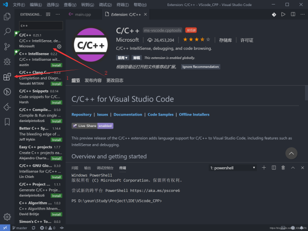
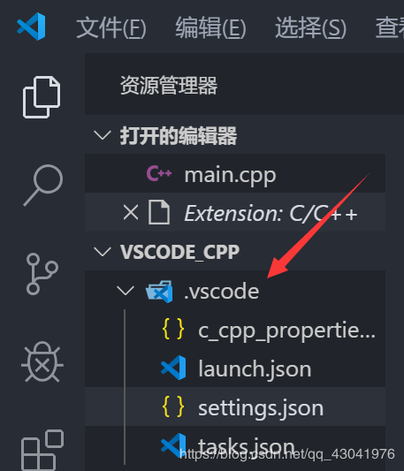
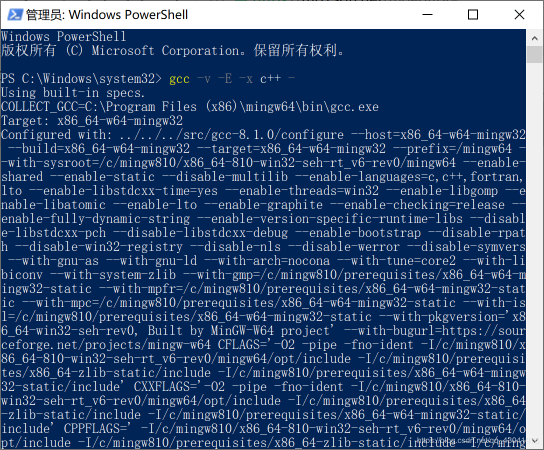
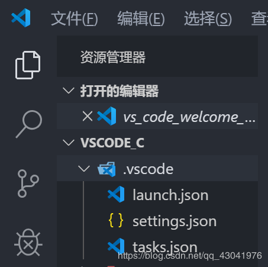

# vscode C&C++环境配置

## 第一步：下载安装

- 下载MinGW-W64 GCC-8.1.0编译器（32和64版本都有）
  MinGW-W64 GCC下载地址：https://sourceforge.net/projects/mingw-w64/files/Toolchains targetting Win32/Personal Builds/mingw-builds/installer/mingw-w64-install.exe
  离线下载地址：https://sourceforge.net/projects/mingw-w64/files/mingw-w64/mingw-w64-release/
  安装选项为 x86_64-win32-seh
  
  

## 第二步：环境配置

- 打开你的mingw-w64安装目录，我是默认安装的在C:\Program Files (x86)，里面的MinGW-W64就是安装的编译器了，将里面的bin文件夹加入路径，我的就是C:\Program Files (x86)\mingw64\bin，将这个加入路径即可。
  路径加入方法：
- 加入后，建议重启一下电脑

## 第三步 下载安装VSCode（已经装好了请跳到第四步）

- vscode请到[官网](https://code.visualstudio.com/#alt-downloads)下载最新版（推荐管理权限64位版本）
- 下载地址：https://code.visualstudio.com/#alt-downloads
  

## 第四步：安装VSCode cpp相关的插件

- vscode设置中文环境教程http://www.chuancn.cn/post/将VSCode设置成中文语言环境
- c++插件
  
  -重启vscode软件

## 第五步：配置c++的.vscode文件

- 在你写代码的地方新建文件夹和里面新建一个文件夹

- 然后在文件夹里面创建一个.vscode文件夹
  

- 然后在.vscode文件夹里面创建如上图所示的四个文件，文件名如下

  `c_cpp_properties.json`
  `launch.json`
  `settings.json`
  `tasks.json`

  请根据安装的位置来修改文件路径（如果跟我一样可以不要修改）

- launch.json

```json
{
   "version": "0.2.0",
   "configurations": [
       {
           "name": "(gdb) Launch", // 配置名称，将会在启动配置的下拉菜单中显示
           "type": "cppdbg", // 配置类型，这里只能为cppdbg
           "request": "launch", // 请求配置类型，可以为launch（启动）或attach（附加）
           "program": "${workspaceFolder}/${fileBasenameNoExtension}.exe", // 将要进行调试的程序的路径
           "args": [], // 程序调试时传递给程序的命令行参数，一般设为空即可
           "stopAtEntry": false, // 设为true时程序将暂停在程序入口处，一般设置为false
           "cwd": "${workspaceFolder}", // 调试程序时的工作目录，一般为${workspaceRoot}即代码所在目录 workspaceRoot已被弃用，现改为workspaceFolder
           "environment": [],
           "externalConsole": true, // 调试时是否显示控制台窗口，一般设置为true显示控制台
           "MIMode": "gdb",
           "miDebuggerPath": "C:/Program Files (x86)/mingw64/bin/gdb.exe", // miDebugger的路径，注意这里要与MinGw的路径对应
           "preLaunchTask": "g++", // 调试会话开始前执行的任务，一般为编译程序，c++为g++, c为gcc
           "setupCommands": [
               {
                   "description": "Enable pretty-printing for gdb",
                   "text": "-enable-pretty-printing",
                   "ignoreFailures": false
               }
           ]
       }
   ]
}
```

- tasks.json
  如果遇到找不到文件 比如这样：
  
  把 `"${workspaceFolder}"`替换为 `"\\"`或 `"//"`

```json
{
   "version": "2.0.0",
   "command": "g++",
   "args": [
       "-g",
       "${file}",
       "-o",
       "${fileBasenameNoExtension}.exe"
   ], // 编译命令参数
   "problemMatcher": {
       "owner": "cpp",
       "fileLocation": [
           "relative",
           "${workspaceFolder}"
       ],
       "pattern": {
           "regexp": "^(.*):(\\d+):(\\d+):\\s+(warning|error):\\s+(.*)$",
           "file": 1,
           "line": 2,
           "column": 3,
           "severity": 4,
           "message": 5
       }
   }
}
```

- c_cpp_properties.json
  "includepath"设置问题 路径获取获取方法为：cmd——》gcc -v -E -x c++ -
  
  如果第一种出错请使用第二种

```json
{
    "configurations": [
        {
            "name": "Win32",
            "includePath": [
                "${workspaceRoot}",
                "C:/Program Files (x86)/mingw64/include/**",
                "C:/Program Files (x86)/mingw64/bin/../lib/gcc/x86_64-w64-mingw32/8.1.0/include/c++",
                "C:/Program Files (x86)/mingw64/bin/../lib/gcc/x86_64-w64-mingw32/8.1.0/include/c++/x86_64-w64-mingw32",
                "C:/Program Files (x86)/mingw64/bin/../lib/gcc/x86_64-w64-mingw32/8.1.0/include/c++/backward",
                "C:/Program Files (x86)/mingw64/bin/../lib/gcc/x86_64-w64-mingw32/8.1.0/include",
                "C:/Program Files (x86)/mingw64/bin/../lib/gcc/x86_64-w64-mingw32/8.1.0/include-fixed",
                "C:/Program Files (x86)/mingw64/bin/../lib/gcc/x86_64-w64-mingw32/8.1.0/../../../../x86_64-w64-mingw32/include"
            ],
            "defines": [
                "_DEBUG",
                "UNICODE",
                "__GNUC__=6",
                "__cdecl=__attribute__((__cdecl__))"
            ],
            "intelliSenseMode": "msvc-x64",
            "browse": {
                "limitSymbolsToIncludedHeaders": true,
                "databaseFilename": "",
                "path": [
                    "${workspaceRoot}",
                    "C:/Program Files (x86)/mingw64/include/**",
                    "C:/Program Files (x86)/mingw64/bin/../lib/gcc/x86_64-w64-mingw32/8.1.0/include/c++",
                    "C:/Program Files (x86)/mingw64/bin/../lib/gcc/x86_64-w64-mingw32/8.1.0/include/c++/x86_64-w64-mingw32",
                    "C:/Program Files (x86)/mingw64/bin/../lib/gcc/x86_64-w64-mingw32/8.1.0/include/c++/backward",
                    "C:/Program Files (x86)/mingw64/bin/../lib/gcc/x86_64-w64-mingw32/8.1.0/include",
                    "C:/Program Files (x86)/mingw64/bin/../lib/gcc/x86_64-w64-mingw32/8.1.0/include-fixed",
                    "C:/Program Files (x86)/mingw64/bin/../lib/gcc/x86_64-w64-mingw32/8.1.0/../../../../x86_64-w64-mingw32/include"
                ]
            }
        }
    ],
    "version": 4
}
```

第二种

```json
{
    "configurations": [
        {
            "name": "Win32",
            "includePath": [
                "C:/Program Files (x86)/mingw64/include/**",
                "C:/Program Files (x86)/mingw64/bin/../lib/gcc/x86_64-w64-mingw32/8.1.0/include/c++",
                "C:/Program Files (x86)/mingw64/bin/../lib/gcc/x86_64-w64-mingw32/8.1.0/include/c++/x86_64-w64-mingw32",
                "C:/Program Files (x86)/mingw64/bin/../lib/gcc/x86_64-w64-mingw32/8.1.0/include/c++/backward",
                "C:/Program Files (x86)/mingw64/bin/../lib/gcc/x86_64-w64-mingw32/8.1.0/include",
                "C:/Program Files (x86)/mingw64/bin/../lib/gcc/x86_64-w64-mingw32/8.1.0/include-fixed",
                "C:/Program Files (x86)/mingw64/bin/../lib/gcc/x86_64-w64-mingw32/8.1.0/../../../../x86_64-w64-mingw32/include"
            ],
            "browse": {
                "limitSymbolsToIncludedHeaders": true,
                "databaseFilename": ""
            }
        }
    ],
    "version": 4
}
```

- settings.json

```json
{
    // "workbench.colorTheme": "One Dark Pro",
    //"atomKeymap.promptV3Features": true,
    "editor.multiCursorModifier": "ctrlCmd",
    // "[cpp]": {
    //     "editor.quickSuggestions": true
    // },
    // "[c]": {
    //     "editor.quickSuggestions": true
    // },
    "files.associations": {
        "*.json": "jsonc",
        "*.cfg": "ini",
        "*.fsh": "glsl",
        "stack": "cpp",
        "iostream": "cpp",
        "ostream": "cpp",
        "*.tcc": "cpp",
        "cctype": "cpp",
        "clocale": "cpp",
        "cmath": "cpp",
        "cstdint": "cpp",
        "cstdio": "cpp",
        "cstdlib": "cpp",
        "cwchar": "cpp",
        "cwctype": "cpp",
        "exception": "cpp",
        "initializer_list": "cpp",
        "iosfwd": "cpp",
        "istream": "cpp",
        "limits": "cpp",
        "new": "cpp",
        "stdexcept": "cpp",
        "streambuf": "cpp",
        "system_error": "cpp",
        "type_traits": "cpp",
        "typeinfo": "cpp",
        "utility": "cpp",
        "iomanip": "cpp"
    },
    "editor.snippetSuggestions": "top",
    "C_Cpp.clang_format_sortIncludes": true,
    "editor.wordWrap": "on",
    "editor.formatOnPaste": true,
    "editor.formatOnType": true,
    "editor.codeActionsOnSaveTimeout": 500,
    "files.autoSave": "onFocusChange",
    "files.autoSaveDelay": 500,
    "editor.hover.delay": 0,
    "files.autoGuessEncoding": true,
    "editor.detectIndentation": false,
    "files.encoding": "utf8",
    "editor.formatOnSaveTimeout": 20,
    "editor.fontFamily": "Consolas",
    // "workbench.iconTheme": "vscode-icons",
    "fileheader.configObj": {
        "autoAdd": true, // 将该选项设置为true即可开启
    },
    "code-runner.runInTerminal": true
}
```

## 第六步：配置c语言的.vscode文件

- 在你写代码的地方新建文件夹和里面新建一个文件夹
- 然后在文件夹里面创建一个.vscode文件夹
  
- 然后在.vscode文件夹里面创建如上图所示的四个文件，文件名如下
  `launch.json`
  `settings.json`
  `tasks.json`
- launch.json

```cpp
{
    "version": "0.2.0",
    "configurations": [
        {
            "name": "(gdb) Launch", // 配置名称，将会在启动配置的下拉菜单中显示
            "type": "cppdbg", // 配置类型，这里只能为cppdbg
            "request": "launch", // 请求配置类型，可以为launch（启动）或attach（附加）
            "program": "${workspaceFolder}/${fileBasenameNoExtension}.exe", // 将要进行调试的程序的路径
            "args": [], // 程序调试时传递给程序的命令行参数，一般设为空即可
            "stopAtEntry": false, // 设为true时程序将暂停在程序入口处，一般设置为false
            "cwd": "${workspaceFolder}", // 调试程序时的工作目录，一般为${workspaceRoot}即代码所在目录
            "environment": [],
            "externalConsole": true, // 调试时是否显示控制台窗口，一般设置为true显示控制台
            "MIMode": "gdb",
            "miDebuggerPath": "C:/Program Files (x86)/mingw64/bin/gdb.exe", // miDebugger的路径，注意这里要与MinGw的路径对应
            "preLaunchTask": "gcc", // 调试会话开始前执行的任务，一般为编译程序，c++为g++, c为gcc
            "setupCommands": [
                {
                    "description": "Enable pretty-printing for gdb",
                    "text": "-enable-pretty-printing",
                    "ignoreFailures": true
                }
            ]
        }
    ]
}
```

- tasks.json

```cpp
{
    "version": "2.0.0",
     "command": "gcc",
    "args": ["-g","${file}","-o","${fileBasenameNoExtension}.exe"]
}
```

- settings.json

```cpp
{
    "C_Cpp.errorSquiggles": "Enabled",
    "editor.fontSize": 16,
    "editor.detectIndentation": false,
    "files.autoSave": "onFocusChange"
}
```


> 参考文章：
> https://www.cnblogs.com/ggg-327931457/p/9694516.html
> https://blog.csdn.net/weixin_40694527/article/details/84251461
> http://www.chuancn.cn/post/将VSCode设置成中文语言环境

