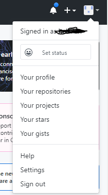
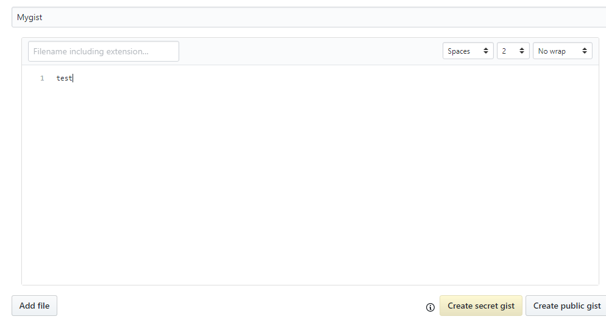
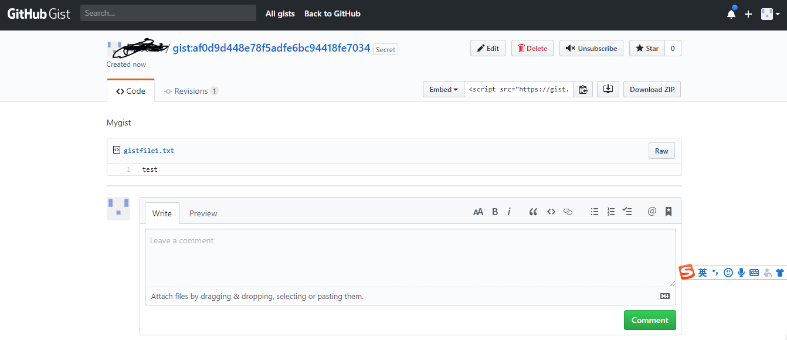
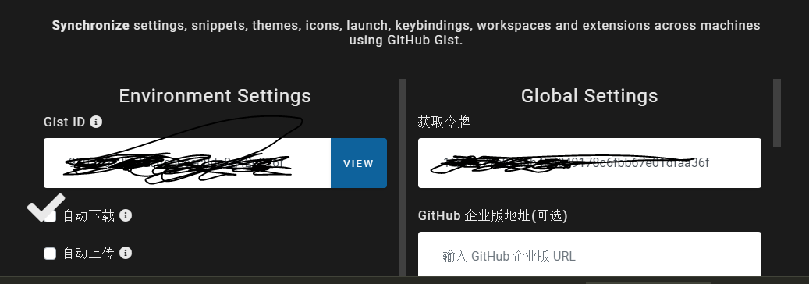
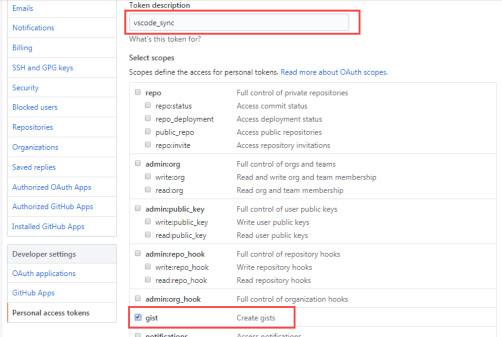

# [vscode同步插件 sync(gist,token)](https://www.cnblogs.com/hebdzw/p/11456325.html)

网上很多同步教程，按照教程操作upload时一直报错：sync:invalid gist ID

查找问题很久才知道 gist和token是两个东西。下面重新梳理下：

## 一、下载安装插件 Setting sync

## 二、github上生成gist

  

 

###  进入 your gists

 

 

随便给自己的gist起个名，添加内容，然后"Create secret gist"

 

 上图中的af0d9d448e78f5adfe6bc94418fe7034就是gist

## 三、生成token（见网上其他教程）

## 四、vscode配置gist和token

​    vscode里：

> ​    1,、Ctrl + P调出命令框
>
> ​    2、输入>sync:advanced option
>
> ​    3、找到打开设置
>
> ​    4、出现下面的设置界面
>

 

 其中的Gist ID 就是我们上面获取的Gist ID，令牌就是其他教程里（如下图）生成的token

 

 

填完毕后回车自动更新json.

## 5、shift+alt+u ：将本地配置上传到github上

## 6、在其他设备上，下载sync插件，shift+alt+d ：从github上下载配置到本地。