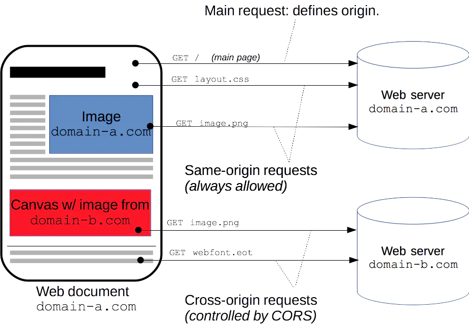

# 访问控制CORS及相关问题

## 什么是 `CORS` ？

> 跨域资源共享(CORS) 是一种机制，它使用额外的 HTTP 头来告诉浏览器  让运行在一个 origin (domain) 上的 Web 应用被准许访问来自不同源服务器上的指定的资源。当一个资源从与该资源本身所在的服务器不同的域、协议或端口请求一个资源时，资源会发起一个跨域 HTTP 请求。 比如，站点 `http://domain-a.com` 的某 HTML 页面通过 `` 的 src 请求 `http://domain-b.com/image.jpg`。网络上的许多页面都会加载来自不同域的 CSS 样式表，图像和脚本等资源。
> 出于安全原因，浏览器限制从脚本内发起的跨源 HTTP 请求。 例如，XMLHttpRequest 和 Fetch API 遵循同源策略。 这意味着使用这些 API 的 Web 应用程序只能从加载应用程序的同一个域请求 HTTP 资源，除非响应报文包含了正确 CORS 响应头。





> 跨域资源共享（ CORS ）机制允许 Web 应用服务器进行跨域访问控制，从而使跨域数据传输得以安全进行。现代浏览器支持在 API 容器中（例如 XMLHttpRequest 或 Fetch ）使用 CORS，以降低跨域 HTTP 请求所带来的风险。

不过呢，并不一定是浏览器限制了发起跨站请求，也可能是跨站请求可以正常发起，但是返回结果被浏览器拦截了。

在“上古时代”，解决跨域有很多黑科技，什么 JSONP 啊，`window.name` 啊，`document.domain` 啊等等都用上了，但现代用的基本都是`CORS`跨域，所以上述方法在这里就不讨论了。

由上述可知，实现 `CORS` 通信的关键是服务器。只要服务器实现了 `CORS` 接口，就可以跨源通信。

虽然工作重心在后端，但是作为前端，也要了解这方面的知识，否则就会出现`204`预请求，然后后端没处理，就甩锅给前端的情况。

下面介绍一些 `CORS` 过程中常见的 HTTP 响应头（Response Headers）。

## 什么是 `Access-Control-Allow-Origin` ？

这是 HTTP 响应首部中的一个字段，

具体格式是： `Access-Control-Allow-Origin: <origin> | *`。

其中，`origin` 参数的值指定了允许访问该资源的外域 URI。对于不需要携带身份凭证的请求，服务器可以指定该字段的值为通配符，表示允许来自所有域的请求。

如果服务端指定了具体的域名而非`*`，那么响应首部中的 Vary 字段的值必须包含 Origin。这将告诉客户端：服务器对不同的源站返回不同的内容。例如：

```shell
// 只响应来自 http://mozilla.com 的请求
Access-Control-Allow-Origin: http://mozilla.com
```

## 什么是 `Access-Control-Allow-Methods` ？

该字段必需，它的值是逗号分隔的一个字符串，表明服务器支持的所有跨域请求的方法。注意，返回的是所有支持的方法，而不单是浏览器请求的那个方法。这是为了避免多次"预检"请求。

具体格式是：`Access-Control-Allow-Methods: <method>[, <method>]*`

## 什么是 `Access-Control-Allow-Headers` ?

可支持的请求首部名字。请求头会列出所有支持的首部列表，用逗号隔开。

如果浏览器请求包括`Access-Control-Request-Headers`字段，则`Access-Control-Allow-Headers`字段是必需的。它也是一个逗号分隔的字符串，表明服务器支持的所有头信息字段，不限于浏览器在"预检"中请求的字段。

具体格式是：`Access-Control-Allow-Headers: <header-name>[, <header-name>]*`

## 什么是 `Access-Control-Allow-Credentials` ？

该字段可选。它的值是一个布尔值，表示是否允许发送 Cookie。默认情况下，Cookie 不包括在 CORS 请求之中。设为 true，即表示服务器明确许可，Cookie 可以包含在请求中，一起发给服务器。

## 浏览器的正常请求和回应

一旦服务器通过了"预检"请求，以后每次浏览器正常的 CORS 请求，就都跟简单请求一样，会有一个 Origin 头信息字段。服务器的回应，也都会有一个 `Access-Control-Allow-Origin` 头信息字段。

