# [Ettercap入门学习](https://blog.csdn.net/pcmiaomiao/article/details/72844690)

入门了解ettercap嗅探、中间人攻击的功能

- **测试环境：**
  ettercap 0.8.2
  三台硬件主机位于同局域网，其上的ubuntu虚拟机与主机间的网络采用桥接模式
  网关地址为10.0.0.1

| 主机        | 功能                   | IP          |
| ----------- | ---------------------- | ----------- |
| 主机A       | 用作服务器端           | 10.0.10.159 |
| 主机B       | 用作客户端             | 10.0.10.127 |
| 中间人主机C | 安装了ettercap发起攻击 | 10.0.10.163 |

- **一、嗅探**
1. 主机C终端输入sudo ettercap -G -w dara.cap进入ettercap图形界面，并将所有嗅探的数据保存为dara.cap文件：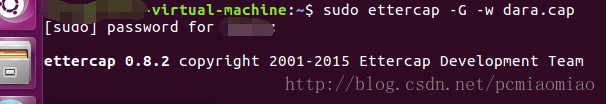
2. 选择菜单栏Sniff，以Unified sniffing模式开启嗅探，选中当前使用的网卡，点击OK进入嗅探：
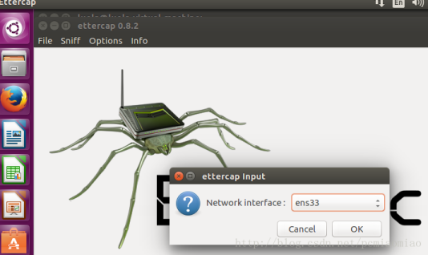
嗅探开始，将网关ip10.0.0.1 和 目标主机A 10.0.10.159添加作为目标
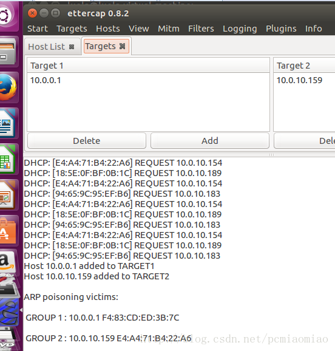
3. 选择菜单栏下Mitm -> ARP poisoning 开启基于ARP的中间人攻击，使得10.0.10.159经过网关10.0.0.1的所有数据包均可以被攻击主机（10.0.10.163）捕获嗅探：
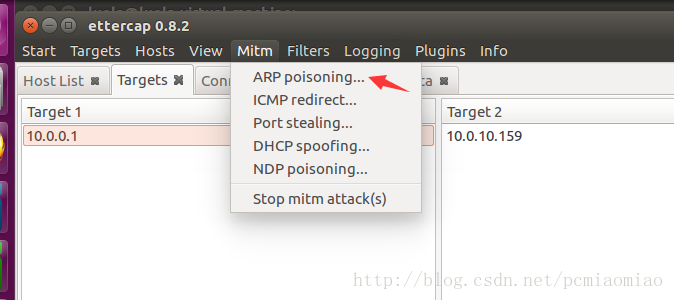

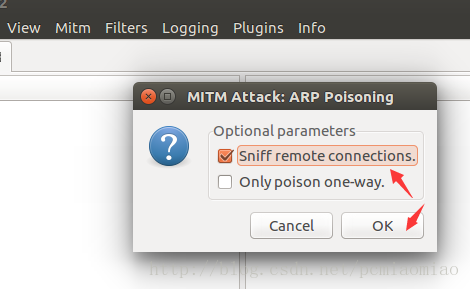
4.通过菜单栏View下的选项可以查看当前产生的数据包信息，如下是主机A访问百度网页是产生的数据：
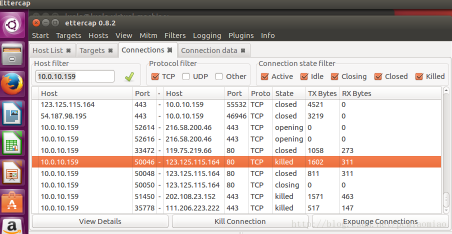

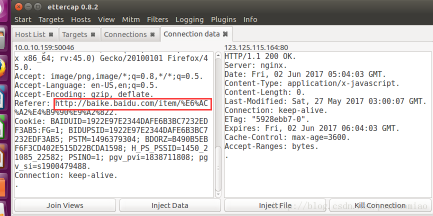
5. 整个过程中嗅探的数据还保存成为了.cap文件，可以用wireshark打开，做后续的深入分析：
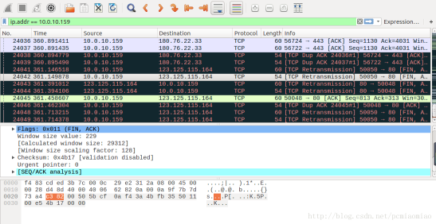
- **二、中间人攻击**
1. 通过python简单编写了利用socket通信的文件，内容如下：
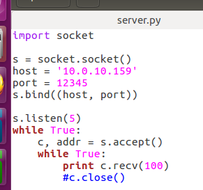
主机A服务器端：利用12345号端口接收数据

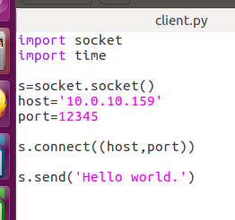
主机B客户端：向服务器端12345端口发送数据“Hello world”
2. 正常情况下在对应主机上运行两文件，可以在服务器端接收数据“Hello world”：
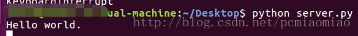
3. 根据ettercap中filter的编写规则，编写一个filter.txt文件用来将客户端B传向服务端A的数据“Hello world”修改为“test for long string…”，实现中间人攻击（当数据篡改成功后会在ettercap显示“okay1!”）：
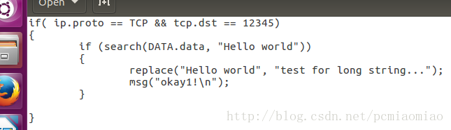
主机C利用etterfilter filter.txt -o filter.ef命令将其生成为ettercap的过滤规则文件：
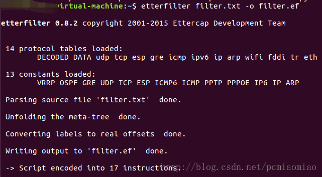
在root模式下输入ettercap –G以图形界面打开ettercap，选择菜单栏Sniff，以Unified sniffing模式开启嗅探工作。
选择菜单栏下Filters -> Load a filter,找到生成的filter.ef文件，并添加：

4. 选择菜单栏下的Hosts -> Scan for hosts,待扫描结束后选择Hosts -> Hosts list,将主机A、主机B的IP添加为目标1、2,可以在Targets菜单查看当前目标，并在下面的状态看到新添加的目标机：
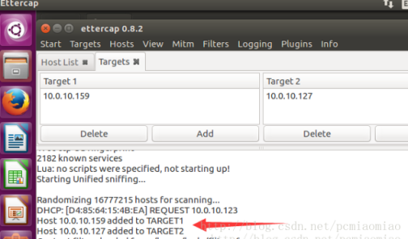
5. 选择菜单栏下Mitm -> ARP poisoning 开启基于ARP的中间人攻击：
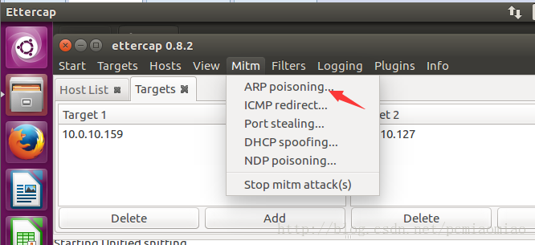

6. 再运行两个python文件进行通信，可以看到服务器接收的数据成功替换为“test for long string…”：
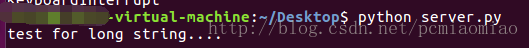

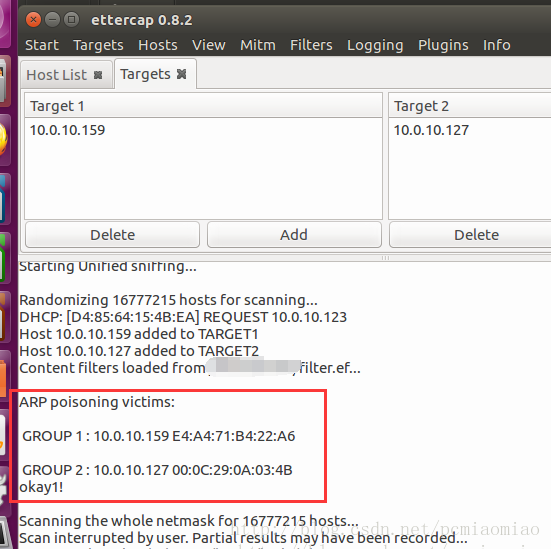
7. 也可将“Hello world”修改为长度小于自身的数据，例如“test”：
Filter文件如下：
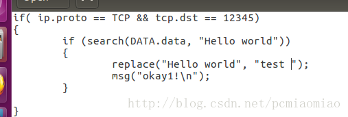

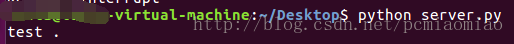

*到这里相信你已经入门ettercap最简单的操作啦~ettercap是一款非常强大的渗透工具，并且扩展了许多插件可以实现多种渗透功能，感兴趣的童鞋可以做深入研究~*