# [Kali学习笔记2：Wireshark详细使用方法](https://www.cnblogs.com/xuyiqing/p/9012979.html)

## Kali Linux自带Wireshark工具使用介绍：

### 1.进入界面

这里Lua脚本报错，无需关注

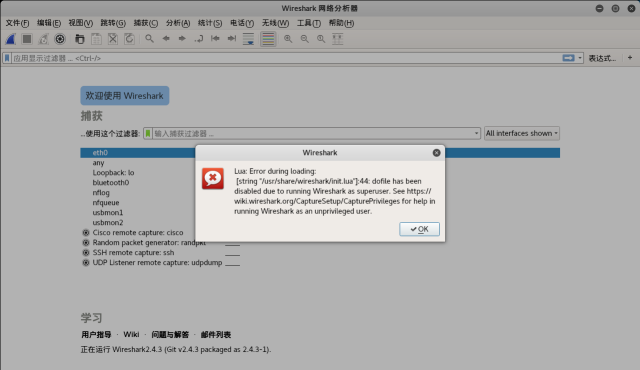

### 开始使用：

 双击第一个eth0：以太网0，开始抓包：

点击上边的这个按钮可以设置：

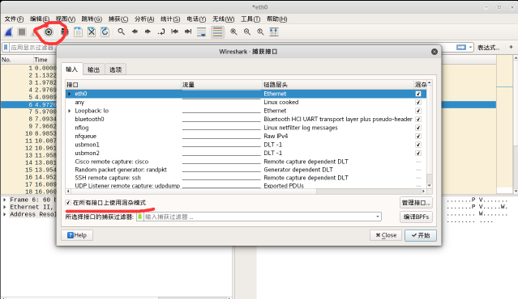

这里注意：需要选择混杂模式，获取机器所有以太网连接包

作用：不发送给当前IP的数据包也会抓取

同时我们观察到，下边这个捕获过滤器，这个有什么用呢？

通常我们抓获的数据包都有很多，这里的过滤器作用就是过滤得到我们需要的数据包。

### 使用方式：

点击绿色按钮再管理界面：

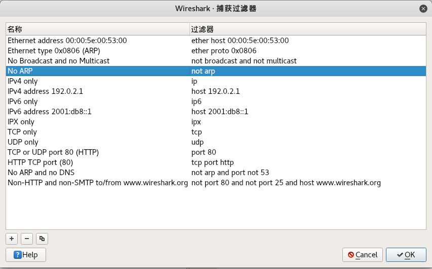

在这里就可以设置各种，可以按需求自己按照格式书写，点击加号新建：

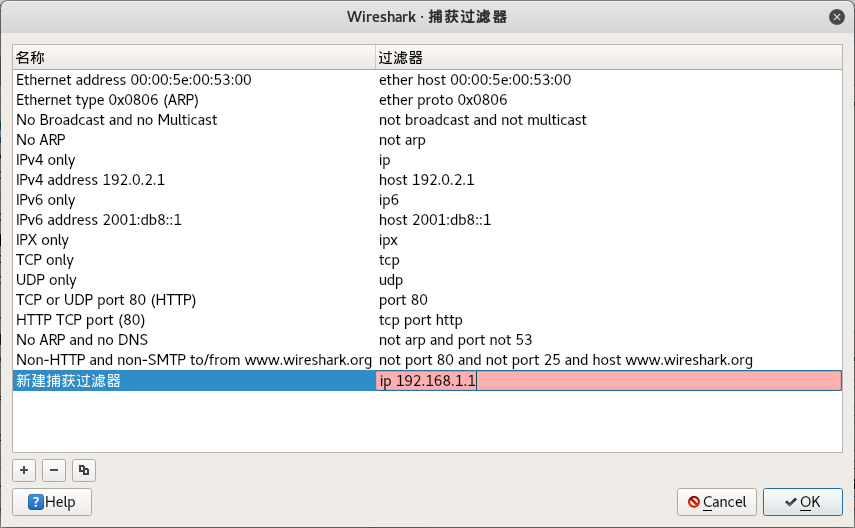

好的，我们选择抓本机的包：192.168.87.132：

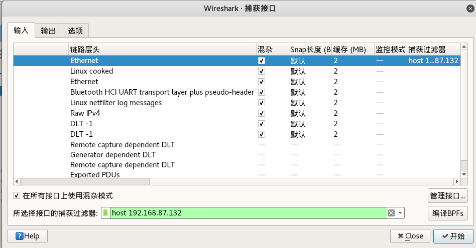

点击开始，然而，并没有反应

我们ping 一下其他IP

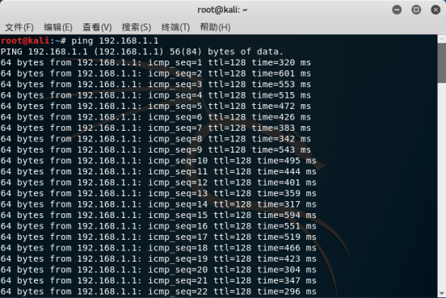

这时候打开wireshark，发现有数据了

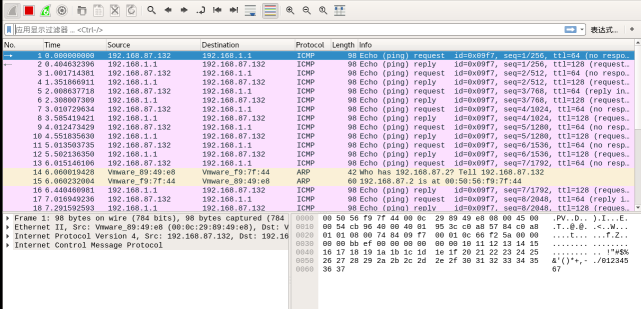

抓取到的这些数据包可以保存下来，以后看，点击文件中的保存即可

我们还可以在编辑的首选项中设置适合自己的布局、在列中设置每一列需要显示的内容（通常默认设置足以满足我们的需求）：

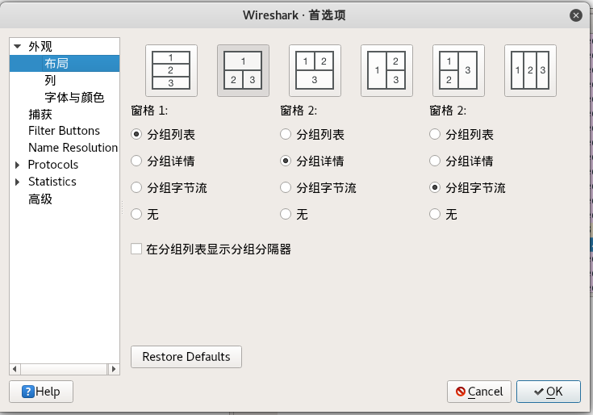

好的，刚才我们设置的是**抓包筛选器**（总闸）

### 接下来看看显示筛选器：对抓取到的数据包进行筛选

我们实际使用的其实通常是显示筛选器：

比如这里我们只需要ARP协议：

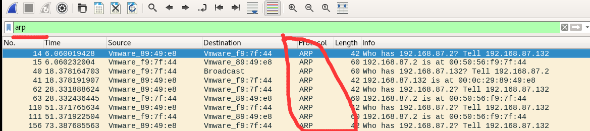

可以手动输入，也可以自动：

比如我只看192.168.1.1的：

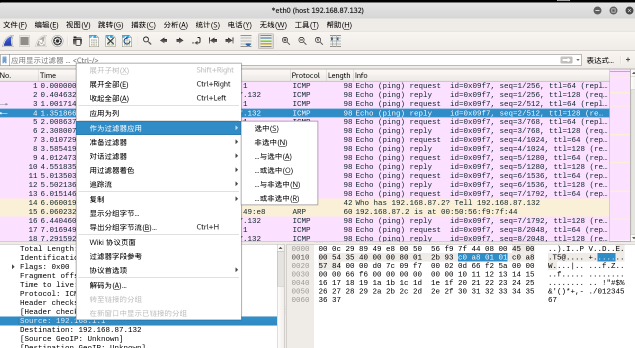

选中后，它会自动生成匹配规则：

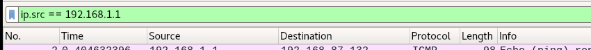

也可以多选一些，多种组合：

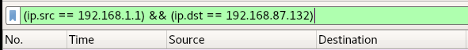

可以查看抓取包的详细信息，以一个ARP协议包为例：

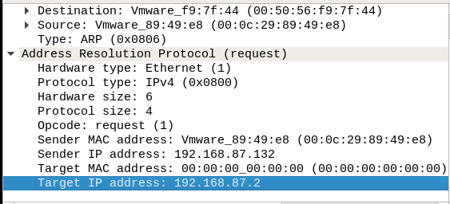

### 看一个TCP协议包：

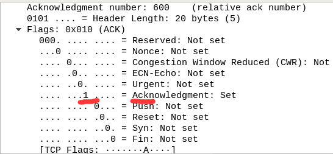

我们发现这里为1，说明这个包是TCP协议的ACK数据包

### 简单介绍下TCP协议：

在客户机和[服务器](https://baike.baidu.com/item/服务器)之间建立正常的TCP网络连接时

客户机首先发出一个SYN消息

服务器使用SYN+ACK应答表示接收到了这个消息

最后客户机再以[ACK](https://baike.baidu.com/item/ACK)消息响应

这样在客户机和服务器之间才能建立起可靠的TCP连接

 

 

再看一个DNS协议：

这是一个查询的DNS数据包：

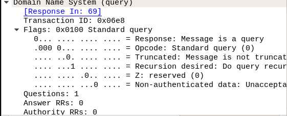

 

这是一个响应包：

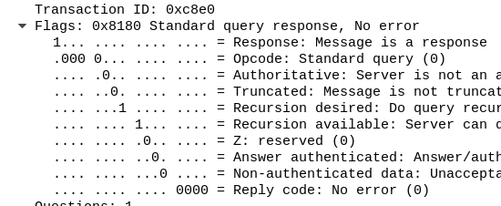

 

具体数据：

 

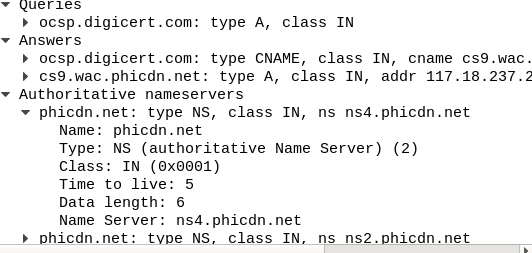

 

 

我们最常见的其实是HTTP协议：

 访问下百度看看：

 

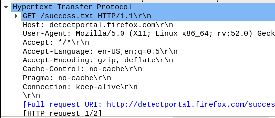

 

通常HTTP协议是80端口，但是如果有些奇葩网站，偏要使用81端口，那么Wireshark无法自动解析，我们可以这样：

 

右键解码为：

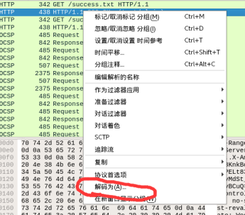

 

点击添加相应的端口即可（81）

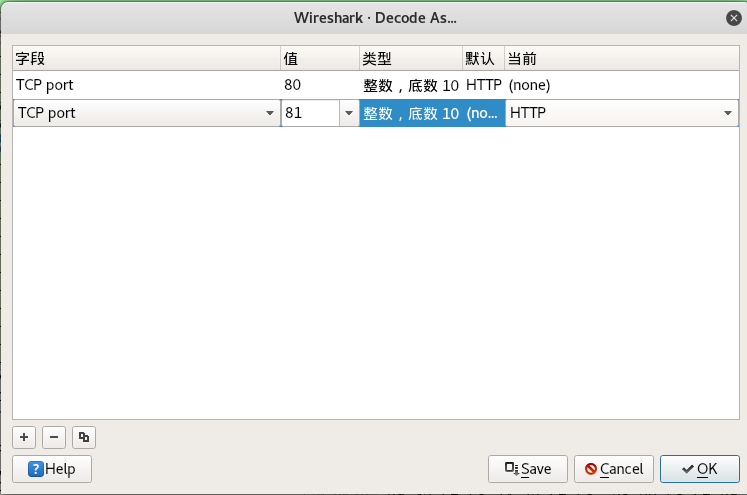

 

这时候81端口就会解析为HTTP协议

 

Wireshark还有一个follow stream的功能，会跟踪你的访问：

右键，这里有个追踪流：

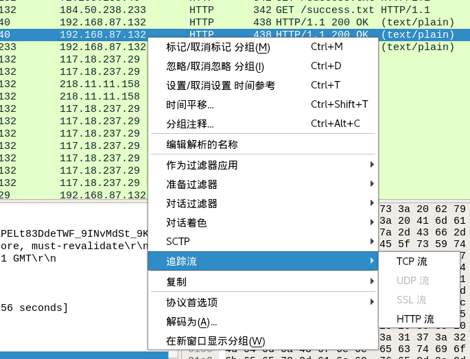

 

通常我们追踪TCP流：

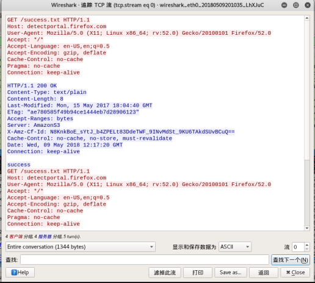

 

从这里可以看到：

我发送了一个GET请求，服务器响应了一个200状态码

 

在这里就可以完整观察一个连接过程

 

我们可以再看看TCP数据包：

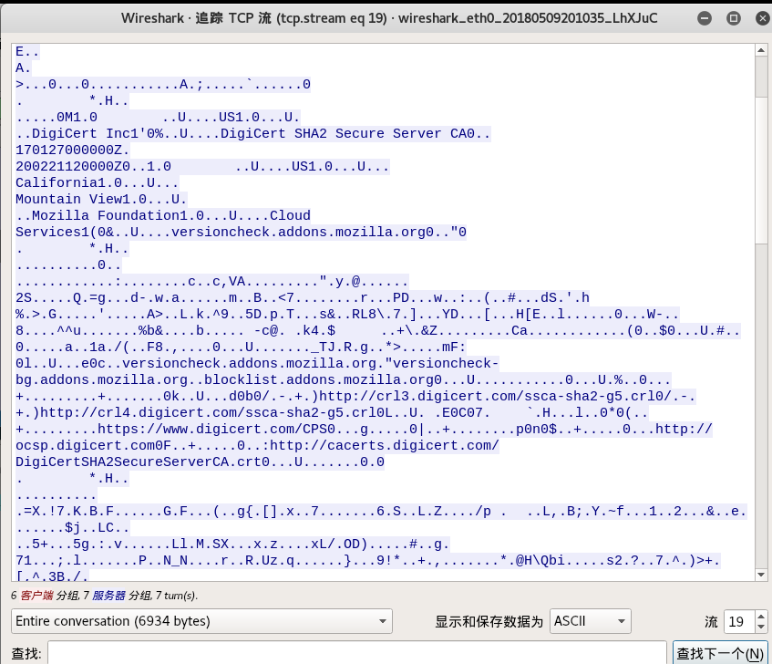

 

 

这里我们可以发现，我们看不懂TCP数据包，而HTTP数据包能看懂？

因为，HTTP是明文传输的，我们可以看出来内容

于是产生了HTTPS加密，我们抓包HTTPS，基本就无法看出来了

我们可以看一个SSL：

 

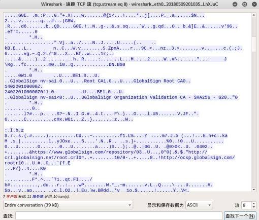

 

 

看不懂？没错，这就是HTTPS加密

 

基本功能的使用就到这里了，还有一些统计等等功能。