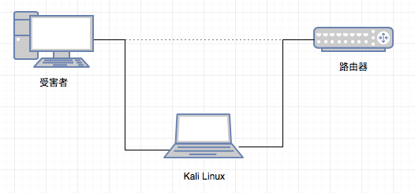
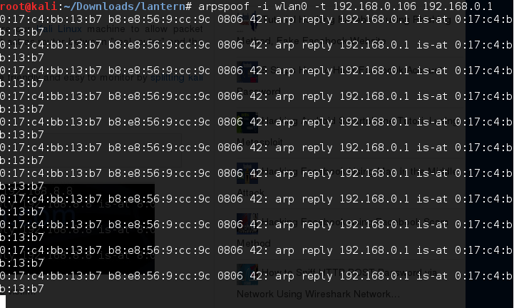
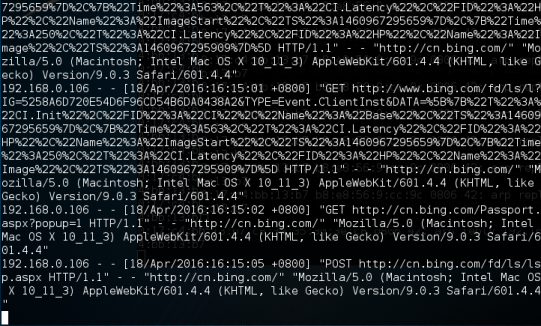

# 使用Kali Linux执行中间人攻击(演示)

中间人攻击也叫Man-In-The-Middle-Attack。

我假设你已经知道中间人攻击的基本概念，引用一段wikipedia：

> 中间人攻击（Man-in-the-middle attack，缩写：MITM）是指攻击者与通讯的两端分别建立独立的联系，并交换其所收到的数据，使通讯的两端认为他们正在通过一个私密的连接与对方直接对话，但事实上整个会话都被攻击者完全控制。在中间人攻击中，攻击者可以拦截通讯双方的通话并插入新的内容。在许多情况下这是很简单的（例如，在一个未加密的Wi-Fi 无线接入点的接受范围内的中间人攻击者，可以将自己作为一个中间人插入这个网络）。
>
> 一个中间人攻击能成功的前提条件是攻击者能将自己伪装成每一个参与会话的终端，并且不被其他终端识破。中间人攻击是一个（缺乏）相互认证的攻击。大多数的加密协议都专门加入了一些特殊的认证方法以阻止中间人攻击。例如，SSL协议可以验证参与通讯的一方或双方使用的证书是否是由权威的受信任的数字证书认证机构颁发，并且能执行双向身份认证。

我画了一个简单的图示：



- 受害者IP地址：192.168.0.106
- Kali Linux的IP地址：192.168.0.112，使用网络接口wlan0
- 路由器IP地址：192.168.0.1

使用到的工具：

- arpspoof
- driftnet
- urlsnarf

## 打开端口转发

确保Kali Linux打开端口转发，因为Kali Linux要起到中转的作用，开启方法：

端口转发通常用来让我们的计算机表现的像个路由器。个人计算机收到数据包之后再转发到其他目标计算机。

改变/proc/sys/net/ipv4/ip_forward的值，把值改为1：
`echo '1' > /proc/sys/net/ipv4/ip_forward`
上面的方法是临时的，系统重启失效。要想永久，vpn里有设置方法。

## 拦截数据包

受害者->路由器：

```shell
# arpspoof -i wlan0 -t 192.168.0.106 192.168.0.1
```

> arpspoof redirects packets from a target host (or all hosts) on the LAN intended for another host on the LAN by forging ARP replies. This is an extremely effective way of sniffing traffic on a switch.



路由器－>受害者：

再打开一个终端，执行：

```shell
# arpspoof -i wlan0 -t 192.168.0.1 192.168.0.106
```

经过执行上面两个命令，现在受害者电脑接收和发送的所有数据包都经过Kali Linux，这时你就可以使用抓包分析工具了(Wireshark)。

攻击原理：攻击者说服受害者计算机－攻击者计算机的Mac地址就是路由器的Mac地址。

driftnet：监控受害者电脑的图片流量

> Driftnet watches network traffic, and picks out and displays JPEG and GIF images for display. It is an horrific invasion of privacy and shouldn’t be used by anyone anywhere. It has been described as a graphical tcpdump(8)', EtherPeg for Unix’, and called all sorts of nasty names by people on Freshmeat. It is also possible to use driftnet to capture MPEG audio data from the network and play it through a player such as mpg123(1).

It is an horrific invasion of privacy and shouldn’t be used by anyone anywhere.

打开新终端，执行：

```shell
# driftnet -i wlan0
```

当受害者电脑浏览带图片的网站（http）时，可以截获图像：


数据加密可以有效防止中间人攻击。

## urlsnarf：获得受害者的HTTP请求

> urlsnarf outputs all requested URLs sniffed from HTTP traffic in CLF(Common Log Format, used by almost all web servers), suitable for off‐line post-processing with your favorite web log analysis tool (analog,wwwstat, etc.).



## sslstrip：

自行查看man手册