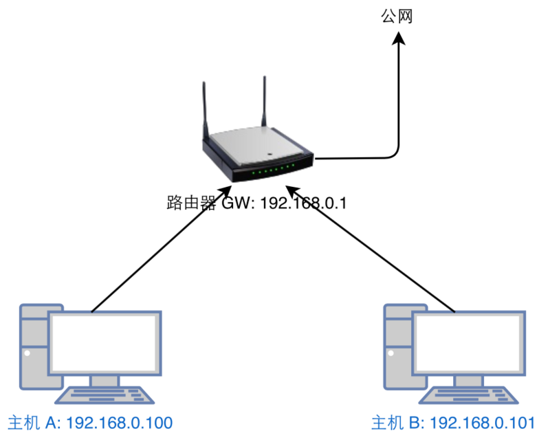
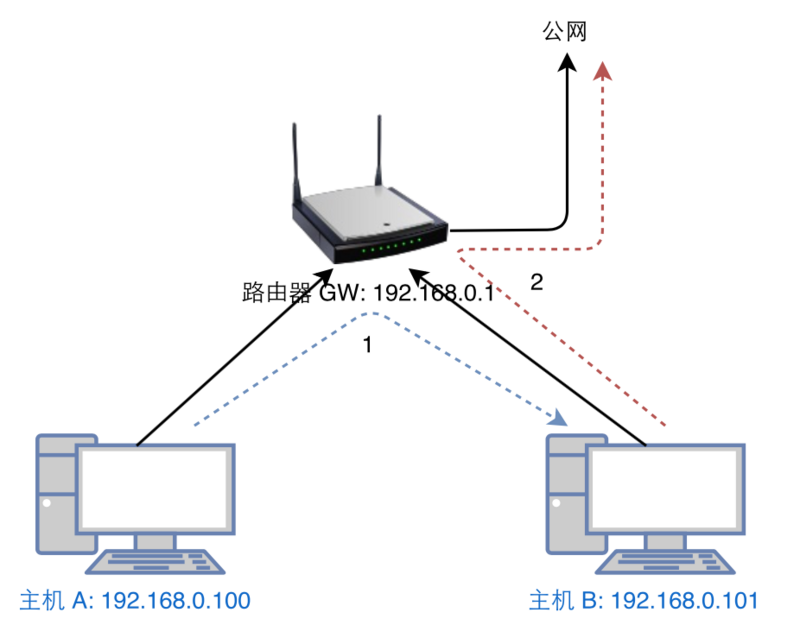

# 局域网 ARP 欺骗原理详解

**ARP 欺骗是一种以 ARP 地址解析协议为基础的一种网络攻击方式, 那么什么是 ARP 地址解析协议:** 

> 首先我们要知道, 一台电脑主机要把以太网数据帧发送到同一局域网的另外一台主机, 它的底层是通过 48bit 的 Mac 地址来确定目的接口的, 但是我们在应用层是使用 IP 地址来访问目标主机的, 所以 ARP 的作用就是当一台主机访问一个目标 IP 地址的时候, 它为该主机返回目标 IP 主机的 Mac 地址, 并且这个过程是自动完成的, 应用层的程序是不用关心这件事的.

在讲 ARP 欺骗之前我们先来了解一下正常情况下一台主机是如何通过路由器上网的:



如上图, 我们以 A 主机 ping 8.8.8.8 为例:

1. 主机 A 上执行 `ping 8.8.8.8`
2. 主机 A 准备根据默认路由将数据包发送给 `192.168.0.1`, 但是最开始的时候主机 A 不知道 `192.168.0.1` 的 Mac 地址, 所以主机 A 广播一条 ARP Request, 询问 `192.168.0.1` 的 Mac 地址是什么
3. 路由器收到该 ARP 请求, 发现自己是 `192.168.0.1` 于是向主机 A 回复一条 ARP Reply, 告诉主机 A `192.168.0.1` 的 Mac 地址是 xxxGW.
4. 主机 A 收到该 ARP Reply, 并使用该 Reply 中的 MAC 地址封一个 ICMP Request 包, 然后将包发出去
5. 路由器收到该 ICMP 包, 发现目标 IP 是公网 IP, 便将该包放送到公网, 公网返回 ICMP Reply 给路由器
6. 路由器准备将 ICMP Reply 发送给 `192.168.0.100`, 但是同第2步, 路由器最开始的时候也不知道 `192.168.0.100` 的 Mac 地址是多少, 所以路由器会广播一条 ARP Request, 询问 `192.168.0.100` 的 Mac 地址是什么
7. 主机 A 收到 ARP Request, 发现自己是 `192.168.0.100`, 于是向路由器回复 ARP Reply, 告诉路由器 `192.168.0.100` 的 Mac 地址是 xxxA.
8. 路由器收到 ARP Reply, 并使用该 Reply 中的 MAC 地址将第5步收到 ICMP Reply 包重新封包, 并发送出去
9. 主机 A 收到 ICMP Reply

至此, 正常的上网流程结束. 然后对照上面的流程回答下面两个问题:

1. 如果主机 B 无脑的向主机 A 发送 ARP Reply, 告诉 A `192.168.0.1` 的 MAC 是 xxxB, 会发生什么?
2. 如果主机 B 无脑的向路由器 GW 发送 ARP Reply, 告诉 GW `192.168.0.100` 的 MAC 是 xxxB, 会发生什么?

答案如下图:



如果主机 B 做了上面说的两件事的话, 那么主机 A 访问网络的所有数据都会先经过主机 B, 并且回来的数据也都会经过 B, 至此, 整个 ARP 欺骗完成.

至于实际操作, 在自己的机器上安装一个 `arpspoof` 工具便可以, Ubuntu 下可以直接使用如下命令安装:

```shell
apt install dsniff
```

安装好之后先打开 IP 转发:

```shell
echo 1 > /proc/sys/net/ipv4/ip_forward
```

然后使用 `arpspoof` 命令进行欺骗, 命令使用方法如下:

```shell
arpspoof -i <网卡名> -t <欺骗的目标> <我是谁>
```

比如上面我举得例子, 分别开两个终端:

终端1, 欺骗主机 A 我是网关

```shell
arpspoof -i eth0 -t 192.168.0.100 192.168.0.1
```

终端2, 欺骗网关我是主机 A

```shell
arpspoof -i eth0 -t 192.168.0.1 192.168.0.100
```

欺骗成功之后可以通过抓包工具查看主机 A 所有的流量, 这里不再多说.