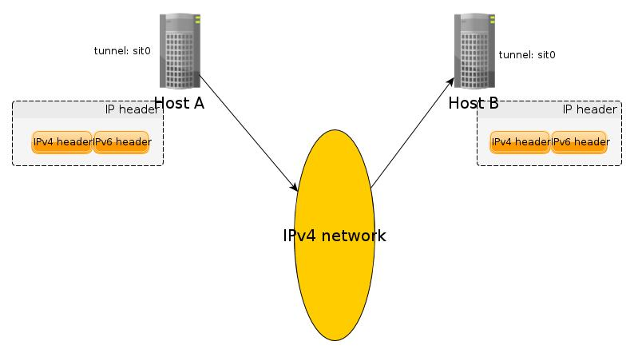
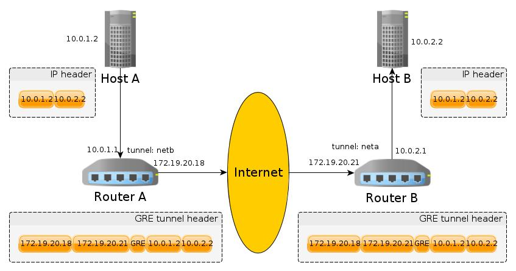
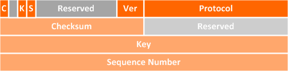

# [GRE学习笔记](http://blog.wachang.net/2013/03/tunnel-techology-note/)

## 文章1：王聪：[各种 tunnel](http://wangcong.org/blog/archives/1683)

还是罗列一下我的学习笔记：

> 概括地讲，所谓 tunnel 就是把下一层（比如IPv4层）的包封装到上一层（比如 SSH，HTTP）或者同一层（比如IPv6层）的协议中进行传输，从而实现网络之间的穿透。很明显，这种实现有个前提，那就是，发送端和接收端必须各有一个解析这种包的程序或者内核模块才能实现正常通信。

之前我知道GRE是三层协议，以为就是封装网络层的数据，从这么看的话，不是的，GRE应该是可以封装2层和三层的！！！

> 内核中可以支持四种隧道：ipip、gre、sit、isatap
>
> ipip 是把 IP 层封装到 IP 层的一个 tunnel，看起来似乎是浪费，实则不然。它的作用其实基本上就相当于一个基于IP层的网桥！我们知道，普通的网桥是基于mac层的，根本不需 IP，而这个 ipip 则是通过两端的路由做一个 tunnel，把两个本来不通的网络通过点对点连接起来。ipip 的源代码在内核 net/ipv4/ipip.c 中可以找到。
>
> sit 和 isatap 都是 IPv6 over IPv4 的 tunnel，它们的源代码在 net/ipv6/sit.c 中。它们之间也不同，和IPv6的地址有关，写在这里恐怕放不下了，故省略。
>
> IPSec 还用到一个叫 L2TP 的 tunnel，在内核源代码 net/l2tp 中，PPTP 是另外一个，在 drivers/net/pptp.c 中实现。
>
> gre 和它类似，但它功能还要更强大一些，还支持广播，它可以取代 ipip。

## 王聪：[深入理解 GRE tunnel](http://wangcong.org/blog/archives/2149)

王聪的另外一个文章详细讲解了GRE隧道的特点

也是好文章，直接引用~~~

首先，多数tunnel都是点到点的，也就是说，是从机器的一端到另外一个机器的一端，如下图：

除了端点的 host A 和 host B之外，中间经过的任何设备都是看不到里面的 IPv6 的头，对于它们来说，经过 sit 发出的包和其它的 IPv4 的包没有任何区别。

GRE tunnel 却不一样了，它的原理从根本上和 sit，ipip 这样的 tunnel 就不一样。除了外层的 IP 头和内层的 IP 头之间多了一个 GRE 头之外，它最大的不同是，tunnel 不是建立在最终的 host 上，而是在中间的 router 上！换句话说，对于端点 host A 和 host B 来说，该 tunnel 是透明的（对比上面的 sit tunnel）。这是网上很多教程里没有直接告诉你的。理解这一点非常关键，正是因为它这么设计的，所以它才能解决 ipip tunnel 解决不了的问题。所以，经过 GRE tunnel 发送的包（从 host A 发送到 host B）大体过程是这样子的：

我们可以看出，从 host A 发出的包其实就是一个很普通的 IP 包，除了目的地址不直接可达外。该 GRE tunnel 的一端是建立在 router A上，另一段是建立在 router B上，所以添加外部的 IP 头是在 router A 上完成的，而去掉外面的 IP 头是在 router B上完成的，两个端点的 host 上几乎什么都不用做（除了配置路由，把发送到 10.0.2.0 的包路由到 router A）！

这么设计的好处也就很容易看出来了，ipip tunnel 是端对端的，通信也就只能是点对点的，而 GRE tunnel 却可以进行多播。

最后来一张GRE报文格式图：

## 参考文章：

http://www.linuxdocs.org/HOWTOs/Adv-Routing-HOWTO-5.html

原创文章，转载请注明： 转载自[Wang Chang's Blog](http://blog.wachang.net/)

本文链接地址: http://blog.wachang.net/2013/03/tunnel-techology-note/