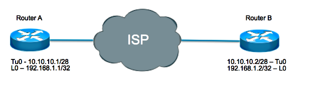

# GRE隧道Keepalive

[英语](https://www.cisco.com/c/en/us/support/docs/ip/generic-routing-encapsulation-gre/118370-technote-gre-00.html)

## 目录

[简介](https://www.cisco.com/c/zh_cn/support/docs/ip/generic-routing-encapsulation-gre/118370-technote-gre-00.html#anc0)

[GRE 隧道](https://www.cisco.com/c/zh_cn/support/docs/ip/generic-routing-encapsulation-gre/118370-technote-gre-00.html#anc1)

[隧道 Keepalive 工作原理](https://www.cisco.com/c/zh_cn/support/docs/ip/generic-routing-encapsulation-gre/118370-technote-gre-00.html#anc2)

[GRE隧道Keepalive](https://www.cisco.com/c/zh_cn/support/docs/ip/generic-routing-encapsulation-gre/118370-technote-gre-00.html#anc3)

[GRE Keepalive和单播反向路径转发](https://www.cisco.com/c/zh_cn/support/docs/ip/generic-routing-encapsulation-gre/118370-technote-gre-00.html#anc4)

[IPsec和GRE Keepalive](https://www.cisco.com/c/zh_cn/support/docs/ip/generic-routing-encapsulation-gre/118370-technote-gre-00.html#anc5)

[有IPsec的GRE隧道](https://www.cisco.com/c/zh_cn/support/docs/ip/generic-routing-encapsulation-gre/118370-technote-gre-00.html#anc6)

[与Keepalive的问题，当您结合IPsec和GRE](https://www.cisco.com/c/zh_cn/support/docs/ip/generic-routing-encapsulation-gre/118370-technote-gre-00.html#anc7)

[场景 1](https://www.cisco.com/c/zh_cn/support/docs/ip/generic-routing-encapsulation-gre/118370-technote-gre-00.html#anc8)

[场景 2](https://www.cisco.com/c/zh_cn/support/docs/ip/generic-routing-encapsulation-gre/118370-technote-gre-00.html#anc9)

[场景 3](https://www.cisco.com/c/zh_cn/support/docs/ip/generic-routing-encapsulation-gre/118370-technote-gre-00.html#anc10)

[解决方法](https://www.cisco.com/c/zh_cn/support/docs/ip/generic-routing-encapsulation-gre/118370-technote-gre-00.html#anc11)

[相关信息](https://www.cisco.com/c/zh_cn/support/docs/ip/generic-routing-encapsulation-gre/118370-technote-gre-00.html#anc12)


## 简介

本文解释什么通用路由封装(GRE) Keepalive是，并且他们如何工作。

**注意**：GRE Keepalive不与在任何情况下的IPSec隧道保护一起支持。本文档讨论这一问题。


## GRE 隧道

GRE 隧道是 Cisco 路由器的逻辑接口，通过它可以将乘客数据包封装在传输协议内。它是设计的体系结构提供服务为了实现点对点封装方案。

GRE 隧道设计为完全无状态。这意味着每个隧道终点不保持关于状态的任何远程隧道终点的信息或可用性。此的结果是本地隧道终点路由器没有能力减少GRE隧道接口的线路通信协议，如果通道的远程终端是不可得到的。使用在链路远程端不可用时将接口标记为关闭的功能，是为了删除路由表中使用该接口作为出站接口的所有路由（具体说来是静态路由）。具体而言，如果接口的线路协议更改为关闭，则会从路由表中删除使用该接口的所有静态路由。这允许为备选(浮动的)静态路由的安装或基于策略的路由(PBR)为了选择一个备选下一跳或接口。

通常，GRE 隧道接口在配置后立即打开，只要存在打开的有效隧道源地址或接口，它就保持打开状态。隧道目标 IP 地址也必须可路由。即使隧道另一端未进行配置也是如此。这意味着，即使 GRE 隧道数据包未达到隧道另一端，通过 GRE 隧道接口对数据包进行的静态路由或 PBR 转发也仍然有效。

在GRE Keepalive实现前，没有有仅方式确定在路由器的本地问题和方式确定在相关网络的问题。例如， GRE隧道信息包顺利地转发的盒，但是丢失，在他们到达通道的另一端前。这样方案将导致通过GRE隧道是“被钻孔的黑色”的数据包，即使使用的备用路由PBR或一浮动静态路由通过另一个接口也许取得到。GRE 隧道接口上的 Keepalive 可以解决这一问题，方式与 Keepalive 在物理接口上的使用方式相同。


## 隧道 Keepalive 工作原理

GRE隧道保活机制类似于PPP Keepalive因为给一端的能力能产生和收到keepalive数据包到/从远程路由器，即使远程路由器不支持GRE Keepalive。GRE 是 IP 内隧道传输 IP 的数据包隧道机制，因此，GRE IP 隧道数据包可以在另一个 GRE IP 隧道数据包里构建。GRE Keepalive，发送方prebuilds Keepalive响应数据包在原始Keepalive请求包里面，以便仅远程终端需要执行外面GRE IP报头的标准的GRE解封装然后恢复内在IP GRE数据包到发送方。这些数据包说明了 IP 隧道的概念，其中 GRE 是封装协议，IP 是传输协议。乘客协议也是IP (虽然它可以是另一份协议类似DECNet、互联网分组交换或者AppleTalk)。

**正常数据包:**

| IP 报头 | TCP 报头 | Telnet |
| ------- | -------- | ------ |
|         |          |        |

**被建立隧道的数据包:**

| GRE IP报头 | GRE  | IP 报头TCP 报头Telnet |
| ---------- | ---- | --------------------- |
|            |      |                       |

- IP 是传输协议。
- GRE 是封装协议。
- IP 是乘客协议。

在这里起源于路由器A keepalive数据包的示例并且为路由器B.是注定的。路由器 B 返回给路由器 A 的 Keepalive 响应已在内部 IP 报头中。路由器 B 只是解封 Keepalive 数据包，然后将其发送出物理接口 (S2)。它处理 GRE Keepalive 数据包的方式与任何其他 GRE IP 数据包一样。

GRE Keepalive ：

| GRE IP报头 | GRE    | IP 报头GRE来源B目的 A PT=0 |
| ---------- | ------ | -------------------------- |
| 来源A      | 目的 B | PT=IP                      |

通过这种机制，可以将 Keepalive 响应转发出物理接口而不是隧道接口。这意味着GRE Keepalive响应数据包没有受在隧道接口的任何**输出功能的**影响，例如‘通道保护…’， QoS、虚拟路由和转发(VRF)，等等。

**注意**：如果在GRE隧道接口的入站访问控制表(ACL)配置，则必须允许相反的设备发送的GRE隧道keepalive数据包。否则，对面设备的 GRE 隧道会关闭。（access-list <编号> permit gre host <隧道源> host <隧道目标>）

GRE隧道Keepalive另一个属性是在每一侧的保活计时器独立，并且不必须匹配，类似于PPP Keepalive。

**提示**：只在隧道一端配置 Keepalive 的问题在于，如果 Keepalive 计时器过期，只有配置了 Keepalive 的路由器才会将其隧道接口标记为关闭。另一端的 GRE 隧道接口（未配置 Keepalive）保持为打开状态，即使通道另一端关闭也是如此。对于从未配置 Keepalive 的一端发送到隧道中的数据包而言，隧道可能成为黑洞。

**提示**：在大型星型 GRE 隧道网络中，可能只适合在辐射端配置 GRE Keepalive，而不适合在中心端配置。这是因为，通常情况下，更重要的是使辐射端发现无法到达中心端，从而切换为备份路径（例如拨号备份）。


## GRE隧道Keepalive

使用 Cisco IOS® 软件版本 12.2(8)T，可以在点对点 GRE 隧道接口上配置 Keepalive。通过这一更改，如果 Keepalive 在某一时间段内出现故障，则隧道接口会动态关闭。

关于其他保活的形式如何的更多信息工作，参考[保活机制概述在Cisco IOS的](https://www.cisco.com/c/en/us/support/docs/content-networking/keepalives/118390-technote-keepalive-00.html)。

**注意**：仅在点对点 GRE 隧道上支持 GRE 隧道 Keepalive。隧道 Keepalive 可在多点 GRE (mGRE) 隧道上配置，但是没有任何效果。

**注意**：一般来说，隧道保活不会运作，当VRF在隧道接口使用和fVRF (“通道VRF…’)和iVRF (“转发的IP VRF…’在隧道接口)请勿匹配。这是关键在“反射” Keepalive回到请求方的隧道终点。当Keepalive请求接收时在fVRF和已解封的接收。这显示预做的Keepalive回复，然后需要转发回到发送方，但是该转发是在隧道接口的iVRF中。所以，如果iVRF和fVRF然后不配比Keepalive应答数据包没有转发回到发送方。这是真的，即使您用“全局”替换iVRF和fVRF。

此输出显示用于在 GRE 隧道上配置 Keepalive 的命令。

```
Router# configure terminalRouter(config)#interface tunnel0Router(config-if)#keepalive 5 4          !--- The syntax of this command is keepalive [seconds [retries]].!--- Keepalives are sent every 5 seconds and 4 retries.!--- Keepalives must be missed before the tunnel is shut down.!--- The default values are 10 seconds for the interval and 3 retries.
```

为了改善请知道隧道保活机制如何工作，考虑此示例通道拓扑和配置：

[](https://www.cisco.com/c/dam/en/us/support/docs/ip/generic-routing-encapsulation-gre/118370-technote-gre-00-00.png)

路由器 A

```shell
interface loopback 0
  ip address 192.168.1.1 255.255.255.255
interface tunnel 0
  ip address 10.10.10.1 255.255.255.252
  tunnel source loopback0
  tunnel destination 192.168.1.2
  keepalive 5 4
```

路由器 B

```shell
interface loopback 0
  ip address 192.168.1.2 255.255.255.255
interface tunnel 0
  ip address 10.10.10.2 255.255.255.252
  tunnel source loopback0
  tunnel destination 192.168.1.1
  keepalive 5 4 
```

在此方案中，路由器A执行这些步骤：

1. 修建内在IP报头每五秒where:

   - 来源设置作为本地隧道目的地，是192.168.1.2
   - 目的地设置作为本地隧道源，是192.168.1.1

   并且GRE报头添加与协议类型(PT) 0

   生成由路由器A，但是没发送的数据包：

   | IP 报头            | GRE                     |      |
   | ------------------ | ----------------------- | ---- |
   | Source:192.168.1.2 | Destination:192.168.1.1 | PT=0 |

2. 发送该数据包在其隧道接口外面，导致数据包封装有外面IP报头where:的

   - 来源设置作为本地隧道源，是192.168.1.1
   - 目的地设置作为本地隧道目的地，是192.168.1.2

   并且GRE报头添加与PT = IP。

   从路由器A发送的数据包到路由器B ：

   | GRE IP报头        | GRE                 | IP 报头GRESource:192.168.1.2Destination:192.168.1.1 PT=0 |
   | ----------------- | ------------------- | -------------------------------------------------------- |
   | 来源：192.168.1.1 | 目的地：192.168.1.2 | PT=IP                                                    |

3. 由一个增加隧道保活计数器。

   

4. 假设可以到达远端隧道终点并且隧道线路协议因其他原因未关闭，则数据包会到达路由器 B。它匹配隧道0，然后变为是在路由器A的隧道源IP地址的已解封的和转发对目的地IP。

   发送从路由器B对路由器A ：

   | IP 报头            | GRE                     |      |
   | ------------------ | ----------------------- | ---- |
   | Source:192.168.1.2 | Destination:192.168.1.1 | PT=0 |

5. 在路由器A的到达时，数据包变为已解封的，并且PT的检查导致0。这表示这是 Keepalive 数据包。然后，隧道 Keepalive 计数器重置为 0，丢弃数据包。

如果路由器B是不可得到的，路由器A继续修建和发送keepalive数据包以及正常流量。如果Keepalive不回来，通道线路通信协议坚持，只要隧道保活计数器比重试次数数量是较少，在这种情况下是四。如果不是这种情况，则当路由器 A 下次尝试将 Keepalive 发送到路由器 B 时，线路协议会关闭。

**注意**：在打开/关闭状态下，隧道不转发或处理任何数据流。不过，它会继续发送 Keepalive 数据包。在一个Keepalive响应的接收，与暗示隧道终点再可及的，隧道保活计数器重置到0，并且在通道的线路通信协议出来。

为了看到在操作的Keepalive，请启用**调试通道**并且**调试隧道保活**。

取样从路由器A的调试：

```
debug tunnel keepalive
        Tunnel keepalive debugging is on
        01:19:16.019: Tunnel0: sending keepalive, 192.168.1.1->192.168.1.2
        (len=24 ttl=0), counter=15
        01:19:21.019: Tunnel0: sending keepalive, 192.168.1.1->192.168.1.2
        (len=24 ttl=0), counter=16
        01:19:26.019: Tunnel0: sending keepalive, 192.168.1.1->192.168.1.2
        (len=24 ttl=0), counter=17
```


## GRE Keepalive和单播反向路径转发

单播RPF (单播反向路径转发)是帮助检测并且降低与信息包源地址验证的伪装的IP流量路由表的安全功能。 当单播RPF在严格模式(**ip verify unicast source reachable-via rx**)运行，在路由器将使用为了转发返回信息包的接口必须接收数据包。如果严格模式或松散模式单播RPF在收到GRE keepalive数据包路由器的隧道接口启用，则保活信息包将由RPF丢弃在通道解封装以后，因为对数据包(路由器的自己的隧道源源点地址)的源地址的路由不是通过隧道接口。RPF丢包可以被观察在输出的**show ip traffic**如下：

```shell
Router#show ip traffic | section Drop 
 Drop: 0 encapsulation failed, 0 unresolved, 0 no adjacency
 0 no route, 156 unicast RPF, 0 forced drop
 0 options denied 
```

结果，隧道保活的发起者将减少通道由于未接Keepalive返回信息包。在GRE隧道Keepalive的严格或松散模式不能所以配置单播RPF能工作。关于单播RPF的更多信息，参考[了解单播反向路径转发](https://www.cisco.com/web/about/security/intelligence/unicast-rpf.html)。


## IPsec和GRE Keepalive


### 有IPsec的GRE隧道

因为IPsec不支持IP组播数据包， GRE隧道与IPsec有时一起。因此，动态路由协议不能在IPSec VPN网络成功运行。GRE 隧道支持 IP 组播，因此，动态路由协议可以在 GRE 隧道上运行。结果可以由IPsec加密的GRE IP单播数据包。

有两个不同的方式IPsec能加密GRE数据包：

- 一种方式是使用

  加密映射

  。当使用时加密映射，应用对出站物理接口为GRE隧道信息包。在这种情况下，步骤顺序如下：

  1. 加密的信息包到达物理接口。
  2. 数据包解密并且转发对隧道接口。
  3. 数据包被解封装然后转发对在明文的IP目的地。

- 另一个方式将使用

  通道保护

  。如果使用

  隧道保护

  ，是在 GRE 隧道接口上配置的。Cisco IOS 软件版本 12.2(13)T 提供了

  隧道保护命令

  。在这种情况下，步骤顺序如下：

  1. 加密的信息包到达物理接口。
  2. 数据包转发对隧道接口。
  3. 数据包解密并且被解封装然后转发对在明文的IP目的地。

两个方法指定IPSec加密在GRE封装的新增内容以后进行。有两关键区别在之间，当您使用一个加密映射时，并且，当您使用通道保护时：

- 当数据包转发物理接口， IPsec加密映射附加对物理接口和被检查。

  GRE 隧道此时已对数据包进行 GRE 封装。

- 隧道保护将加密功能绑定到 GRE 隧道，在对数据包进行 GRE 封装之后，并且在将数据包发送到物理接口之前进行检查。


### 与Keepalive的问题，当您结合IPsec和GRE

给两种方式添加加密对GRE隧道，有三种明显的方式设置一已加密GRE隧道：

1. 当对等体B有在物理接口时，配置的加密映射并列A有在隧道接口配置的通道保护。
2. 当对等体B有在隧道接口时，配置的通道保护并列A有在物理接口配置的加密映射。
3. 两对等体有在隧道接口配置的通道保护。

在方案描述的配置1和2在星型设计经常被执行。隧道保护在中心路由器上配置以减少配置的大小，而在每个辐射端使用静态加密映射。

考虑与在对等体启用的GRE Keepalive的这些方案中的每一个B(spoke)，并且隧道模式使用加密的地方。


#### 场景 1

**设置：**

**-----------**

- 并列用途通道保护。
- 对等体B使用加密映射。
- Keepalive在对等体B.启用。
- IPSec加密在隧道模式完成。

在此方案中，因为GRE Keepalive在对等体B配置，顺序事件，当Keepalive生成时如下：

1. 对等体B生成是GRE被封装然后转发对phyiscal接口它加密并且被传送到隧道目的地，对等体A.的keepalive数据包。

   数据包从对等体B发送并列回答:

   | IP 报头 | ESP报头      | GRE IP报头 | GRE报头      | IP 报头GRESourceADestinationBPT=0 | ESP报尾 |
   | ------- | ------------ | ---------- | ------------ | --------------------------------- | ------- |
   | SourceB | DestinationA | SourceB    | DestinationA | PT=IP                             |         |

2. 在对等体A， GRE Keepalive接收解密：

   | GRE IP报头 | GRE          | IP 报头GRESourceADestinationB PT=0 |
   | ---------- | ------------ | ---------------------------------- |
   | SourceB    | DestinationA | PT=IP                              |

   解封装：

   | IP 报头 | GRE          |      |
   | ------- | ------------ | ---- |
   | SourceA | DestinationB | PT=0 |

   然后内在GRE Keepalive响应数据包根据是对等体B.的其目的地址路由。那在对等体A含义，数据包立即路由取消并列的物理接口B。因为对等体A用途建立隧道在

   隧道接口的

   保护， keepalive数据包没有加密。

   所以，数据包从对等体A发送并列B ：

   | IP 报头 | GRE          |      |
   | ------- | ------------ | ---- |
   | SourceA | DestinationB | PT=0 |

   **注意**：Keepalive没有加密。

3. 对等体B当前收到在其物理接口没有加密的GRE Keepalive响应，但是由于在物理接口配置的加密映射，期待一加密的信息包和如此丢弃它。

所以，即使对等体A回应到keepailves和始发路由器，对等体B收到答复，它从未处理他们和最终更改隧道接口的线路通信协议到故障状态。

**结果：**

**----------**

在对等体启用的Keepalive B造成对等体的B隧道状态更改到up/down。


#### 场景 2

**设置：**

**-----------**

- 并列用途加密映射。
- 对等体B用途建立隧道保护。
- Keepalive在对等体B.启用。
- IPSec加密在隧道模式完成。

在此方案中，因为GRE Keepalive在对等体B onfigured，顺序事件，当Keepalive生成时如下：

1. 对等体B生成是GRE封装然后加密由在隧道接口的通道保护然后转发对物理接口的keepalive数据包。

   数据包从对等体B发送并列回答:

   | IP 报头 | ESP报头      | GRE IP报头 | GRE报头      | IP 报头GRESourceADestinationBPT=0 | ESP报尾 |
   | ------- | ------------ | ---------- | ------------ | --------------------------------- | ------- |
   | SourceB | DestinationA | SourceB    | DestinationA | PT=IP                             |         |

2. 在对等体A， GRE Keepalive接收解密：

   | GRE IP报头 | GRE          | IP 报头GRESourceADestinationB PT=0 |
   | ---------- | ------------ | ---------------------------------- |
   | SourceB    | DestinationA | PT=IP                              |

   解封装：

   | IP 报头 | GRE          |      |
   | ------- | ------------ | ---- |
   | SourceA | DestinationB | PT=0 |

   然后内在GRE Keepalive响应数据包根据是对等体B.的其目的地址路由。那在对等体A含义，数据包立即路由取消并列的物理接口B。因为对等体A使用在

   物理接口的

   加密映射，首先将加密此数据包，在转发它前。

   所以，数据包从对等体A发送并列B ：

   | IP 报头 | ESP报头      | IP 报头GRESourceADestinationBPT=0 | ESP报尾 |
   | ------- | ------------ | --------------------------------- | ------- |
   | SourceB | DestinationA |                                   |         |

   **注意**：Keepalive响应加密。

3. 对等体B当前收到目的地转发对隧道接口它解密的一个已加密GRE Keepalive响应：

   | IP 报头 | GRE          |      |
   | ------- | ------------ | ---- |
   | SourceA | DestinationB | PT=0 |

   因为Protocal类型设置到0，并列B知道这是Keepalive响应并且同样地处理它。

**结果：**

**----------**

在对等体启用的Keepalive B顺利地确定什么隧道状态应该根据隧道目的地的可用性。


#### 场景 3

**设置：**

**-----------**

- 两对等体使用通道保护。
- Keepalive在对等体B.启用。
- IPSec加密在隧道模式完成。

此方案类似于方案1由于，当对等体A接收已加密Keepalive时，它解密并且解封装它。然而，当答复转发时取消，它没有加密，因为对等体A用途建立隧道在**隧道接口的**保护。因此，对等体B下降未加密Keepalive响应，并且不处理它。

**结果：**

**----------**

在对等体启用的Keepalive B造成对等体的B隧道状态更改到up/down。


### 解决方法

在这些情况下必须加密的地方GRE数据包，有三个可能的解决方案：

1. **请使用一个加密映射并列A，建立隧道在对等体B的保护，并且启用在对等体B.的Keepalive。**

   因为这类配置在星型网设置主要使用和，因为在这样设置对是重要发言知道集线器的可接通性，解决方案将使用在集线器(对等体A)和在分支(对等体B)和enable (event)在分支的GRE Keepalive的通道保护的一个动态加密映射。这样，虽然在集线器的GRE隧道接口依然是，路由邻居和路由到通道丢失，并且备用路由可以设立。在辐射端，隧道接口关闭可能会触发打开拨号器接口并回拨到中心（或中心的其他路由器），然后建立新连接。

   

2. **请使用某事除GRE Keepalive之外为了确定对等体可达性**。

   如果两路由器配置与通道保护，则GRE隧道keeaplives不可能用于任一个方向。在这种情况下，如果对等体可及的，唯一选择是使用路由协议或其他机制，例如Service Assurance Agent，为了发现。

   

3. **请使用加密映射并列A并且并列B。**

   如果两路由器配置与加密映射，隧道保活在两个方向能通过，并且GRE隧道接口在二者之一或两个方向能关闭和触发将做的备用连接。这是最灵活的方法。


## 相关信息

- - **[RFC 1701，通用路由器封装 (GRE)](http://www.ietf.org/rfc/rfc1701.txt)**
  - **[RFC 2890，GRE 密钥和序列号扩展](http://www.ietf.org/rfc/rfc2890.txt)**
  - **[通用路由封装 (GRE) 隧道Keepalive](https://www.cisco.com/c/en/us/support/docs/ip/generic-routing-encapsulation-gre/64565-gre-tunnel-keepalive.html)**
  - **[IP 分段和 PMTUD](https://www.cisco.com/c/en/us/support/docs/ip/generic-routing-encapsulation-gre/25885-pmtud-ipfrag.html)**
  - **[保活机制概述在Cisco IOS的](https://www.cisco.com/c/en/us/support/docs/content-networking/keepalives/118390-technote-keepalive-00.html)**
  - **[技术支持 - Cisco Systems](https://www.cisco.com/cisco/web/support/index.html)**


### 由思科工程师提供

- Atri Basu

  Cisco TAC Engineer

- Wen Zhang

  Cisco TAC Engineer

### 查看此文档的人还看了

- [GRE隧道接口状态，并且什么影响他们](https://www.cisco.com/c/zh_cn/support/docs/ip/generic-routing-encapsulation-gre/118361-technote-gre-00.html?referring_site=RE&pos=1&page=https://www.cisco.com/c/zh_cn/support/docs/ip/generic-routing-encapsulation-gre/118370-technote-gre-00.html)
- [GRE隧道接口状态，并且什么影响他们](https://www.cisco.com/c/zh_cn/support/docs/ip/generic-routing-encapsulation-gre/118361-technote-gre-00.html?referring_site=RE&pos=2&page=https://www.cisco.com/c/zh_cn/support/docs/ip/generic-routing-encapsulation-gre/118370-technote-gre-00.html)
- [GRE Keepalive如何工作](https://www.cisco.com/c/zh_cn/support/docs/ip/generic-routing-encapsulation-gre/63760-gre-keepalives-63760.html?referring_site=RE&pos=3&page=https://www.cisco.com/c/zh_cn/support/docs/ip/generic-routing-encapsulation-gre/118370-technote-gre-00.html)

