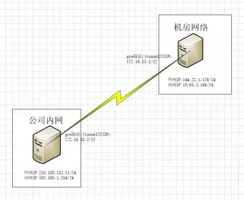

# [GRE隧道配置实践](https://www.linuxprobe.com/gre-tunnel-config.html)



从拓扑图可以看到，公司和机房的服务器上各有一个内网IP和外部IP。gre隧道的原理就是把两台服务器的外网IP进行绑定，在两个外网IP直接建立一条隧道tunnel2。tunnel2对服务器看来，就像一个网口，直连着隧道的另一边。

这里给tunnel配置一个新的IP段：172.16.33.1/2

**具体配置：**

218.188.152.11：

```bash
开启路由转发，加载gre协议模块
# echo 1 > /proc/sys/net/ipv4/ip_forward
# modprobe ip_gre

创建隧道tunnel2，添加一虚拟网段172.16.33.0/24
# ip tunnel add tunnel2 mode gre local 218.188.152.11 remote 144.22.1.176 ttl 255 dev eth1
# ip addr add 172.16.33.2 dev tunnel2 peer 172.16.33.1/32
# ip link set dev tunnel2 up
  
添加一条路由到通过隧道到机房内网的路由
# ip route add 10.65.3.0/24 dev tunnel2
```

144.22.1.176:

```bash
开启路由转发，加载gre协议模块
# echo 1 > /proc/sys/net/ipv4/ip_forward
# modprobe ip_gre
创建隧道tunnel2，添加一虚拟网段172.16.33.0/24

# ip tunnel add tunnel2 mode gre local 144.22.1.176 remote 218.188.152.11 ttl 255 dev em1
# ip addr add 172.16.33.1 dev tunnel2 peer 172.16.33.2/32
# ip link set dev tunnel2 up
  
添加一条路由到通过隧道到公司内网的路由
# ip route add 192.168.1.0/24 dev tunnel2
```

**查看路由**

218.188.152.11：

```bash
# netstat -nr
Kernel IP routing table
Destination     Gateway         Genmask         Flags   MSS Window  irtt Iface
172.16.33.1     0.0.0.0         255.255.255.255 UH        0 0          0 tunnel2
192.168.1.0     0.0.0.0         255.255.255.0   U         0 0          0 eth0
10.65.3.0       0.0.0.0         255.255.255.0   U         0 0          0 tunnel2
0.0.0.0         xx.xx.xx.xx    0.0.0.0         UG        0 0          0 eth0
```

   内网服务器多了172.16.33.1,10.65.3.0/24的两条路由，网关为gre隧道，通过隧道到达机房服务器。

144.22.1.176:

```bash
# netstat -nr
Kernel IP routing table
Destination     Gateway         Genmask         Flags   MSS Window  irtt Iface
172.16.33.2     0.0.0.0         255.255.255.255 UH        0 0          0 tunnel2
192.168.1.0     0.0.0.0         255.255.255.0   U         0 0          0 tunnel2
10.65.3.0       0.0.0.0         255.255.255.0   U         0 0          0 em2
0.0.0.0         xx.xx.xx.xx    0.0.0.0         UG        0 0          0 em1
```

   机房服务器多了172.16.33.2,192.168.1.0/24的两条路由，网关为gre隧道，通过隧道到达机房服务器。

**测试网络连通：**

218.188.152.11：

```bash
# ping 172.16.33.2
PING 172.16.33.2 (172.16.33.2) 56(84) bytes of data.
64 bytes from 172.16.33.2: icmp_seq=1 ttl=64 time=0.048 ms
64 bytes from 172.16.33.2: icmp_seq=2 ttl=64 time=0.059 ms
--- 172.16.33.2 ping statistics ---
2 packets transmitted, 2 received, 0% packet loss, time 1021ms
rtt min/avg/max/mdev = 0.048/0.053/0.059/0.009 ms

# ping 10.65.3.194
PING 10.65.3.194 (10.65.3.194) 56(84) bytes of data.
64 bytes from 10.65.3.194: icmp_seq=1 ttl=64 time=7.96 ms
64 bytes from 10.65.3.194: icmp_seq=2 ttl=64 time=7.63 ms
--- 10.65.3.194 ping statistics ---
2 packets transmitted, 2 received, 0% packet loss, time 1100ms
rtt min/avg/max/mdev = 7.638/7.799/7.960/0.161 ms
```

   公司服务器可以直接ping通对端机房服务器的gre ip以及内网IP。

144.22.1.176:

```bash
# ping 172.16.33.1
PING 172.16.33.1 (172.16.33.1) 56(84) bytes of data.
64 bytes from 172.16.33.1: icmp_seq=1 ttl=64 time=0.018 ms
64 bytes from 172.16.33.1: icmp_seq=2 ttl=64 time=0.016 ms
--- 172.16.33.1 ping statistics ---
2 packets transmitted, 2 received, 0% packet loss, time 1274ms
rtt min/avg/max/mdev = 0.016/0.017/0.018/0.001 ms

# ping 192.168.1.254
PING 192.168.1.254 (192.168.1.254) 56(84) bytes of data.
64 bytes from 192.168.1.254: icmp_seq=1 ttl=64 time=7.81 ms
64 bytes from 192.168.1.254: icmp_seq=2 ttl=64 time=7.97 ms
--- 192.168.1.254 ping statistics ---
2 packets transmitted, 2 received, 0% packet loss, time 1232ms
rtt min/avg/max/mdev = 7.810/7.894/7.978/0.084 ms
```

​    反过来，机房服务器也可以直接ping通对端公司服务器的gre ip以及内网IP。

## 小结

实现本文中的场景的方法绝不止今天说的这一种，还可以是VPN、SSH隧道等。总之，在运维童鞋的手里，没有啥不可能的，要上天绝不入地~~~o(∩_∩)o 哈哈，你说呢？~~