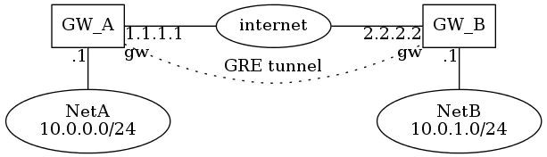
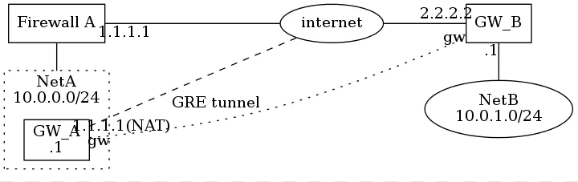
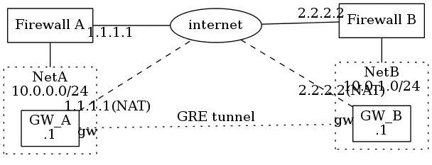

# Linux下用GRE隧道直接连通两个私网

## 概述

这篇文档其实主要讲的是行内关于“打洞”的事情。

## 什么叫“打洞”

通过在两个私网之间打一条隧道（tunnel）而把他们连接起来的方法，行内俗称“**打洞**”，其实专业的说法应该是“搭建隧道”，在两个能路由的两个单独的私有网络之间搭建一条隧道（tunnel）以便于两个私网之间能够直接互通。

## 为什么要“打洞”？刚需

这个恐怕对于大多数互联网企业来讲，都是绕不开的需求。互联网公司大多有好些单独的私网，比如，每个单独的办公环境都有单独的私网吧，还有托管机房是不是也有单独的私网？如果用了公有云的话，那么每个公有云是不是也有单独的私网？而“打洞”就是为了把这些网络无缝的连接起来，组成一张大的“内网”。显而易见有几个好处：

- 办公网的每一个用户可以自动漫游，无需修改配置而访问办公网的每一个节点
- 办公、管理都走私网，貌似更显得专业、安全一些

## 中小企业场景

我们这里主要讲中小企业常用的Linux+GRE+tunnel方案，为什么不提大型企业呢？因为大公司大多直接采购专业的网络设备来做类似的工作了，更有甚者，直接租用点对点专线来直连各个私网，所以高富帅的生活我等屌丝不懂，也就不在这里讨论了。

## 怎样“打洞”

下面就以在CentOS6.x(CentOS7.x其实是一样的)下为例来讲下怎样打洞（GRE tunnel），其他Linux发行版下的情况可以同理推之。

## 场景一

如下图所示：两个私网的网关都分别直接有公网地址。这个场景应该是最普遍的场景。



注意：上图由如下graphviz代码生成。

```shell
 <graphviz dot>
 digraph G {
 rankdir="LR";
 GA [shape=box, label="GW_A"];
 NetA [label="NetA\n10.0.0.0/24"];
 GA -> NetA [dir=none, taillabel=".1"];
 GA -> Internet [dir=none, taillabel="1.1.1.1"];
 Internet [label="internet"];
 Internet -> GB [dir=none, headlabel="2.2.2.2"];
 GB [shape=box, label="GW_B"];
 GB -> NetB [dir=none, taillabel=".1"];
 NetB [label="NetB\n10.0.1.0/24"];
 GA -> GB [dir="none", style="dotted", label="GRE tunnel", headlabel="gw", taillabel="gw", constraint=false];
 {rank=same GA NetA}
 {rank=same GB NetB}
 }
 </graphviz>
```

这个配置是最好写了，在GW_A上写配置文件*/etc/sysconfig/network-scripts/ifcfg-gw*

```ini
DEVICE=gw
ONBOOT=yes
TYPE=GRE
PEER_OUTER_IPADDR=2.2.2.2
PEER_INNER_IPADDR=10.0.1.0/24
MY_INNER_IPADDR=10.0.0.1
KEY=haw-haw.org
BOOTPROTO=none
```

同样的，在GW_B上写配置文件*/etc/sysconfig/network-scripts/ifcfg-gw*

```ini
DEVICE=gw
ONBOOT=yes
TYPE=GRE
PEER_OUTER_IPADDR=1.1.1.1
PEER_INNER_IPADDR=10.0.0.0/24
MY_INNER_IPADDR=10.0.1.1
KEY=haw-haw.org
BOOTPROTO=none
```

最后，分别在GW_A和GW_B上分别激活网络设备gw即可，具体命令是：

```bash
ifup gw;
```

## 场景二

如下图所示：只有一个私网的网关（GW_B）直接有公网地址，另外一个(GW_A)没有直接接公网，但是它在Firewall A设备上有个一对一的NAT(ip是1.1.1.1)，这个情况就稍稍复杂一些。

!

注意：上图由如下graphviz代码生成。

```shell
 <graphviz dot>
 digraph G {
 newrank=true;
 rankdir=LR;
 compound=true;
 FWA [shape=box, label="Firewall A"];
 subgraph cluster_NetA {
 rankdir=LR;
 graph [style="dotted"];
 label="NetA\n10.0.0.0/24";
 GA [shape=box, label="GW_A\n.1"];
 }
 Internet [label="internet"];
 GB [shape=box, label="GW_B"];
 NetB [label="NetB\n10.0.1.0/24"];
 FWA -> GA [dir="none", lhead="cluster_NetA", minlen=2];
 FWA -> Internet [dir=none, taillabel="1.1.1.1", minlen=2, labeldistance=2];
 GA -> Internet [dir=none, style="dashed", taillabel="1.1.1.1(NAT)", constraint=false, labeldistance=3];
 Internet -> GB [dir=none, headlabel="2.2.2.2", minlen=1.5, labeldistance=2];
 GB -> NetB [dir=none, taillabel=".1"];
 GA -> GB [dir="none", style="dotted", label="GRE tunnel", headlabel="gw", taillabel="gw", constraint=false, labeldistance=1];
 {rank=same GB NetB}
 {rank=same FWA GA}
 }
 </graphviz>
```

在GW_A上写配置文件*/etc/sysconfig/network-scripts/ifcfg-gw*

```ini
DEVICE=gw
ONBOOT=yes
TYPE=GRE
PEER_OUTER_IPADDR=2.2.2.2
PEER_INNER_IPADDR=10.0.1.0/24
MY_INNER_IPADDR=10.0.0.1
KEY=haw-haw.org
BOOTPROTO=none
```

同样的，在GW_B上写配置文件*/etc/sysconfig/network-scripts/ifcfg-gw*

```ini
DEVICE=gw
ONBOOT=yes
TYPE=GRE
PEER_OUTER_IPADDR=1.1.1.1
PEER_INNER_IPADDR=10.0.0.0/24
MY_INNER_IPADDR=10.0.1.1
KEY=haw-haw.org
BOOTPROTO=none
```

最后，分别在GW_A和GW_B上分别激活网络设备gw即可，具体命令是：

```bash
ifup gw;
```

细心的人会发现，这两种场景下配置文件是一样的！对，就是一样的。:)

## 场景三

如下图所示：两个私网的网关（GW_A和GW_B）都没有公网地址，都是通过防火墙设备(Firewall A和Firewall B)上分别做的一对一的NAT(ip分别是1.1.1.1和2.2.2.2)。



注意：上图由如下graphviz代码生成。

```shell
 <graphviz dot>
 digraph G {
 newrank=true;
 rankdir=LR;
 compound=true;
 FWA [shape=box, label="Firewall A"];
 subgraph cluster_NetA {
 rankdir=LR;
 graph [style="dotted"];
 label="NetA\n10.0.0.0/24";
 GA [shape=box, label="GW_A\n.1"];
 }
 Internet [label="internet"];
 FWB [shape=box, label="Firewall B"];
 subgraph cluster_NetB {
 rankdir=LR;
 graph [style="dotted"];
 label="NetB\n10.0.1.0/24";
 GB [shape=box, label="GW_B\n.1"];
 }
 FWA -> Internet [dir=none, taillabel="1.1.1.1", minlen=2, labeldistance=2];
 Internet -> FWB [dir="none", headlabel="2.2.2.2", minlen=2, labeldistance=2];
 FWA -> GA [dir="none", lhead="cluster_NetA", minlen=2];
 FWB -> GB [dir="none", lhead="cluster_NetB", minlen=2];
 GA -> Internet [dir=none, style="dashed", taillabel="1.1.1.1(NAT)", constraint=false, labeldistance=3];
 Internet -> GB [dir=none, style="dashed", headlabel="2.2.2.2(NAT)", minlen=1.5, labeldistance=2];
 GA -> GB [dir="none", style="dotted", label="GRE tunnel", headlabel="gw", taillabel="gw", constraint=false, labeldistance=1];
 {rank=same FWB GB}
 {rank=same FWA GA}
 }
 </graphviz>
```

GW_A和GW_B上的配置，跟前两种场景是一样的。

# 调整MTU

这点很重要！不做这个的话你的网络也许会出各种各样的神奇问题！：）

方法很简单，在GW_A和GW_B的机器上分别执行

```bash
iptables -t mangle \
    -A FORWARD \
    -p tcp \
    -m tcp \
    --tcp-flags SYN,RST SYN \
    -j TCPMSS \
    --clamp-mss-to-pmtu;
```

# 优点

这样配置的好处是显而易见的：

## 避免引入互联IP

行内其他的方案其实也差不多，唯一比较大的区别是其他方案一般都会在GW_A和GW_B的隧道虚接口gw上配上互联IP地址来用于互通，然后把对端的私有网络地址段的路由指向对端隧道虚接口gw的互联IP。这样做其实也能实现功能，但是有几个问题：

- 网关机器GW_A和GW_B跟对端私网的非网关的其他机器的私网通讯可能会有问题，需要其他机器上到互联ip所在网段的路由正好指向本网段的网关地址
- 简单看是仅多一对互联IP，但其实是整多一个互联网段！这对于ip地址及网络的维护带来的工作量不能低估

## 配置文件维护方便

- 保证重启服务器、重启网络甚至于重启网络设备都会正确读取配置
- 虚接口也可以单独启停，维护起来相当方便
- 维护模式相当清晰，改动起来非常方便

# 其他

## 启停命令

```bash
ifup gw;# start
ifdown gw;# stop
```

需要注意的是：在以上三种场景中，都需要确认在NetA和NetB网络中机器上到10.0.1.0/24和10.0.0.0/24的路由分别指向了GW_A和GW_B(可以分别在default gw上做)

## 静态路由

在某些具体的场景下，比如NetA后面还接的有NetC，IP地址段是172.16.1.0/24，那么为了让NetB和NetC能私网互通，则必须要在NetB的网关GW_B上将NetC的地址172.16.1.0/24指向NetA的网关地址GW_A才行，这种情况下只需要在GW_B上编辑配置文件*/etc/sysconfig/network-scripts/route-gw*，其内容如下：

```ini
172.16.1.0/24 dev gw src 10.0.1.1
```

这样设置的静态路由会在

```bash
ifup gw;
```

时自动被启用，

```bash
ifdown gw;
```

时自动删除，能不能不要这么方便、人性化！

# 存在问题

本文话题到此就结束了，但是安全意识强的同学就会马上意识到：这种方式把几个不同的网络连成了一个大三层的网络，的确是很方便，但是网络之间的通讯没有被加密，直接明文传输，是不是不太合适？好问题！所以，下一篇文章我们将讲一下怎样把网络之间的流量加密一下。请看，进阶阅读：[CentOS6.x下用ipsec加密GRE隧道](https://www.jianshu.com/p/96c976713bd6)。