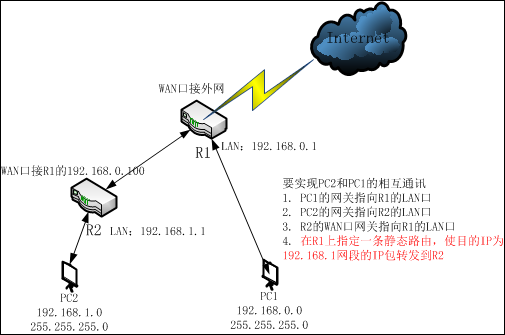
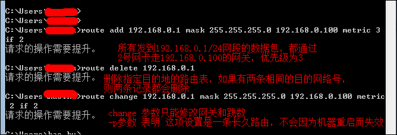
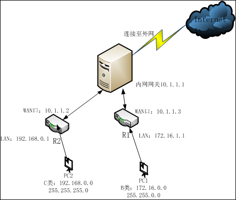
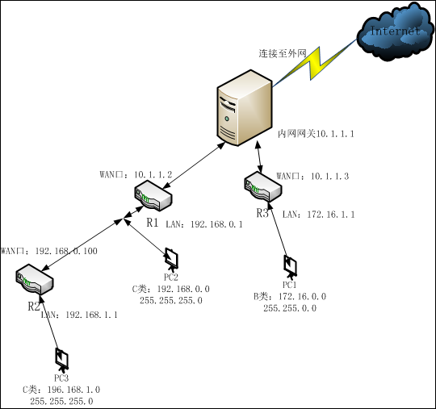

# 不同网段设备相互访问

> 现在有一个需求，A子网和B子网处于不同网段，当网络中存在多个路由器时，要求不同路由器下属的子网可以互相通讯，同时又可以通过宽带路由器上网，这如何实现？在查阅了大量资料和参考了网上现有的解决方案下，得出如下解决方法，更加详细的说明，请[设置静态路由不同网段互相访问](http://wenku.baidu.com/view/423348edb8f67c1cfad6b8db.html)参考。

## 先介绍几个基本知识。

1. 网关，简单来说就是网络中数据的关口，网关的IP地址就是具有路由功能设备的IP地址，而此类设备可以是路由器、启动路由协议的服务器或者代理服务器等。

2. 路由就是把信息从源传输到目的地的行为，在大多数宽带路由器中，未配置静态路由的情况下，内部就存在一条默认路由，这条路由将LAN口下所有目的地不在自己局域网之内的信息包转发到WAN口指定的网关去。每个信息包在经过路由器时，路由器会检查目的IP，将它和路由表中的子网掩码做与计算，并与路由条目中的IP进行对比，相同，就按照这条路由规则转发，不相同就在检查对比下一条，如果所有的都不相同，则转发到默认路由去。

3. 默认路由，路由器在转发时，它将所有非本网段的目的IP包都发到WAN口的网关去，由WAN口网关所指定的设备决定信息包是发到它自己连的内网还是发到外网去。

4. 路由器隔绝广播，划分了广播域，也就是说，路由器不会转发广播数据，不同路由器之间通讯，是通过ARP协议来获得下一跳路由器的MAC地址，ARP是基于广播的，路由器只能发现一跳范围内的其他路由器设备。

5. IPv4地址是有4段8位二进制数组成，一部分是网络位，一部分是主机位，网络位对于的子网掩码部分全为1，而主机位全为0.

## 情景一：

企业通过一台路由器R1上网，局域网LAN1,。因为业务需要，扩充了一台路由器R2，加入一个新的局域网段LAN2。

要使能PC1和PC2相互通讯，需要做如下图中所说的设置。

一条静态路由一般由三部分组成，目的IP地址、子网掩码和下一跳地址，按照上图的分析，新建一条静态路由所包含的信息，应该有如下内容，发往目的地址192.168.1.0网段的IP包(子网掩码为255.255.255.0)的下一跳地址为192.168.0.100.具体配置位置，如果是在路由器中，以TP-Link的为例子，在路由器配置界面，有静态路由表配置：

在设置静态路由时，网关IP必须是与本路由器LAN口IP属于同一个网段。 

如果目的IP地址是一台主机的IP地址，则子网掩码必须为255.255.255.255

如果是在服务器上，可以通过命令行来配置静态路由，包括添加、删除和修改。

## 情景二：

小区共享性宽带接入，A用户用一台宽带路由器构建了一个局域网，B用户也用一台宽带路由器构建局域网，A、B用户各自局域网之间的主机不能相互通讯。网络拓扑如下：

 

要想实现PC2和PC1之间的互相访问，和情景一类似，需要在内网网关中添加两条静态路由。一般的小区网关肯定是不会随便让用户配置路由的，而且这样配置后，其他网段的电脑也可以访问PC1和PC2，这样带来了安全隐患。我们可以这样设置，不在内网网关上面添加静态路由，在R1和R2上各添加一条路由，指向对象来实现R1和R3下主机的相互访问。

## 情景三：

既有串联也有并联，网络中有多级路由设备的环境，这种情况可以说是情景一和情景二的整合。

类似的网络拓扑如下：

要实现PC1、PC2和PC3之间的互访，需要配置如下的静态路由：

R1:目的地址为192.168.1.0，掩码255.255.255.0，下一跳为192.168.0.100

   目的地址为172.16.0.0，掩码255.255.0.0，下一跳为10.1.1.3

R3：目的地址为192.168.0.0，掩码255.255.255.0，下一跳为10.1.1.2

​    目的地址为192.168.1.0，掩码255.255.255.0，下一跳为10.1.1.2.

对于路由器R3来看，它只能看到R1，而看不到R2.对于R3来说，上面两条路由，可以汇总会一条，就是

目的地址为192.168.0.0，掩码为255.255.0.0，下一跳为10.1.1.2.这个网段包含了192.168.0.0~192.168.255.0所有的子网，这条静态路由会使所有目的IP在这个范围内的信息包，都转发给10.1.1.2路由器R1，这种，将多条子路由条目汇总成一条都包含在内的总路由条目，叫做路由汇总。

在大型路由器上，路由表往往很长很大，采用路由汇总可以减少路由表的长度，提高路由器效率。

路由汇总也不总是有效的，因为子网的划分是人为的，路由汇总中的其他网段可能存在其他局域网下。

上述例子中的路由汇总，不那么精确，对于192.168.0.0和192.168.1.0，网络位相同的位数有前23位，要可以通过掩码来区分这两个网段的话，需要将掩码设置为255.255.254.0,这条改进的汇总路由表应该写成这样：

目的地址为192.168.0.0，子网掩码为255.255.254.0，下一跳为10.1.1.2.这条汇总路由，只会包含192.168.0.0和192.168.0.1两个子网，这是一条精确路由。

## 总结：

在进行路由汇总时，应该经历使用精确的汇总条目，本能汇总的条目就汇总，不能精确汇总的条目就不汇总的原则，这样有助于网络以后的扩展和维护。