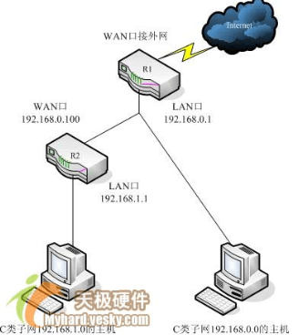
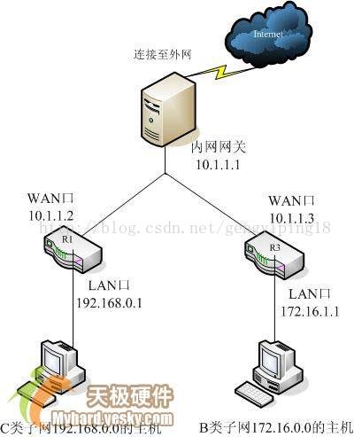
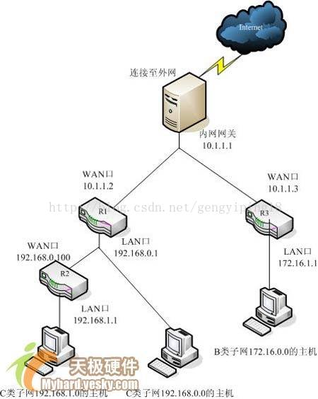
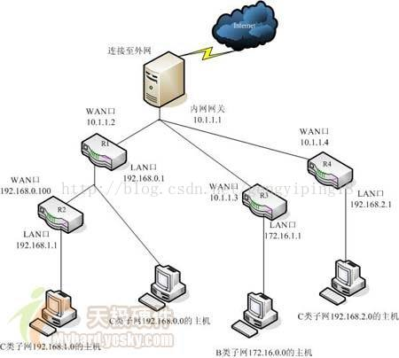

# [局域网两个不同网段互相访问](https://www.cnblogs.com/embedded-linux/p/10200831.html)

局域网内为便于管理和接入，经常划分为不同的网段，不同网段的PC通过一个路由器与上层网段连接，可访问外网或上层网络；但上层或同层网络不同网段PC不能访问其他网段PC。

PC通过一个路由器与主网或上层网络连接时，也出现上述现象：自己的路由器连接到主网上，PC和嵌入式设备连接到路由器，PC和嵌入式设备可访问上层网络或外网，但上层网络或其他网段PC不能访问自己PC或嵌入式设备。

**可通过设置上层网络的网关的静态路由实现互相访问；若是同级，可互相指定路由。**

## 基础知识

1. 网关，简单来说就是网络中数据的关口，网关的IP地址就是具有路由功能设备的IP地址，而此类设备可以是路由器、启动路由协议的服务器或者代理服务器等。

2. 路由就是把信息从源传输到目的地的行为，在大多数宽带路由器中，未配置静态路由的情况下，内部就存在一条默认路由，这条路由将LAN口下所有目的地不在自己局域网之内的信息包转发到WAN口指定的网关去。每个信息包在经过路由器时，路由器会检查目的IP，将它和路由表中的子网掩码做与计算，并与路由条目中的IP进行对比，相同，就按照这条路由规则转发，不相同就在检查对比下一条，如果所有的都不相同，则转发到默认路由去。

3. 默认路由，路由器在转发时，它将所有非本网段的目的IP包都发到WAN口的网关去，由WAN口网关所指定的设备决定信息包是发到它自己连的内网还是发到外网去。

4. 路由器隔绝广播，划分了广播域，也就是说，路由器不会转发广播数据，不同路由器之间通讯，是通过ARP协议来获得下一跳路由器的MAC地址，ARP是基于广播的，路由器只能发现一跳范围内的其他路由器设备。

5. IPv4地址是有4段8位二进制数组成，一部分是网络位，一部分是主机位，网络位对于的子网掩码部分全为1，而主机位全为0.

\-----------------------------------------------------------------------

如下转自：[多个路由器设置静态路由 不同网段可以互相访问](https://blog.csdn.net/gengyiping18/article/details/53581534)

随着宽带接入的普及，很多家庭和小企业都组建了局域网来共享宽带接入。而且随着局域网规模的扩大，很多地方都涉及到2台或以上路由器的应用。当一个局域网内存在2台以上的路由器时，由于其下主机互访的需求，往往需要设置路由。由于网络规模较小且不经常变动，所以静态路由是最合适的选择。可是如果是多网段，又想实现不同网段电脑互访，设置静态路由就要掌握方法了。

本文作为一篇初级入门类文章，会以几个简单实例讲解静态路由，并在最后讲解一点关于路由汇总（归纳）的知识。由于这类家庭和小型办公局域网所采用的一般都是中低档宽带路由器，所以这篇文章就以最简单的宽带路由器为例。（其实无论在什么档次的路由器上，除了配置方式和命令不同，其配置静态路由的原理是不会有差别的。）常见的1WAN口、4LAN口宽带路由器可以看作是一个最简单的双以太口路由器＋一个4口小交换机，其WAN口接外网，LAN口接内网以做区分。

路由就是把信息从源传输到目的地的行为。形象一点来说，信息包好比是一个要去某地点的人，路由就是这个人选择路径的过程。而路由表就像一张地图，标记着各种路线，信息包就依靠路由表中的路线指引来到达目的地，路由条目就好像是路标。在大多数宽带路由器中，未配置静态路由的情况下，内部就存在一条默认路由，这条路由将 LAN口下所有目的地不在自己局域网之内的信息包转发到WAN口的网关去。宽带路由器只需要进行简单的WAN口参数的配置，内网的主机就能访问外网，就是这条路由在起作用。本文将分两个部分，第一部分讲解静态路由的设置应用，第二部分讲解关于路由归纳的方法和作用。

## 静态路由设置

下面就以网络初学者遇到的几个典型应用为例，说明一下什么情况需要设置静态路由，静态路由条目的组成，以及静态路由的具体作用。

### 例一：最简单的串连式双路由器型环境

这种情况多出现于中小企业在原有的路由器共享Internet的网络中，由于扩展的需要，再接入一台路由器以连接另一个新加入的网段。而家庭中也很可能出现这种情况，如用一台宽带路由器共享宽带后，又加入了一台无线路由器满足无线客户端的接入。

公司里原有一个局域网LAN 1，靠一台路由器共享Internet，现在又在其中添加了一台路由器，下挂另一个网段LAN 2的主机。经过简单设置后，发现所有主机共享Internet没有问题，但是LAN 1的主机无法与LAN 2的主机通信，而LAN 2的主机却能Ping通LAN 1下的主机。这是怎么回事？

这是因为路由器隔绝广播，划分了广播域，此时LAN 1和LAN 2的主机位于两个不同的网段中，中间被新加入的路由器隔离了。所以此时LAN 1下的主机不能“看”到LAN 1里的主机，只能将信息包先发送到默认网关，而此时的网关没有设置到LAN 2的路由，无法做有效的转发。这种情况下，必须要设置静态路由条目。此种网络环境的拓扑示意如下：

 图1（注：图中省略了可能存在的交换层设备）

如图一所示，LAN 1为192.168.0.0这个标准C类网段，路由器R1为原有路由器，它的WAN口接入宽带，LAN口（IP为192.168.0.1）挂着 192.168.0.0网段（子网掩码255.255.255.0的C类网）主机和路由器R2（新添加）的WAN口（IP为 192.168.0.100）。R2的LAN口（IP为192.168.1.1）下挂着新加入的LAN 2这个192.168.1.0的C类不同网段的主机。

如果按照共享 Internet的方式简单设置，此时应将192.168.0.0的主机网关都指向R1的LAN口（192.168.0.1），192.168.1.0网段的主机网关指向R2的LAN口（192.168.1.1），那么只要R2的WAN口网关指向192.168.0.1，192.168.1.0的主机就都能访问192.168.0.0网段的主机并能通过宽带连接上网。这是因为前面所说的宽带路由器中一条默认路由在起作用，它将所有非本网段的目的IP包都发到WAN口的网关（即路由器R1），再由R1来决定信息包应该转发到它自己连的内网还是发到外网去。但是192.168.0.0网段的主机网关肯定要指向 192.168.0.1，而R1这时并不知道192.168.1.0这个LAN 2的正确位置，那么此时只能上网以及本网段内的互访，不能访问到192.168.1.0网段的主机。这时就需要在R1上指定一条静态路由，使目的IP为 192.168.1.0网段的信息包能转发到路由器R2去。

一条静态路由条目一般由3部分组成：1）目的IP地址或者叫信宿网络、子网；2）子网掩码；3）网关或叫下一跳。

例一中R1上设定的静态路由条目就应该为：目的IP地址192.168.1.0（代表1.x这个网段），子网掩码255.255.255.0（因为是C 类网段），下一跳192.168.0.100。如图2，此图为TP-LINK R410中的静态路由表配置项，保存后即可生效。如果是Cisco的路由器，则在全局配置模式下键入命令：Router(config)# ip route 192.168.1.0 255.255.255.0 192.168.0.100。

 

注意：其中的网关IP必须是与WAN或LAN口属于同一个网段。**那条默认路由写出来就是：目的IP为 0.0.0.0，子网掩码0.0.0.0，下一跳为WAN口上的默认网关，有时我们也称它为“8个0的默认路由”。**另外，如果目的IP是一个具体的主机 IP（如192.168.1.2），那么路由条目应为：目的IP 192.168.1.2，子网掩码255.255.255.255，下一跳或网关192.168.0.100。

使用此种连接方式，还可以方便的使用路由器内置的访问控制列表来设置LAN 2下主机的访问权限，这对企业用户而言还是很方便的。宽带路由器中的“防火墙设置”其实就是一个简化的访问控制列表，即ACL- Access Control Lists。如：希望局域网LAN 2中IP地址为192.168.1.7的计算机不能收发邮件，IP地址为192.168.1.8的计算机不能访问企业内部位于LAN 1的ERP服务器（假设其IP为192.168.0.10），对局域网中的其它计算机则不做任何限制，这时您需要指定如下的数据包过滤表，如图：

### 例二：两台平级并连的路由器，下挂子网中主机需要互相通信的环境这种情况

两台平行并连的路由器上层应该还有一个总的出口网关，而这个网关有可能因某种原因不便设置路由，而此时网络中存在3个不同的网段。

我家是小区共享型的宽带接入，我自己用一台宽带路由器构建了一个家庭局域网以共享Internet，正好邻居也跟我一样用宽带路由器构建了另一个家庭局域网。而我们各自局域网内的主机之间却不能互相通信，根本ping不通，这是怎么回事？

这种情况下整个小区其实就是一个大的局域网，主机不能互通的原因，其实跟例一中LAN 1不能ping通LAN 2的原因一样，都是因为上层的默认网关不知道目的IP所属网段的正确位置，无法做有效转发所致。这种环境的典型示意图如下：

图中内网网关就是小区的网关，R1和R3分别为两户的宽带路由器，它们之间一般通过楼层的接入交换机和小区的骨干交换机连接在一起，此图省略了这一部分。图4的这种情况，只要在网关设备上按例一的方式添加两条路由就能实现两个子网中主机的互访，而且其10.0.0.0这个A类网段中存在的主机也都能通过这两条路由访问到R1和R3下的内网机。但是如果是小区的网关设备，那肯定是不会让用户随便配置路由条目的，而且你应该也不想小区内的所有用户都能直接访问到你的内网主机。这时，我们可以在R1和R3上各添加一条路由指向对方来实现R1和R3下主机直接互访的效果。

在R1上：目的IP地址172.16.0.0，子网掩码255.255.0.0（B类网段），下一跳10.1.1.3。

在R3上：目的IP地址192.168.0.0，子网掩码255.255.255.0（C类网段），下一跳10.1.1.2。

注：有些新型小区中使用了P-VLAN技术，这种网络的情况比较复杂，这样上面简单的静态路由设置有可能无法达到目的。

### 例三：既串且并，网络中有多级路由设备的环境

这种情况可以说是例一和例二两种应用的整合和延伸，看似复杂其实简单。如果像例二中那样的环境中，我家里的局域网再添置一个路由器，下挂另一个网段以做扩展，那要怎么设置呢？

这种网络结构，确实就是将例一和例二合在一起了。这时一共有4个网段并存，我们的设置是要让两户家庭局域网下的3个子网内主机能够互通，而此时小区的网关当然还是不能去设置的。其拓扑示意图如下：

 

可以看到图5就是将图1和图4整合在一起了。既然拓扑图是例一、例二的结合，那将例一、例二中的路由条目加在一起是不是就可以了呢？当然也不是这么简单，如果只是配置了前两例的路由条目，R3下的主机是无法直接访问到R2下的192.168.1.0这个子网的。所以在R3上还要加一条到 192.168.1.0这个子网的路由。静态路由条目配置如下：

R1：目的IP地址192.168.1.0，子网掩码255.255.255.0，下一跳192.168.0.100。

  目的IP地址172.16.0.0，子网掩码255.255.0.0，下一跳10.1.1.3。

R3：目的IP地址192.168.0.0，子网掩码255.255.255.0，下一跳10.1.1.2。

  目的IP地址192.168.1.0，子网掩码255.255.255.0，下一跳10.1.1.2。

为何R3中第二条路由的下一跳不是直接指向R2，而是也指向R1呢？

这个问题要从路由器间通信的原理来讲解。路由器是通过ARP解析协议来获得下一跳路由器的MAC地址，而ARP基于广播，在一般情况下路由器是不会转发广播，也就是广播包无法过路由。所以对于路由器R3来讲，R1和R3才是同等级的，它只能看到R1，不能看到R2，这就是为何在例一的注意中提到：“其中的网关IP必须是与WAN或LAN口属于同一个网段”的原因。而文中所说的静态路由条目组成的第3部分：网关又叫下一跳，而不叫下两跳、下三跳也是这个意思。总之，在一般情况下，下一跳路由的IP地址肯定要跟这个路由器的某个接口是在同一个网段的。

## 路由汇总（或叫路由归纳）

上面例三中R3上的静态路由条目，其实可以写成一条：目的IP地址192.168.0.0，子网掩码255.255.0.0（不再是C类子网的掩码），下一跳10.1.1.2。这时192.168.0.0，掩码255.255.0.0这个网段不能称为C类或B类的子网了，由于它超过了本身C类网段的范围，所以可以称它是一个超网。这个网段包含了192.168.0.0～192.168.255.0所有的子网。也就是说，这条静态路由会使所有目的IP在这个范围内的信息包，都发给10.1.1.2的路由器R1。将多条子路由条目汇总成一条都包含其内的总路由条目，这就是路由汇总或叫路由归纳。路由器在检查计算路由时是比较消耗资源的，路由条目越多，路由表越长，则这个过程耗时越多，所以**通过路由汇总减少路由表的长度，对提高路由器工作效率**是很有帮助的。虽然在举例中的这种只有几个路由器的小网络中起到的作用有限，但是如果是几十、几百甚至上千、上万个路由器的大型网络中，路由归纳起到的作用就非常明显了，可以说不使用路由归纳是不可想象的。

### 例四：多层次多主机网络

可能细心的读者已经发现，例三最后的那条归纳路由虽然包含了R1下所有的两个子网（192.168.0.0和192.168.1.0），但是也包含了 R1下实际上并不存在的一些子网（192.168.2.0～192.168.255.0）。如果在整个局域网中别的路由器下还存在这些子网（如图6，R4 下存在192.168.2.0子网），那么路由就会出错了，所以这条汇总路由是一条不精确的汇总。

我们都知道IPv4的地址是由4段8位的二进制数组成，一部分是网络位，一部分是主机位。其对应的子网掩码网络位部分就是全1的二进制数，而主机位就是全0 的二进制数。每个信息包在过路由器时会检查其目的IP，和路由表中路由条目的子网掩码做“与”运算，并与路由条目中目的IP进行比对，相同的就按照这条路由规则转发，不相同的就再检查比对下一条。可以看出我们做的汇总路由的操作，就是将多条路由条目中目的IP相同的网络位提取出来写成一条。而例三中的汇总路由之所以不精确就是因为相同部分未能全部提出来。

如例三中，R3上的第一条：目的IP为 192.168.0.0；第二条：目的IP为192.168.1.0。我们只提取了前面的两段192.168，而后面的第三段网络位中还是有相同的部分的。192.168.0.0中第三段写成二进制数为00000000（8位0），182.168.1.0中第三段写成二进制数为00000001（7位 0，1位1），那么它们的前7位是相同的，在对应的子网掩码位置上就应该是11111110（7位1，1位0），合成十进制为254。所以这条汇总路由应该写成：目的IP为192.168.0.0，子网掩码255.255.254.0，下一跳10.1.1.2。这样，这条汇总路由只包含 192.168.0.0和192.168.1.0两个子网，是一条精确的汇总路由。如图6中，R3下172.16.0.0的主机发送到 192.168.2.0网段的信息包，其第三段网络位写成二进制为00000010（前6位0），就不包含在这条精确的汇总路由内了。

这时我们在R3上静态路由条目应该为：

1.目的IP地址192.168.0.0，子网掩码255.255.254.0，下一跳10.1.1.2。

2.目的IP地址192.168.2.0，子网掩码255.255.255.0，下一跳10.1.1.4。

我们在进行路由汇总时应该尽量使用精确的汇总条目，本着能汇总的条目就汇总，不能精确汇总的条目就不汇总的原则。这样在网络以后的扩展和变动时能更有条理的增改路由表，减少出错的几率。

## 总结

静态路由因为其设置简单明了，在不常变动的网络中稳定性好，排错也相对容易，所以在中小企业甚至一些大型的园区网中也都使用静态路由，它在实际应用中是很常见的，属于网络工作人员必会的基础知识。如文中所述，静态路由的设置原理是比较简单的，但可以说它是学习各种路由协议的基础，属于学习路由知识时必学的部分。另外，在越复杂越大的网络中，汇总路由的效果就越显著，而能不能进行有效的路由汇总、汇总的效率如何，都跟网络结构中IP地址网段的分布有密切关系。IP地址的部署越连续而有条理，则路由汇总越容易也越有效，所以我们在部署网络时应该重视体系化编址。（注：在子网环境中，当网络地址是以2的指数形式的连续区块时，路由归纳是最有效的。）