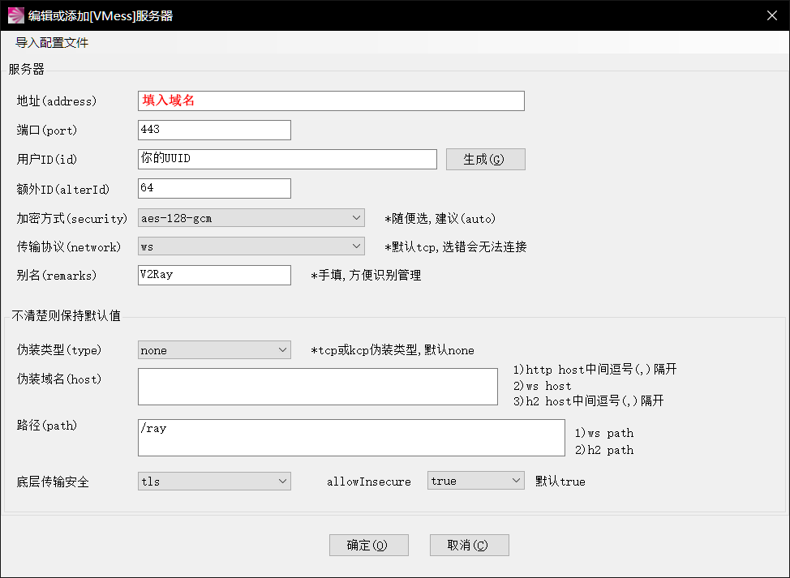

# [V2Ray+WebSocket+TLS+Nginx配置与使用教程](https://doubibackup.com/v2ray-ws-tls-nginx.html)

## 一、准备工作

首先要有一台国外VPS，这里推荐使用搬瓦工，年付$49.99起，还有CN2 GIA-E（年付$119起），支持支付宝，详细可以参考[一些便宜性价比高的VPS推荐（搬瓦工VPS）](https://doubibackup.com/jgjhicaj.html)。

之后需要一个域名，可以付费购买（推荐[Namesilo](https://www.namesilo.com/?rid=775dd38gf)），也可以在Freenom申请一个免费域名（[申请教程](https://doubibackup.com/y1cauqqx.html)），之后解析到你的VPS IP上。

## 二、安装V2Ray

直接使用V2Ray官方脚本即可：

```shell
# 安装v2ray
bash <(curl -L -s https://install.direct/go.sh) # 直接使用脚本
service v2ray start # 启动
vim /etc/v2ray/config.json # 修改配置文件
```

## 三、配置V2Ray服务器

此脚本会自动安装以下文件：

- `/usr/bin/v2ray/v2ray`：V2Ray 程序；
- `/usr/bin/v2ray/v2ctl`：V2Ray 工具；
- `/etc/v2ray/config.json`：配置文件；
- `/usr/bin/v2ray/geoip.dat`：IP 数据文件
- `/usr/bin/v2ray/geosite.dat`：域名数据文件 此脚本会配置自动运行脚本。自动运行脚本会在系统重启之后，自动运行 V2Ray。目前自动运行脚本只支持带有 Systemd 的系统，以及 Debian / Ubuntu 全系列。

运行脚本位于系统的以下位置：

- `/etc/systemd/system/v2ray.service`: Systemd
- `/etc/init.d/v2ray`: SysV
  脚本运行完成后，你需要：

编辑 `/etc/v2ray/config.json` 文件来配置你需要的代理方式；

运行 `service v2ray start` 来启动 V2Ray 进程；

之后可以使用 `service v2ray start|stop|status|reload|restart|force-reload` 控制 V2Ray 的运行。

编辑V2ray配置文件：

```shell
{
  "log" : {
    "access": "/var/log/v2ray/access.log",
    "error": "/var/log/v2ray/error.log",
    "loglevel": "warning"
  },
  "inbound": {
    "port": 9000, //(此端口与nginx配置相关)
    "listen": "127.0.0.1",
    "protocol": "vmess",
    "settings": {
      "clients": [
        {
          "id": "eb950add-608e-409d-937f-e797324387093z", //你的UUID， 此ID需与客户端保持一致
          "level": 1,
          "alterId": 64 //此ID也需与客户端保持一致
        }
      ]
    },
   "streamSettings":{
      "network": "ws",
      "wsSettings": {
           "path": "/v2ray" //与nginx配置相关
      }
   }
  },
  "outbound": {
    "protocol": "freedom",
    "settings": {}
  },
  "outboundDetour": [
    {
      "protocol": "blackhole",
      "settings": {},
      "tag": "blocked"
    }
  ],
  "routing": {
    "strategy": "rules",
    "settings": {
      "rules": [
        {
          "type": "field",
          "ip": [
            "0.0.0.0/8",
            "10.0.0.0/8",
            "100.64.0.0/10",
            "127.0.0.0/8",
            "169.254.0.0/16",
            "172.16.0.0/12",
            "192.0.0.0/24",
            "192.0.2.0/24",
            "192.168.0.0/16",
            "198.18.0.0/15",
            "198.51.100.0/24",
            "203.0.113.0/24",
            "::1/128",
            "fc00::/7",
            "fe80::/10"
          ],
          "outboundTag": "blocked"
        }
      ]
    }
  }
}
```

## 四、配置Nginx

Nginx安装很简单的，Google一下就有了。

另外，编辑Nginx配置文件，添加一个配置：

```shell
server {
    # SSL configuration
    listen 443 ssl http2 default_server;
    listen [::]:443 ssl http2 default_server;
    ssl_certificate /ssl.pem; #你的ssl证书， 如果第一次，可能还需要自签一下，
    ssl_certificate_key /ssl.key; #你的ssl key
 
    root /var/www/html;
 
    # Add index.php to the list if you are using PHP
    index index.html index.htm index.nginx-debian.html;
 
    server_name test.v2ray.com; #你的服务器域名
 
    location /ray { #/ray 路径需要和v2ray服务器端，客户端保持一致
        proxy_redirect off;
        proxy_pass http://127.0.0.1:10000; #此IP地址和端口需要和v2ray服务器保持一致，
        proxy_http_version 1.1;
        proxy_set_header Upgrade $http_upgrade;
        proxy_set_header Connection "upgrade";
        proxy_set_header Host $http_host;
    }
}
```

关于域名ssl 证书，使用certbot自动签一个let’s encrypt证书就行了， 很简单，参考链接: https://certbot.eff.org/，成功后， 在crontab 中添加一条任务计划每三个月执行一次，因为let’s encrypt证书三个月过期：

```
0 0 15 */3 * /root/certbot/certbot-auto renew  #在3，6，9，12月份的15号零点零分执行更新
```

## 五、配置V2Ray客户端

编辑V2Ray客户端配置文件：

```shell
{
  "log": {
    "loglevel": "warning"
  },
  "inbound": {
    "port": 1080,
    "listen": "127.0.0.1",
    "protocol": "socks",
    "settings": {
      "auth": "noauth",
      "udp": false
    }
  },
  "inboundDetour": [
    {
        "port": 8123,
        "listen": "127.0.0.1",
        "protocol": "http",
        "settings": {}
    }
  ],
  "outbound": {
    "protocol": "vmess",
    "settings": {
      "vnext": [{
        "address": "test.v2ray.com", // 服务器地址，请修改为你自己的服务器 ip 或域名
        "port": 443,  // 服务器端口
        "users": [{
            "id": "461aad1f-687c-4188-9abc-80073a618ca3", //你的UUID， 此ID需与服务端保持一致
            "level": 1,
            "alterId": 64,  //此ID也需与客户端保持一致
            "security": "aes-128-gcm"
        }]
      }]
    },
    "streamSettings":{
        "network": "ws",
        "security": "tls",
        "tlsSettings": {
            "serverName": "test.v2ray.com" //此域名是你服务器的域名
        },
        "wsSettings": {
            "path": "/ray" //与服务器配置及nginx配置相关
        }
    },
    "tag": "forgin"
  },
  "outboundDetour": [
    {
        "protocol": "freedom",
        "settings": {},
        "tag": "direct"
    }
  ],
  "routing": { //此路由配置是自动分流， 国内IP和网站直连
    "strategy": "rules",
    "settings": {
        "domainStrategy": "IPIfNonMatch",
        "rules": [
            {
                "type": "chinaip",
                "outboundTag": "direct"
            },
            {
                "type": "chinasites",
                "outboundTag": "direct"
            },
            {
                "type": "field",
                "ip": [
                    "0.0.0.0/8",
                    "10.0.0.0/8",
                    "100.64.0.0/10",
                    "127.0.0.0/8",
                    "169.254.0.0/16",
                    "172.16.0.0/12",
                    "192.0.0.0/24",
                    "192.0.2.0/24",
                    "192.168.0.0/16",
                    "198.18.0.0/15",
                    "198.51.100.0/24",
                    "203.0.113.0/24",
                    "::1/128",
                    "fc00::/7",
                    "fe80::/10"
                ],
                "outboundTag": "direct"
            }
        ]
    }
  },
  "policy": {
    "levels": {
      "0": {"uplinkOnly": 0}
    }
  }
}
```

或者下载Windows客户端：[V2RayN](https://doubibackup.com/v2rayN.zip)

打开软件，点击：服务器→添加[VMess]服务器：


填上你设置的对应数据，如服务器ip、端口、UUID（服务端和客户端必须一致），加密方式一般为`aes-128-gcm`,协议为`ws`,伪装域名留空，路径为`/ray`，开启tls和不安全传输，设置完保存。

右键V2RayN的系统栏小图标，点击`启用Http代理`，Http代理模式选择第二个`PAC模式`，最后再打开V2RayN软件面板，在检查更新里选择`更新PAC`。

到此，V2Ray就全部配置完成了。

```
转载请超链接注明：逗比根据地 » V2Ray+WebSocket+TLS+Nginx配置与使用教程
```