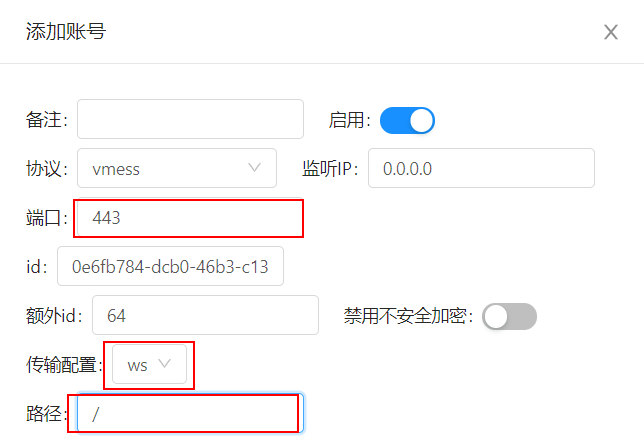
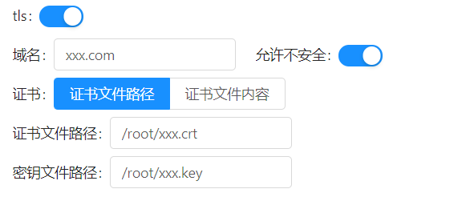
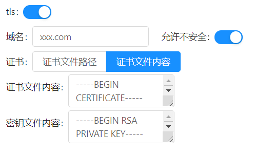
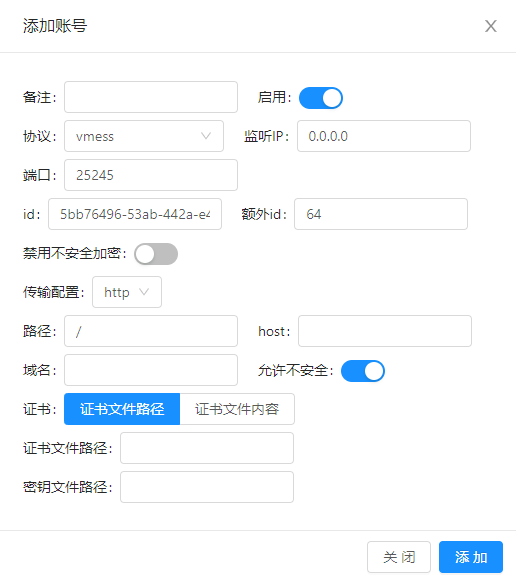
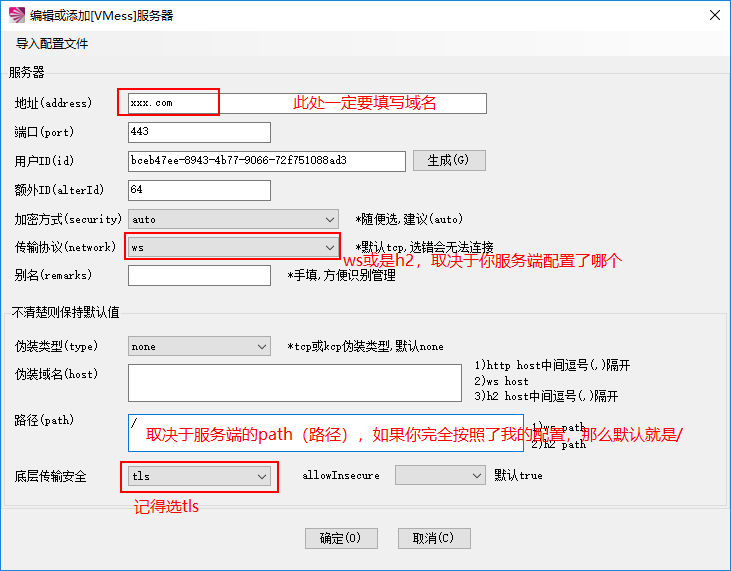

# v2ray 配置 ws + tls 或 http2 + tls 教程

## 一、tls 基本介绍

tls 是传输层安全性协议，其前身是 ssl 协议，可以理解为 ssl 协议的升级版，使用非对称加密技术。目前 tls 版本包括 1.0、1.1、1.2、1.3，v2ray 支持 tls 1.2，也是目前常用的 tls 协议版本，tls 1.3 于 2018 年 8 月发布，还比较新。目前为大众所熟知的 https 协议实际上就等于 http + tls/ssl。

相信有部分人使用过 ssr 的 tls 混淆，实际上那只是一个简单的混淆，相当于就加了一点 tls 特征的数据，企图骗过运营商说我是 tls 协议，并不是真正意义上的 tls，反而会使自己的特征变强，更容易被 ban。

而 v2ray 则实现了一个完整的 tls 1.2，搭配 websocket 或 http2 传输层配置，即可实现真正意义上的 https 网站模拟。这已经模拟了一个 https 网站了，理论上来说能够降低被 ban IP 的几率，但是仍然不能够完全保证你的 IP 是安全的，请把 ban IP 看作是玄学问题，因为谁也不知道防火墙是如何运作的。

如果你确定想使用这种方式，可以继续往下看。

## 二、域名和证书

关于域名的购买，你可以随意的在百度或谷歌上搜索 “购买域名”，有很多域名服务商，随便买。我在此也推荐几个：国内有[阿里云](https://blog.sprov.xyz/go/aliyun-domain)、[腾讯云](https://blog.sprov.xyz/go/tencent-cloud-domain)等等，国外有 [godaddy ](https://blog.sprov.xyz/go/godaddy-sg)等等。以上是我用过的，如果你不用来做大网站，往便宜的挑就行。

证书申请教程：[在 FreeSSL 上为你的域名申请免费 SSL 证书](https://blog.sprov.xyz/2019/04/25/apply-ssl-certificate-at-freessl/)

证书文件获取后，请把公钥文件和私钥文件上传至服务器上，配置时需要用到。

上传文件到服务器的方法请参考：[MobaXterm – 一个强大的全能终端](https://blog.sprov.xyz/2019/02/02/mobaxterm-simple-use/)

## 三、v2ray 服务端安装

以下两者任选其一，前者是手动修改配置文件，后者是通过 web 面板可视化来配置。

[v2ray新手搭建使用教程](https://blog.sprov.xyz/2019/02/04/v2ray-simple-use/)

[v2-ui，一个全新的多协议多用户 v2ray 面板](https://blog.sprov.xyz/2019/08/03/v2-ui/)

## 四、ws + tls 服务端配置

> 建议端口填写 443，因为这是 https 网站最常用的端口，如果服务器上有其它软件占用了 443 端口，也可以填写其它任意端口，理论上也不会有任何问题。

手动 inbound 配置：

> 推荐使用配置文件生成器：[强大的 v2ray 配置文件生成器](https://blog.sprov.xyz/2019/07/19/v2ray-config-generator/)

主要有三个要点要说明的，serverName 填写的是域名，并且这个域名要解析到你安装了 v2ray 的 vps 的 IP。公钥文件和私钥文件需要上传到 vps，可以随意放在一个位置，然后在 certificateFile 填写公钥文件路径，keyFile 填写私钥文件路径，注意要填写绝对路径。

```shell
{
  "port": 443,
  "protocol": "vmess",
  "settings": {
    "clients": [{
      "id": "自行生成 UUID",
      "alterId": 64
     }]
  },
  "streamSettings": {
    "network":"ws",
    "security": "tls",
    "wsSettings":{
      "path":"/",
      "headers":{}
    },
    "tlsSettings": {
      "serverName": "填写域名，如：xxx.com",
      "certificates": [{
        "certificateFile": "公钥文件绝对路径，如：/path/to/xxx.com.crt",
        "keyFile": "私钥文件绝对路径，如：/path/to/xxx.com.key"
      }]
    }
  }
}
```

v2-ui 面板自动配置：

ws 配置

主要说明一下 tls 配置，域名要解析到你安装了 v2ray 的 VPS 的 IP。证书文件一般是 .pem / .crt / .cer 后缀名，密钥文件一般是 .key 后缀名，或者也可能是 .pem，密钥文件名一般会带 “key” 的字样。

> 有些人的证书可能会有三个文件，密钥文件一个，证书文件两个。密钥文件好说，那么证书文件到底填哪个呢，如果分不清的话，在两个证书文件中选内容最长的就好。

这两个文件需要上传到 VPS，可以放在服务器的任意位置，但是你要知道自己上传到哪个路径了，将这两个文件的绝对路径填上去即可。

证书路径配置

或者你也可以不上传这两个文件到 VPS，直接用文本方式打开它们，选择【证书文件内容】，将两个文件的内容分别填进去也可以，最终的效果是一样的。

证书文件内容配置

## 五、http2 + tls 服务端配置

http/2 原本是必须要开 tls 的，在 v2ray 4.20 版本之后加入了 h2c，这样就能不开启 tls 使用 http/2，但是这只推荐在特殊用途的时候使用，引用官方原话：

> V2Ray 4.20 中对服务端的TLS配置的强制条件移除，为了在特殊用途的分流部署环境中，由外部网关组件完成TLS层对话，V2Ray作为后端应用，网关和V2Ray间使用称为`h2c`的明文http/2进行通讯。

所以如果你没有以上特殊用途的话，那么还是**强烈建议你开启 tls**。

手动 inbound 配置：

实际上跟上面的 ws + tls 配置方式差不多，network 改成 http，写上 httpSettings 就可以了。

```shell
{
  "port": 443,
  "protocol": "vmess",
  "settings": {
    "clients": [{
      "id": "自行生成 UUID",
      "alterId": 64
     }]
  },
  "streamSettings": {
    "network":"http",
    "security": "tls",
    "httpSettings":{
      "host": ["在这里填写伪装域名，也可以不填写，直接去掉双引号"],
      "path": "在这里填写网页路径，以 / 开头，例如 /abcde/xyz"
    },
    "tlsSettings": {
      "serverName": "填写域名，如：xxx.com",
      "certificates": [{
        "certificateFile": "公钥文件绝对路径，如：/path/to/xxx.com.crt",
        "keyFile": "私钥文件绝对路径，如：/path/to/xxx.com.key"
      }]
    }
  }
}
```

v2-ui 面板自动配置：

跟上面的的 ws + tls 配置方式差不多，把传输配置改成 http 即可，这个 http 就是 http/2，只不过我懒得改而已。tls 的配置方式直接参考 ws + tls 的配置方式，一样的。



## 六、那到底用哪个

用哪个都可以，就从使用体验上来说，两者没有明显差别，根据你自己的实际情况来选择。

## 七、客户端使用

我就以 Windows 的 v2rayN 为例，其它客户端大同小异，差别不大。

v2rayN 配置

## 八、扩展

实际上你还可以套个 CDN 来进行使用，详情见：[拯救被墙的IP，CDN + v2ray，安全的科学上网方法](https://blog.sprov.xyz/2019/03/11/cdn-v2ray-safe-proxy/)