# 拯救被墙的IP，CDN + v2ray，安全的科学上网方法

## 一、前言

> 总有人没有搞清楚 CDN 是怎么回事，还问为什么用了 CDN 再访问网站查询自己的 IP 怎么显示的还是 VPS 的 IP，我只想说，这是一定的、必须的、正常的。如果实在搞不懂为什么是这样，那就好好用就行了，不要想太多。

相信绝大部分人都有过被 ban IP 的经历，这也是上网环节中最令人头大的地方，无论怎么设置加密、混淆，总会有被 ban IP 的可能，目前还没有任何一个工具，实际上将来也不会有任何一个工具能够保证永远不会出问题。

之所以会被 ban IP，最根本的原因是因为你和 vps 之间是直接连接的，中间必定会经过防火墙（绕过防火墙的专线请无视），只要你的特征越来越明显，防火墙觉得合适了就会阻断你的 IP，从而导致无法连接 vps。

使用 CDN 中转的原理：先在服务器上用 v2ray 伪装成一个网站，再用 CDN 中转，那么，你的流量就是这样传递的：

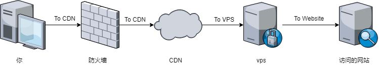网络流量传递

这样的话，防火墙就只知道你和 CDN 之间建立了连接，不知道你的 vps 实际的 IP 地址，这样就可以有效的防止你的 IP 被 ban，并且 CDN 会有很多 IP 地址，防火墙也不会随意去 ban 他们的 IP，毕竟也有很多正规的网站在使用，所以基本上可以确保你的 IP 的安全。

### 优缺点

CDN 也不是万能的，否则大家就都用这个了，其中的优劣如下：

#### 优点

- 有效防止 IP 被 ban
- 已经被 ban 的 IP 也能通过这个方式继续使用
- 对于网络很糟糕的线路可以起到加速的效果

#### 缺点

- 延迟可能会增大
- 对于原本很好的线路会起到减速的效果
- 配置比较繁琐
- 需要拥有一个域名，不过域名价格便宜，也不完全算是缺点，便宜的域名一年的费用还没有 vps 一个月的价格高。

### 适合的人群

- 担心将来 IP 被 ban
- IP 已经被 ban 但是由于各种原因不想或不能换 IP
- 经常为 ban IP 而烦恼
- 对速度要求不高只想安安稳稳的用

### CDN 速度测试

此测试为不严谨测试，只测了一次，本地带宽为电信 20Mbps 下载 + 3Mbps 上传，测试时间为 22:35，晚高峰时期，使用 CloudFlare CDN 代理洛杉矶服务器，因为 CloudFlare 给国内用户默认连接的是洛杉矶节点，所以推荐使用洛杉矶的服务器，速度影响可达到最小。

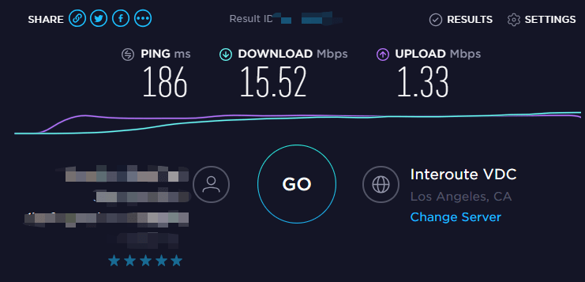晚上测速结果

2019-3-11，早上连了一个公共 WiFi 进行了测试，电信宽带。

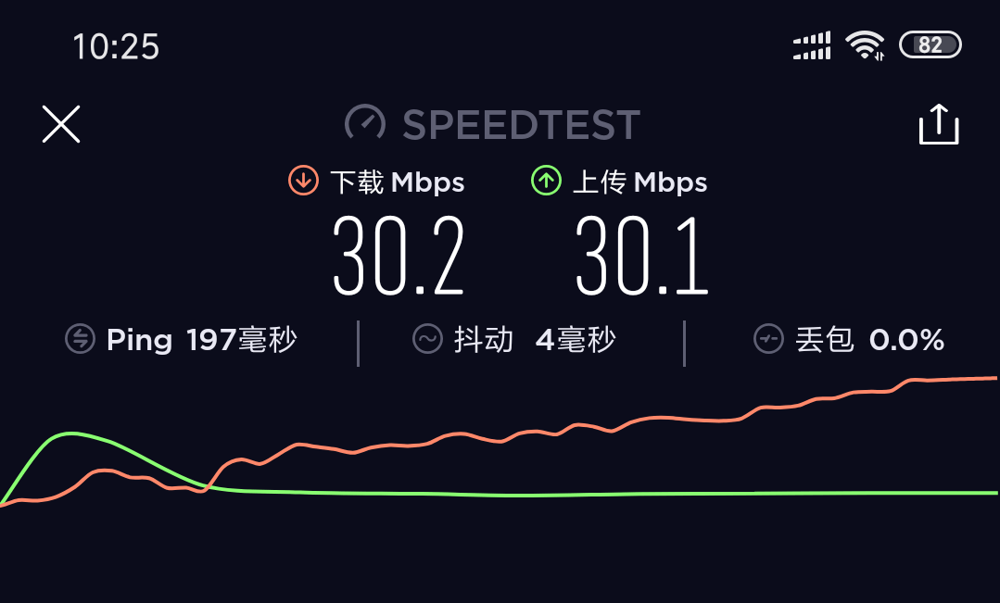早上测试结果

### 如何连接被 ban 的 VPS

既然已经被 ban 了，直接 ssh 连接是连不上的，而使用本教程必须要 ssh 登录你的 VPS，以下有几种办法，可以解决这个问题：

- 使用商家提供的网页 ssh 或 vnc 连接 VPS
- 使用一个可用的代理，通过此代理 ssh 连接 VPS
- 使用一个未被 ban 的境外服务器，ssh 登录此服务器，并在此服务器中继续使用 ssh 登录被 ban 的 VPS

第一种办法最简单，不过要是你连商家的网站都进不去的话，或者商家压根没提供这个功能，那么就不能采用这个方法了。

第二种办法需要有一个可用的代理，如果没有的话那么就需要买一个了，可以看看这篇文章：[2019 搬瓦工官方 ss，Just My Socks 购买使用教程，PayPal支付宝付款，优惠码](https://blog.sprov.xyz/2019/03/18/just-my-socks/)，以下是 [MobaXterm](https://blog.sprov.xyz/2019/02/02/mobaxterm-simple-use/) 设置代理的方式。

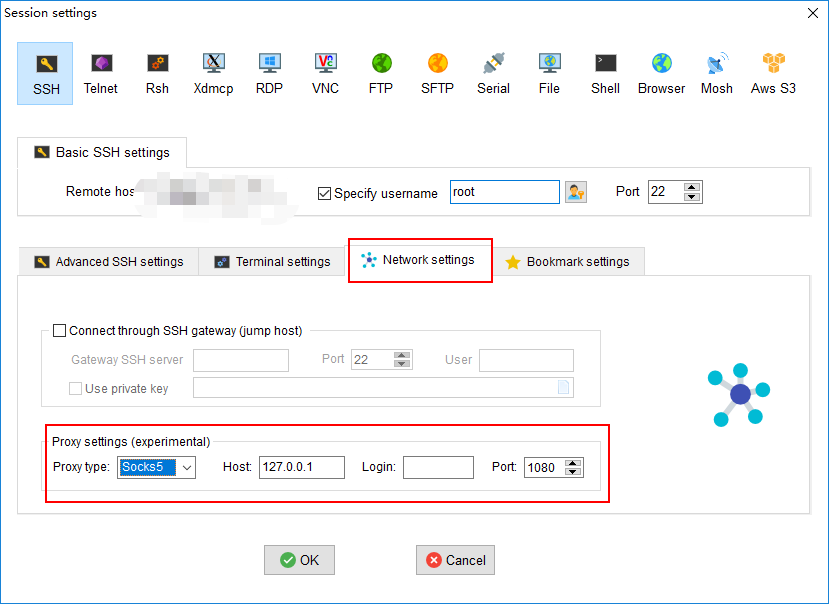MobaXterm 设置 ssh 代理

第三种办法要求更高一些，需要拥有其它的服务器，既然你拥有其它的服务器，那么这就不是什么问题了。

## 二、域名基本概念

首先说明一下域名的基本概念，你购买的域名是一个二级域名，形式类似于 **xxx.后缀**，比如 **baidu.com**、**google.com** 就是二级域名，com 是后缀。

你可以在你的二级域名基础上添加三级域名，比如 **haha.baidu.com**、**heihei.google.com**。甚至是四级或者更多级，比如 **haha.heihei.baidu.com**、**hehe.hehe.hehe.google.com**，因为二级域名已经是你的了，所以你想添加什么就添加什么。

光设置一个三级域名还不行，你得把你的域名和你的 IP 地址结合起来，这个 IP 就叫做域名的解析记录，解析记录有许多不同的类型，常用的有 A、AAAA、CNAME 等等。

- A 类型：解析到一个 IPv4 地址
- AAAA 类型：解析到一个 IPv6 地址
- CNAME 类型：解析到另一个域名，由该域名来提供 IP 地址

假设要将三级域名 haha.baidu.com 解析到 IP 地址 123.123.123.123 上，那么通常的做法是，选择添加解析记录，名称设置为 haha，类型设置为 A，解析记录填入 123.123.123.123，设置好之后 haha.baidu.com 就会解析到 123.123.123.123 了。

如果你初学不是很理解的话，没有关系，这里我只是稍微介绍一下域名，让你有个基本概念，后面我会具体说明如何操作。

## 三、域名购买

> 已经有域名的可以跳过这一步

域名服务商有很多家，国内可以选择[阿里云](https://blog.sprov.xyz/go/aliyun-domain)、[腾讯云](https://blog.sprov.xyz/go/tencent-cloud-domain)等等，国外有[godaddy](https://blog.sprov.xyz/go/godaddy-sg)等等，目前，阿里云和腾讯云有一些首年只要几块钱的域名，可以入手。

在国内服务商购买域名需要实名认证，介意者建议选择国外的域名服务商，我现在正在用的是[godaddy](https://blog.sprov.xyz/go/godaddy-sg)，godaddy是世界上最大的域名服务商，品质绝对有保障，接下来我就以godaddy为例来讲解如何购买域名。

### 在 godaddy 上购买域名

首先进去[godaddy官网](https://blog.sprov.xyz/go/godaddy-sg)，注册一个账号，注册流程自然不用说了，常规操作。

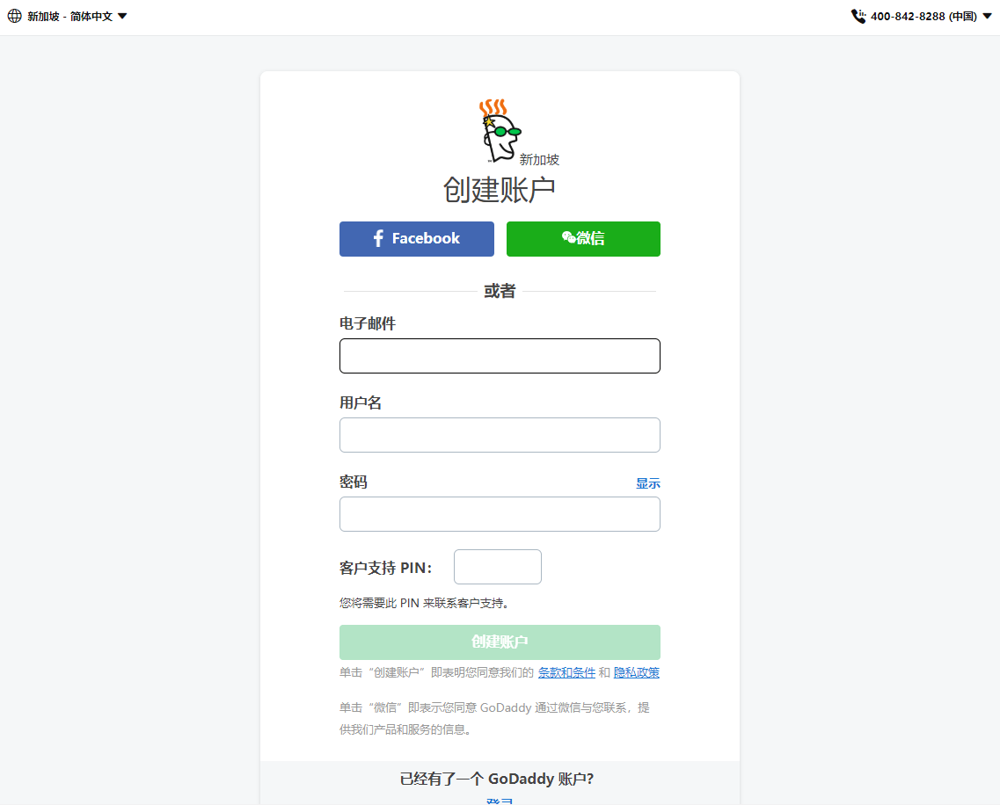注册godaddy

接下来选购域名，输入一个你容易记得住的名称，在下方选择最便宜的即可。不同的域名实际使用不会有什么不同，对域名来说重要的是名字和后缀，一个好记的域名对网站的发展很重要。不过我们并不是要搭建网站，所以选择一个你自己喜欢的就好，但是也有可能你喜欢的别人已经注册过了，那么就换个名称。

特别需要注意的是，godaddy购买首年的域名会很便宜，但是第二年开始就会恢复原价，所以建议一年到期后重新购买一个新的域名，这样又是首年购买。

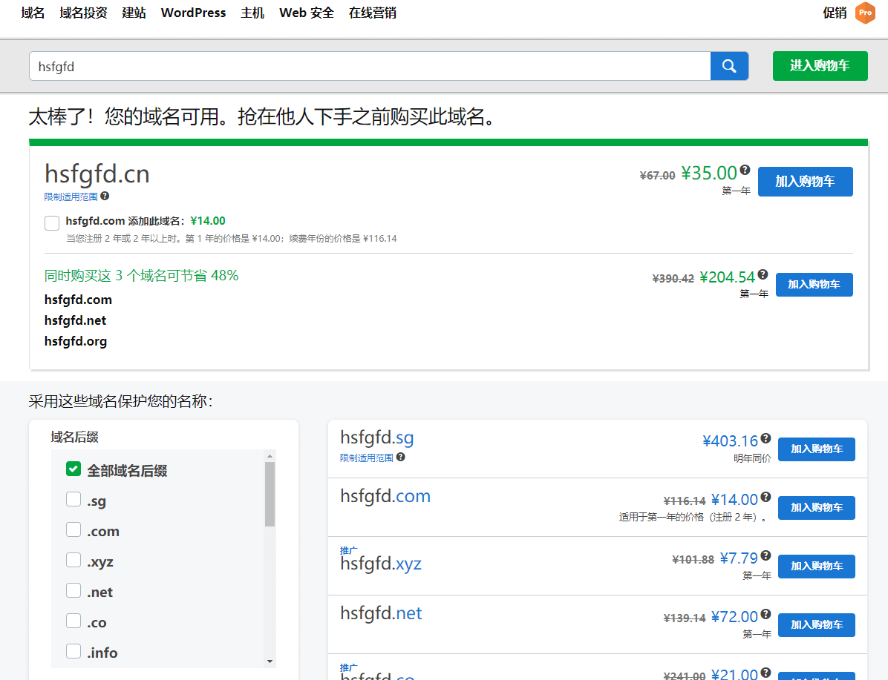选购域名

进入购物车结算，这里可以不选隐私保护，因为只是自己用，不做网站，并不会有哪个无聊的人看到你的信息然后给你发垃圾邮件，更重要的原因是因为隐私保护比较贵，当然不在乎这点钱的人随意。

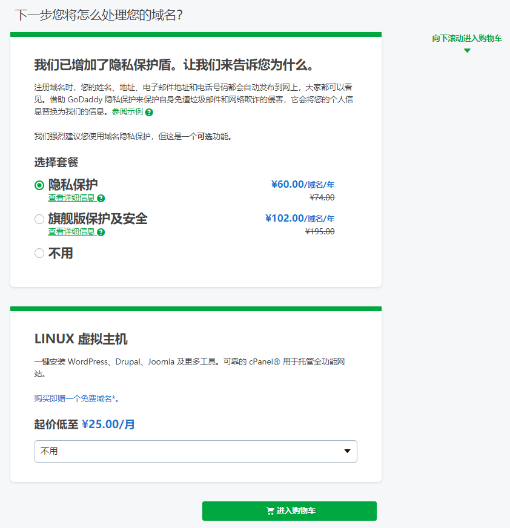

点击进入购物车，会看到结算页面，它默认会给你选择2年，两年会比较贵，选择1年就好了，土豪随意。

左边需要填上个人信息，电话号码是哪个国家就填哪个国家的信息，我这里默认是新加坡，没有改就截图了，除了电话号码，其余的可以填不真实的信息，不要太假就行。

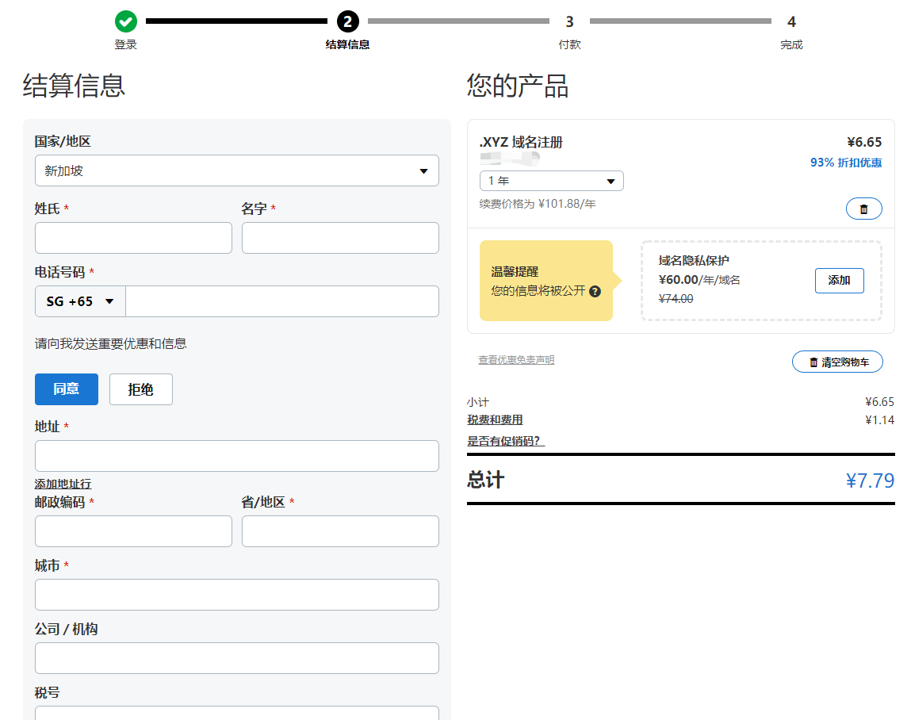域名结算

接下来就是付款了，常规操作，这里不再阐述。

## 四、使用 CloudFlare CDN

CloudFlare 是一家全球知名的 CDN 服务商，并且提供了免费的 CDN 套餐，还不限流量，所以我们完全不需要花一分钱就能使用它的 CDN 服务，接下来我就说明如何注册并使用 CloudFlare。

### 注册 CloudFlare

首先打开 [CloudFlare 官网](https://blog.sprov.xyz/go/cloudflare)，注册一个账号，注册流程很简单，只需要邮箱就行了，这里不再阐述。

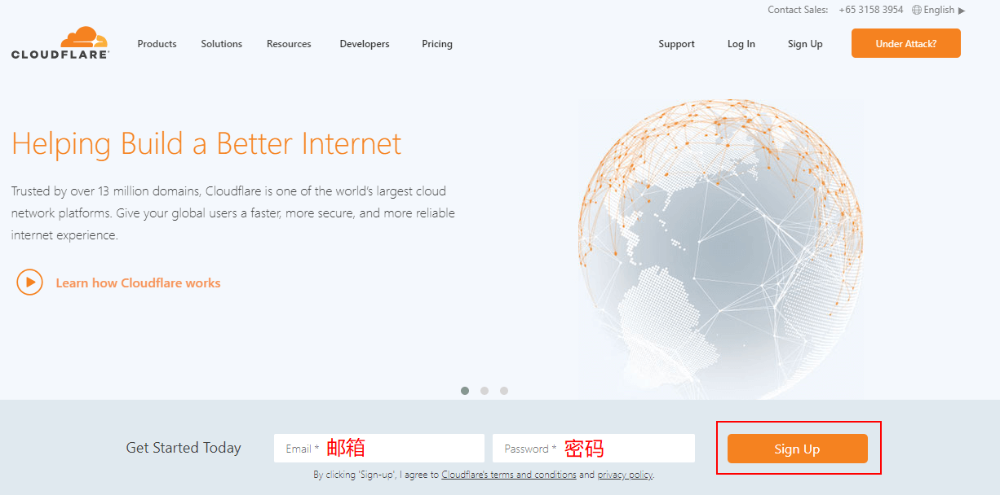注册 CloudFlare

### 使用 CloudFlare 管理域名

注册完成后登录账号，点击 Add site，这个功能的作用是将域名交给 CloudFlare 管理，这样 CloudFlare 才能给你的域名分配 CDN。

添加域名

输入你的二级域名。

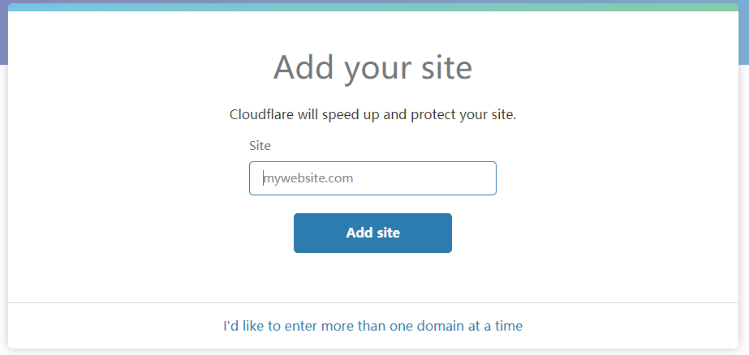输入二级域名

点下一步，选择套餐，这里我们选择 FREE 套餐。

选择套餐

下一步之后，CloudFlare 会检测你域名原先的解析记录，如果你之前有解析记录，CloudFlare 可能检测不全，这时你就需要自己手动将缺失的解析记录添加上，如果不添加的话，之前的解析记录就没了。如果没有要添加的，直接下一步即可。

> 橘色云朵代表流量通过 CloudFlare 的 CDN，灰色云朵代表不通过 CDN，点击一下云朵即可切换。

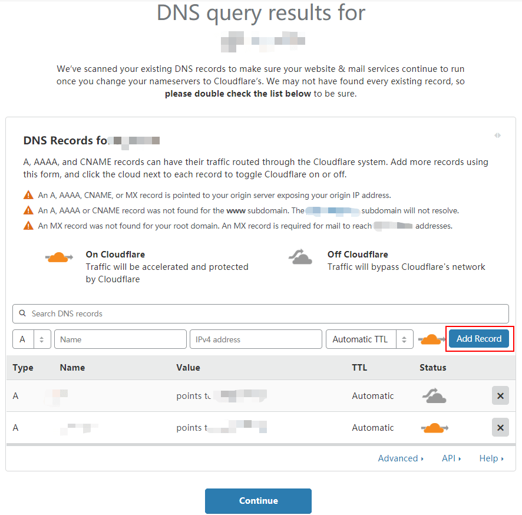检测解析记录

继续下一步，到这里会提示让你修改 Nameservers（域名服务器），并提供了两个域名服务器地址，先去你的注册域名的网站修改域名的域名服务器，下面我就以 godaddy 为例来说明如何修改域名服务器。

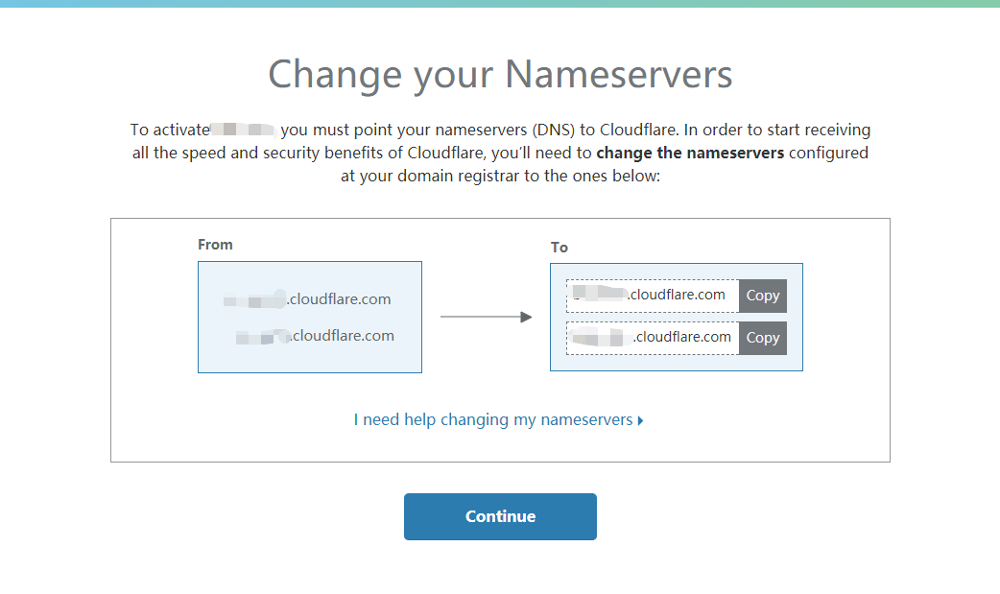域名服务器

### 修改 godaddy 域名服务器

首先登录 [godaddy](https://blog.sprov.xyz/go/godaddy)，在右上角账号的位置下拉，选择【我的产品】。

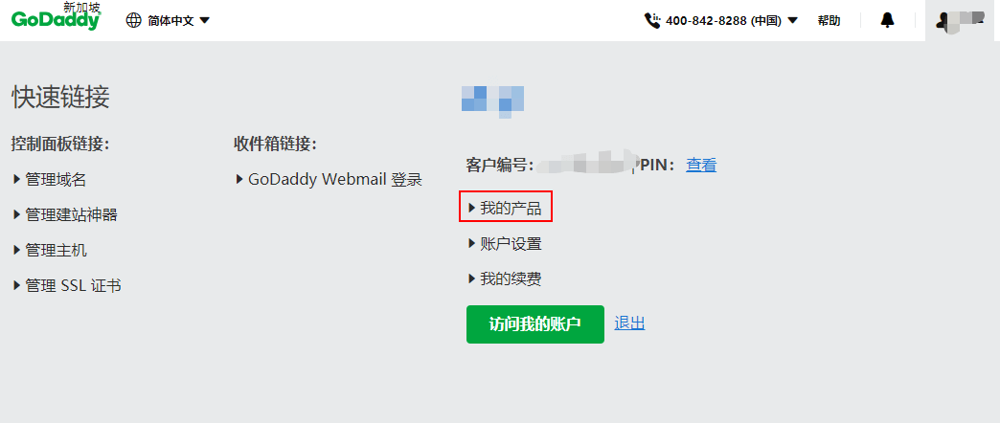我的产品

在你的域名右边点【DNS】。

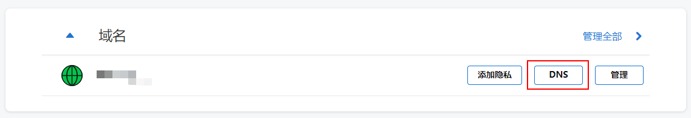进入【DNS】

在下方找到域名服务器，点击更改。

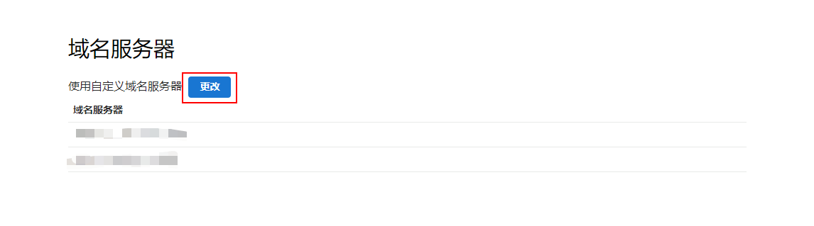更改域名服务器

选择自定义，更改为 CloudFlare 给你提供的域名服务器地址，注意不要有多余的域名服务器，不是 CloudFlare 提供的就要删除，否则可能会出问题。

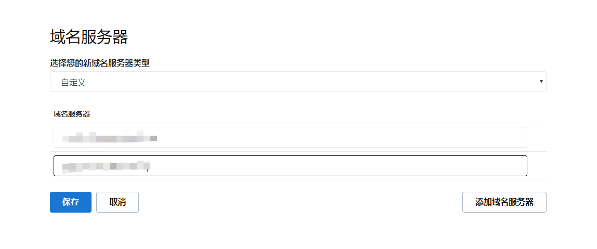更改域名服务器

其它的域名注册商怎么修改域名服务器我这里就不再细说了，具体可以去百度百度，都很简单。

修改完域名服务器后回到 CloudFlare 网页上来，点击 continue，此时 CloudFlare 可能会提示你还没有修改域名服务器，不要担心，修改域名服务器需要一定的时间才能生效，等一等就好了，一般几分钟就会生效，生效之后 CloudFlare 会发邮件给你。

> 你也可以在等待的这段时间里看下面的教程把 v2ray 配置好。

### 使用 CloudFlare CDN

我们选择 【DNS】，这里就是管理域名的解析记录的地方，我这里还没有添加解析记录，下方红框可以用来添加一条解析记录，要填入的信息分别是：解析记录类型、解析名称、解析记录、TTL值。橘色云朵代表该解析记录使用 CDN，灰色云朵代表该解析记录不使用 CDN，点击云朵可以进行切换。

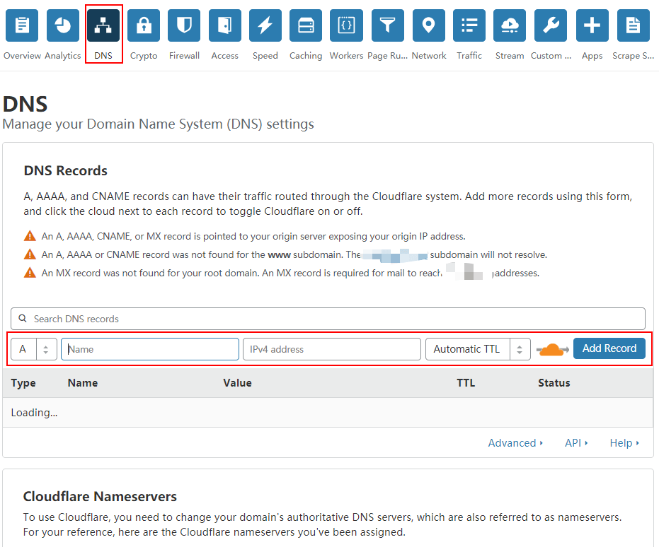DNS管理

我们先添加一条解析记录，类型选择 A，名称填入 www，再填上你的 vps 的 IP 地址，TTL 默认选择 Automatic，橘色云朵，填好之后点击 Add Record，这样，一条解析记录就添加完成了。

> 名称也可以填入其它的值，比如填 @ 就代表直接解析二级域名

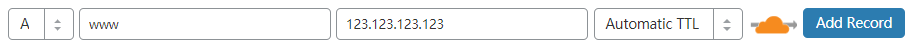添加解析记录

假设你的域名为 haha.xyz，这条解析记录的意思就是：将 www.haha.xyz 解析到 IP 地址 123.123.123.123 上。因为开启了橘色云朵，所以实际上的解析记录是 CloudFlare 提供的 CDN 节点的 IP，并由 CDN 节点来访问实际的 IP 地址。

添加完这条解析记录就不用管 CDN 了，接下来就是配置 v2ray。

## 五、v2ray 服务端配置

### 安装 v2ray

如果你还没安装 v2ray，推荐查看 [v2ray 安装教程](https://blog.sprov.xyz/2019/02/04/v2ray-simple-use/)进行安装，也可以使用 [v2-ui 面板](https://blog.sprov.xyz/2019/08/03/v2-ui/)，更简单方便的配置 v2ray（如果你的 VPS 的 IP 无法访问，那么必须要使用代理来访问 v2-ui 面板）。

### v2ray 手动配置

在 inbounds 里添加一个 inbound，id 部分请使用 **/usr/bin/v2ray/v2ctl uuid** 命令随机生成一个，端口必须设置为 80，请确保你的系统中没有其它软件占用 80 端口，path 可以在后面添加更长的路径，比如 **/abc/123** 等等，必须以 / 开头。

> 若不会配置 v2ray 的话，可以查看[这篇教程](https://blog.sprov.xyz/2019/02/06/v2ray-advance-1-config/)，或者使用 [v2-ui 面板](https://blog.sprov.xyz/2019/08/03/v2-ui/) 。或者也可以使用配置文件生成器：[强大的 v2ray 配置文件生成器](https://blog.sprov.xyz/2019/07/19/v2ray-config-generator/)

```shell
{
  "settings":{
    "clients":[
      {
        "id":"自行生成",
        "alterId":64
      }
    ]
  },
  "protocol":"vmess",
  "port":80,
  "streamSettings":{
    "wsSettings":{
      "path":"/",
      "headers":{}
    },
    "network":"ws"
  }
}
```

### 使用 v2-ui 面板配置

按照下图设置添加一个账号，路径可以在后面添加更长的路径，比如 /abc/123 等等，必须以 / 开头。

添加后会自动重启 v2ray 生效，要确保没有其它程序占用 80 端口，如果重启后 v2ray 状态为错误，那么很有可能是 80 端口被占用了，请自行百度解决一下。

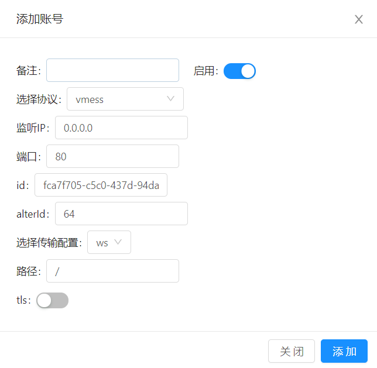添加账号

## 六、客户端使用

### 客户端下载

- v2rayW（Windows）： [Github](https://github.com/Cenmrev/V2RayW/releases)
- V2RayN（Windows）： [Github](https://github.com/2dust/v2rayN/releases)
- v2rayX（macOS）： [Github](https://github.com/Cenmrev/V2RayX/releases)
- V2RayU（macOS）： [Github](https://github.com/yanue/V2rayU/releases)
- Shadowrocket（iOS）： [itunes](https://itunes.apple.com/us/app/shadowrocket/id932747118?mt=8)
- i2Ray（iOS）： [itunes](https://itunes.apple.com/us/app/i2ray/id1445270056?mt=8)
- Quantumult（iOS）： [itunes](https://itunes.apple.com/us/app/quantumult/id1252015438?mt=8)
- BifrostV（Android）： [Play商店](https://play.google.com/store/apps/details?id=com.github.dawndiy.bifrostv) | [ApkPure](https://apkpure.com/bifrostv/com.github.dawndiy.bifrostv)
- V2RayNG（Android）： [Play商店](https://play.google.com/store/apps/details?id=com.v2ray.ang) | [Github](https://github.com/2dust/v2rayNG/releases)

### 客户端配置

众多的客户端我就不一一演示了，基本上大同小异，这里就以 Windows 客户端 v2rayN 来说明一下配置要点：

- 地址一定要填域名，并且这个域名要解析到 v2ray 服务器的 IP，开启橘色云朵
- 传输协议选择 ws，有些客户端叫做 WebSocket，是一样的
- 路径一定要和服务端的一模一样，错了就连不上
- 其余的都是常规配置，这里不再说明

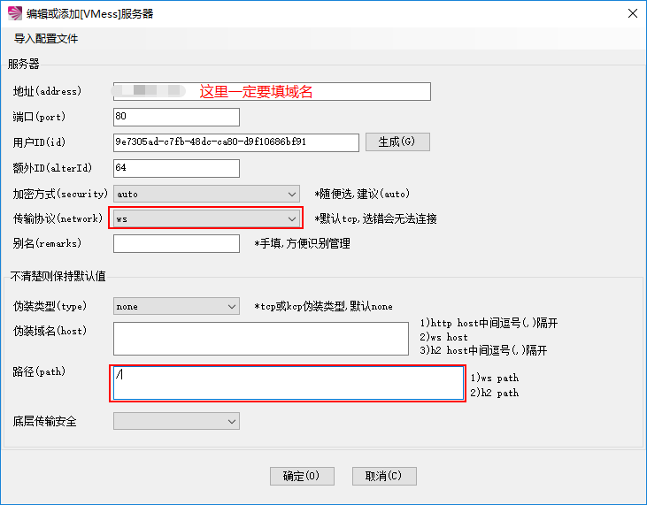配置填写

## 七、总结

以上就是使用 CDN + v2ray 的代理方式的全部教程了，内容比较多，对于新手来说可能会比较复杂，如果你遇到了难以解决的问题，可以在评论区留言，我会尽量给出解决方案，祝你搭建成功。