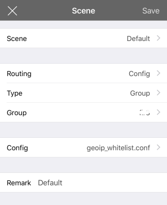
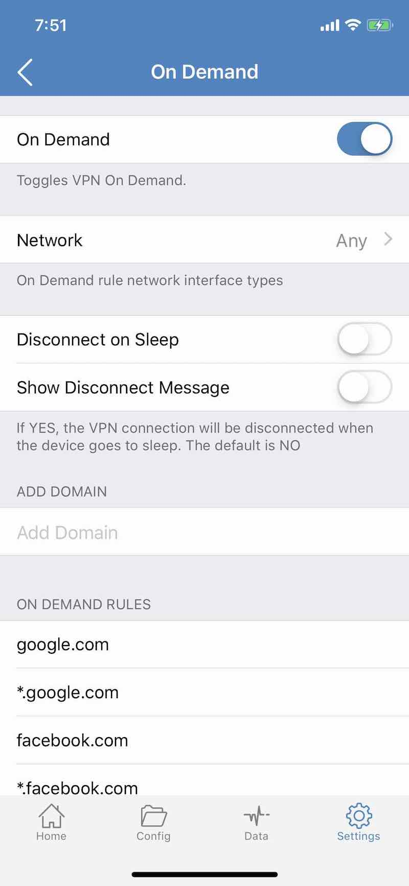
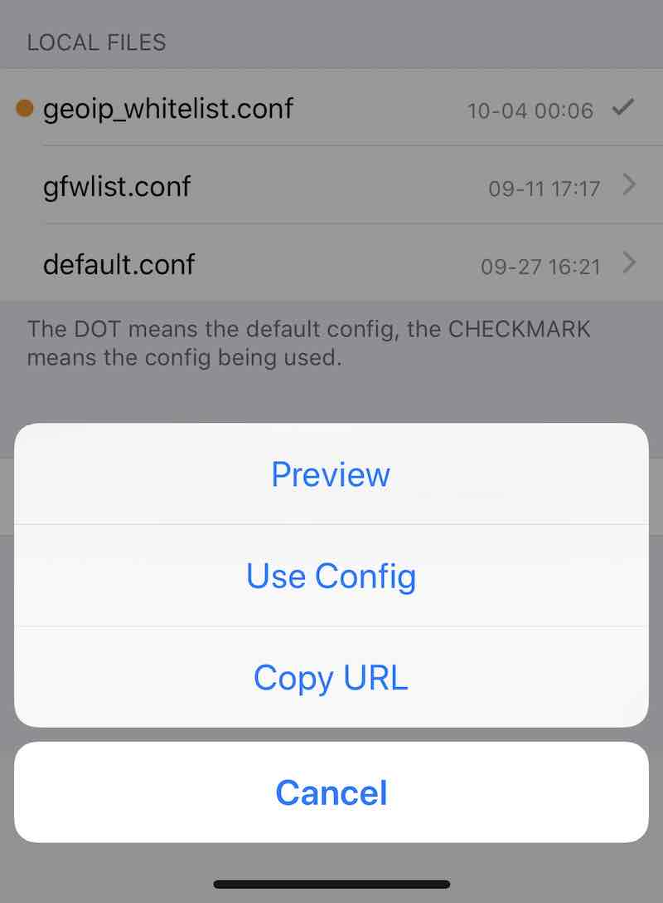

# 小火箭高级配置

一键更新配置文件

使用小火箭很久了，很多朋友都说，小火箭 **Shadowrocket** 不稳定，老自己掉后台，这次我就来说说我是怎么使用它的。

以前 iOS 不支持这类 VPN 应用，每次在 iOS 上翻墙，都是一件让人煞费苦心的事情。后来 Surge 出现了……我第一时间就买了，当然，再后来中区下架 Surge，我也彻底换了美区的 Apple ID，就没有再买另外一份 Surge，转而买了相对便宜的 Shadowrocket （俗称**小火箭**，其实中区我也买了的，不过也下架了不是？）。

总之，要想让小火箭用的好，是需要一番配置的，它是专门用来翻墙的，所以在功能上更偏向这边，相对与 **Surge**，Shadowrocket 也能支持更多协议。

## 修改测速模式

在 Shadowrocket 的 Setting 里，你可以设置它的 Ping Method，可选 ICMP 和 TCP，我们选择后者，这样测速出来的结果更贴近实际效果而不仅仅是检测服务器是否在线可达。（当然代价是测速需要的时间更长了一点点，如果你添加的服务器比较多，那可能就需要多等一小会才能全部出结果。）

## 添加自动测速

Surge 有个很不错的功能就是能够给多个线路定期自动测速并切换到最快的线路上，这样可以避免在服务器挂了后我们还得手动跑去测速并切换另一条线路。其实 Shadowrocket 也是有的，在 Home 页面，Global Routing 功能里即可发现。

](https://www.logcg.com/archives/3109.html/img_2857)设置 Shadowrocket 自动测速并切换代理

- 首先在 Speed Test 中添加一个测速组，在组里增加几条平时测速比较快的线路，然后开启测速服务；
- 接下来创建一个 Scene，由于这里我们只是要进行自动测速，所以 Scene 选择 Default，Routing 选择 Config，Type 自然是选择 Group，然后在下方的 Config 选择你正在使用的配置即可，最后给 Scene 一个名字，保存并选中之；
- 最后，在 Global Routing 中，选择 Scene。

这样，你的 Shadowrocket 就能每隔 600 秒（默认配置）进行一次测速并选择最快的线路了。

## 崩溃自动重启

比起 Surge，Shadowrocket 支持一个让人意外的功能—— On Demand。这其实是 VPN 的一个有意思的功能，它可以让 iOS 系统级监听你正在请求的域名，当遇到特定的域名时，就先启动 VPN，再请求这个域名。

通过 On Demand 功能让 Shadowrocket 自动重启

我们到 Shadowrocket 的 **On Demand** 功能中，启动这个功能，并关闭 Disconnect on Sleep，Network 选 Any。

Shadowrocket 已经帮你内置了一些常用的域名通配，比如谷歌、Twitter之类的，如果有必要，你也可以自己添加一些。这样，当你在上网时，如果 Shadowrocket 后台挂了，在你点击下一个链接时，它就能再次被系统后台启动。

这样，你就再也不会遇到刷推正刷的开心，突然所有图片消失，检查了大半天，从路由器到服务器，最后发现其实是 Shadowrocket 服务自己停了的尴尬场景了。

## 随时更新的代理策略

我曾在一篇文章中写过关于白名单的事情《[是时候使用 PAC 白名单了](https://www.logcg.com/archives/1292.html)》，但奈何这个列表实在太大，根本无法被 iOS 所容纳——实际上，在新的 Surge 中即使是我的黑名单，也会被提示列表过大。

为此，我专门制作了一个根据 IP 地址判断的白名单列表……总之，这个规则在这里 [geoip_whitelist.conf](https://r0uter.github.io/ss.conf-for-surge/geoip_whitelist.conf) ，在 Shadowrocket 的 Config 页面，最底部添加 Remote Files，~~遗憾的是只能添加一个~~（*感谢网友 **僊** 提醒，见评论，点击页面右上角加号即可添加更多远程配置了*），总之，我们把这个地址添加进去，它就会自动下载了。

这个配置文件是兼容 Surge 和 Shadowrocket 的，不过 Shadowrocket 在添加后会提示你是否也要导入服务器信息，这里点取消，配置中内置的服务器信息只是一个提示内容。

> 这也是我比较喜欢 Shadowrocket 的地方，它把服务器数据和代理策略单独存放，可以很方便地修改配置和策略。

](https://www.logcg.com/archives/3109.html/img_2855)一键更新配置文件

这时你会发现这个地址被保留在了页面底部，今后你可以每隔一星期点击一次，选择 Use Config，Shadowrocket 就会自动下载并更新本地配置了。（我的配置每周自动更新一次，对于本文中的 geoip 策略来说，仅仅更新了去广告规则）

 

本文由 落格博客 原创撰写：[落格博客](https://www.logcg.com/) » [小火箭 Shadowrocket 的四个高级配置](https://www.logcg.com/archives/3109.html)

转载请保留出处和原文链接：https://www.logcg.com/archives/3109.html