# 翻墙教程

## Table of Contents

- 1. 翻墙
  - 1.1. 获取免费节点
    - [1.1.1. ShadowsocksRRShare](#orge19d202)
    - [1.1.2. 放牧的风](#org9c5021d)
    - [1.1.3. 关于节点安全](#org0898b75)
  - 1.2. SSR 客户端使用方法
    - [1.2.1. Android](#org46e563e)
    - [1.2.2. Windows](#orge61d31a)
- [2. 其他](#org7e74300)

## 1 翻墙

首先说明一些我的政治立场，我反对共产党，所以五毛、小粉红，我没办法不让你们看这个教程，但是还是对你们说一句：滚远一点！别TM翻出来爱国了！

一些翻墙注意事项写在前面：

1. 翻墙上网请一定不要使用任何国产浏览器，请使用 [Chrome](https://www.google.com/intl/zh-CN/chrome/) 或 [FireFox](https://www.mozilla.org/zh-CN/firefox/new/) 浏览器，FireFox 一定不要在 http://www.firefox.com.cn/ 下载，这是 FireFox 中国特供版。
2. 一定不要使用任何国产输入法，不管是在手机上还是电脑上。Android 可以使用 Gboard 输入法，win10/macOS/IOS 的自带输入法都很好用。
3. 请一定不要在墙外泄露自己的个人信息。
4. 如果是国产 Android 手机，特别是华为，请一定考虑清楚要不要用它来翻墙。
5. 如果有条件，有两个手机，可以将其中一个专门用于翻墙，最好不要是国产手机，如果是国产手机，会刷机更好，推荐刷一个干净的 Android 原生系统，并且不要安装任何的国产 app 。
6. 电脑翻墙，可以用虚拟机＋洋葱浏览器来翻墙。

以上 5 、6 条是针对身份敏感和动手能力强的网友的建议，一般网友请至少遵守前 4 条注意事项。

### 1.1 获取免费节点

翻墙的方式有几种，主要有 vpn 、ss 、 ssr 、 v2ray 这些，ssr 是在 ss 基础上开发的翻墙软件，想了解翻墙史的朋友可以在成功翻墙后，看一看这篇文章 [道高一尺，魔高一丈：中国人与防火长城的斗争](https://chinadigitaltimes.net/chinese/2020/01/matters｜道高一尺，魔高一丈：中国人与防火长城的斗/)。

在介绍翻墙软件之前，先来分享一下哪里能获取到免费的节点，因为我的教程是教大家使用目前主流的 SSR 翻墙，SSR 翻墙需要用到节点，每个节点对应一个代理服务器，目前很多机场都是用 SS/SSR 技术来翻墙，但是机场的节点都是要钱的，我并不是说要钱的不好，主要是我希望用最低的成本和简单的方式帮助大家翻墙，我自己就是花钱用的机场，这里我不会给机场打广告，关于这些免费节点，是我应急用的，速度不快，想白嫖看视频，体验不会很好，也不稳定，所以大家可以再翻墙之后，可以尝试去找其他稳定的梯子，当然如果只是随便看看网页，上一下 TG ，体验一下在墙外的感觉，免费的节点也够用了。重度用户还是建议花钱买更好的服务。

#### 1.1.1 ShadowsocksRRShare

[ShadowsocksRRShare](https://github.com/ruanfei/ShadowsocksRRShare)是 GitHub 上的一个节点分享项目，资源搬运于 tg 频道 [ssrList](https://t.me/ssrList) 、 [ssList](https://t.me/ssList) 、[V2List](https://t.me/V2List) 。 还提供各个平台的 ss/ssr/v2ray 客户端下载。

有些地区 GitHub 被墙，如新疆，可以跳过这一段，本教程会提供 SSR 软件和今天（2020-2-22）收集到的节点，直接看 [SSR 客户端使用方法](#org6297cd3)，如果时间久，节点都失效，则从[放牧的风](#org9c5021d)开始看。 由于 GFW 会精准的墙掉一些 GitHub 上的项目，比如著名的 [zhao](https://github.com/programthink/zhao) ，墙内就是访问不了的， 如果其他地区也不能打开这个项目了，也从[放牧的风](#org9c5021d)开始看。

进入 [ShadowsocksRRShare](https://github.com/ruanfei/ShadowsocksRRShare) ，可以看到如下图所示，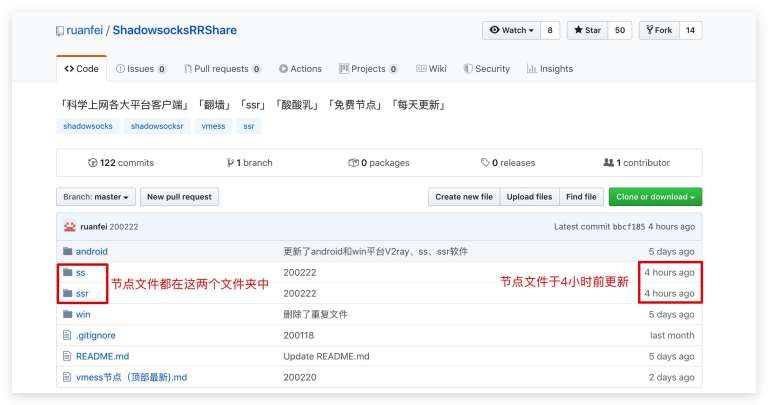我们进入 ssr 文件夹，可以看到历史节点文件，翻到最下面找到最近更新的节点文件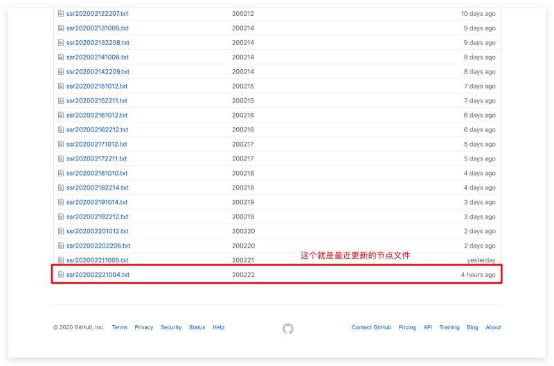点开这个节点文件，复制其中的内容，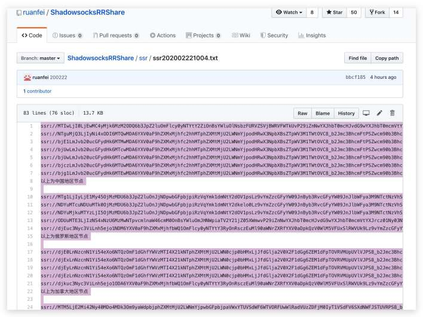新建一个 txt 文件，保存这些节点，我们就获得了这些节点，接下来可以直接跳到这里 [SSR 客户端使用方法](#org6297cd3) 。

#### 1.1.2 放牧的风

[youneed.win](https://www.youneed.win/free-ssr) 这个网站有提供 ss/ssr/v2ray 的免费节点，不过网站被屏蔽了，屏蔽方式是域名DNS污染，不能直接访问，需要修改 host 文件，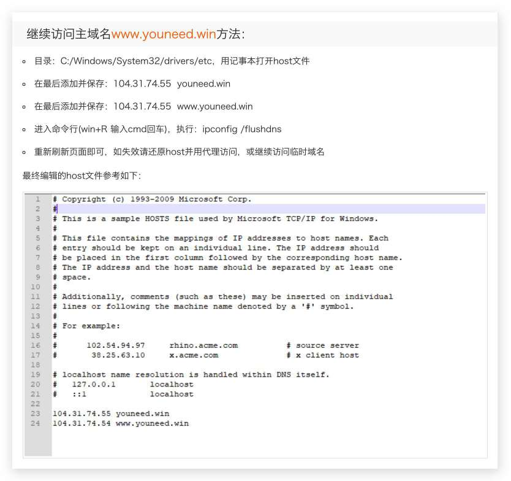

- 继续访问主域名www.youneed.win方法：
  1. 目录：C:/Windows/System32/drivers/etc，用记事本打开host文件
  2. 在最后添加并保存：104.31.74.55 youneed.win
  3. 在最后添加并保存：104.31.74.55 www.youneed.win
  4. 进入命令行(win+R 输入cmd回车)，执行：ipconfig /flushdns
  5. 重新刷新页面即可，如失效请还原host并用代理访问，或继续访问临时域名

以上是站长给出的解决方案。

网站上去之后，下图红框中的部分，就是网站提供的免费节点了。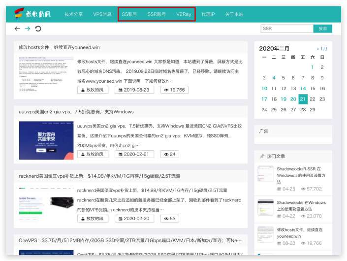

这里我们点击 SSR 帐号进入 SSR 节点的分享页面，进入后会让你输入验证码，输入后就可以看到节点了，如下图就是部分节点信息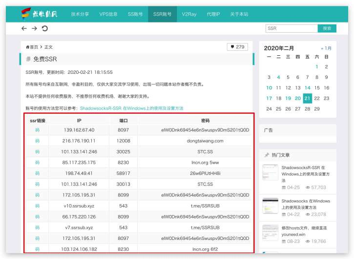

那么如何获取这些节点呢，需要按照以下步骤操作：

手动或者使用快捷键F12 打开浏览器开发者工具，切换到控制台(Console)，执行图中第五步的代码。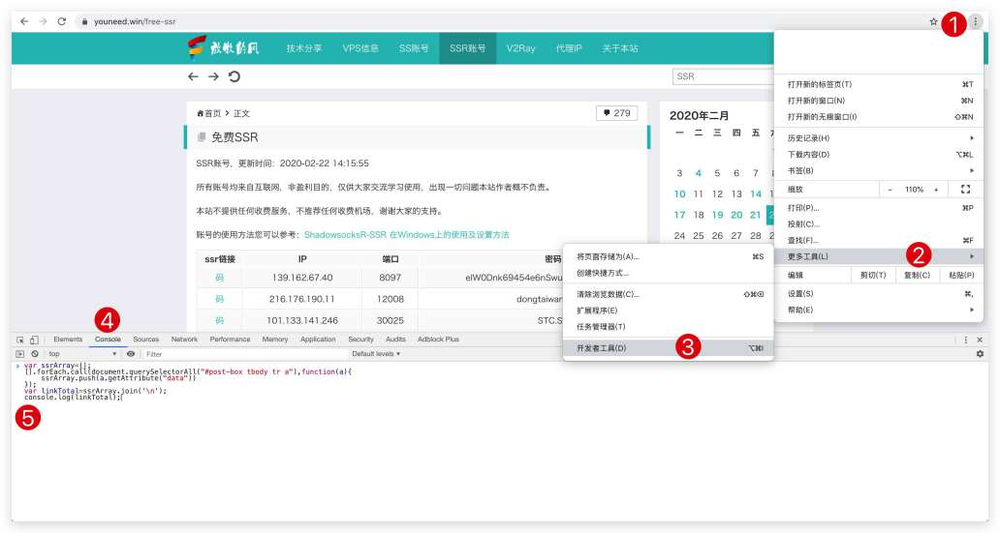代码如下（注意是在 SSR账号页面下执行，不是 SS 账号，也不是 V2Ray）：

```
var ssrArray=[];
[].forEach.call(document.querySelectorAll("#post-box tbody tr a"),function(a){
    ssrArray.push(a.getAttribute("data"))
});
var linkTotal=ssrArray.join('n');
console.log(linkTotal);
```

执行后，鼠标点击如图中的 copy 按钮，复制所有节点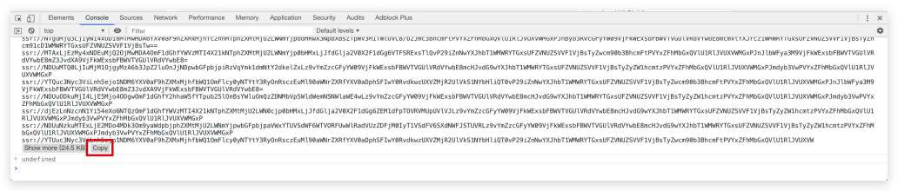然后新建一个文件保存这些节点，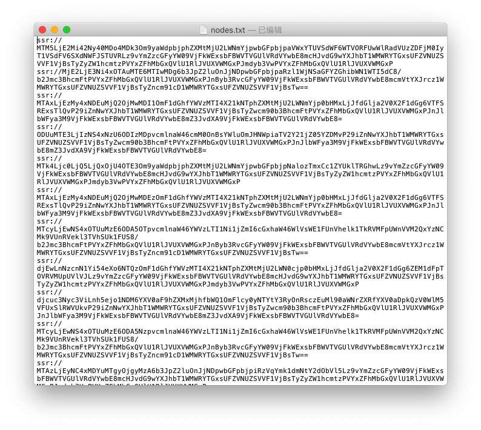

到这就算获得了这些节点，可能会有人觉的这部份有点复杂，但是这是必要的操作，不然到客户端设置的时候，需要你一个个的手写参数，那就更麻烦。

当然还有更方便的方法获取这些节点，使用 [Tampermonkey](https://chrome.google.com/webstore/detail/tampermonkey/dhdgffkkebhmkfjojejmpbldmpobfkfo?hl=zh-CN) 插件，安装 [这个](https://greasyfork.org/sr/scripts/385723-放牧的风免费ssr获取所有链接) 脚本，刷新页面，然后在 SSR 账号页面右下角就会直接有一个 copy 按钮，不过考虑的到下载 chrome 插件需要翻墙，所以实际操作起来可能会更麻烦，翻墙后，可以尝试我上面提到的方法。

软件使用方法中会介绍如何使用这些节点。

#### 1.1.3 关于节点安全

这里声明一下，我并不能保证这些节点都是安全的，我不认识站长，我也不知道那些节点是从哪找来的，包括我自己花钱的机场，我也不能保证机场绝对不是钓鱼机场，不管你花钱还是用免费的，大家都是有一定风险的，所以如果你决定要翻墙出来，那么请一定要保护好自己的个人信息。

### 1.2 SSR 客户端使用方法

我主要写 windows 和 Android 的 SSR 如何使用，IOS 比较麻烦，需要用美服账户购买 Shadowrocket ，我这里没有条件操作，就不讲了， 至于 macOS/Linux 用户，翻墙都是基本操作，我这里也就不多说什么了。

本教程会提供 Android 和 win 的 SSR 客户端和节点文件，给上不去 GitHub 的朋友使用，SSR 客户端在 app 文件夹下，Android 的 apk 文件，直接安装即可，win 的是一个压缩包，解压后直接使用，无需安装。

也提供项目源地址供大家亲自下载：

- win : [shadowsocksr-csharp](https://github.com/shadowsocksrr/shadowsocksr-csharp/releases)
- Android : [shadowsocksr-android](https://github.com/shadowsocksrr/shadowsocksr-android/releases)

节点文件在 nodes 文件夹下， **节点文件时效性很强，也许明天就用不了了** ，所以，如果这些节点都用不了 , 需要跟着 [1.1](#orgf778ca0) 进行操作。

#### 1.2.1 Android

Android 的 SSR 客户端非常多，这里我是用 [SSRR](https://github.com/shadowsocksrr/shadowsocksr-android/releases/download/3.5.4/shadowsocksr-android-3.5.4.apk) 来举例。

首先我们需要把之前的节点文件发送到手机上，如果有其他办法，不要用 QQ 或者微信之类的国产 app 来接收/发送这些文件，可以连接数据线传输，如果非要用 QQ 或微信来接收/发送节点文件，可以压缩加密后再发送到 QQ 。

接收到文件后，打开文件，全选，复制文件的所有内容。

打开 SSRR ，点击顶部的 shadowsocksr R ，进入配置文件，点击右下角的 ＋ 按钮，再点击 `从剪切版导入` 按钮，没问题的话，到这就成功导入节点到 SSRR 了，然后就是测速，筛选掉不能用的节点，选择可用的节点，启用节点，然后就可以翻墙了。

本教程不会讲关于 SSRR 的高级设置选项，如路由、分应用代理等设置，这会增加教程的复杂度，所以使用的是 SSRR 默认的全局路由，如果有人想对 SSRR 的设置选项有更深入的了解，可以过墙后，自行搜索学习。

#### 1.2.2 Windows

Win 的 SSR 客户端也非常多，这里我用到的是 [shadowsocksr-csharp](https://github.com/shadowsocksrr/shadowsocksr-csharp/releases)

首先解压 shadowsocksr-csharp 的压缩包，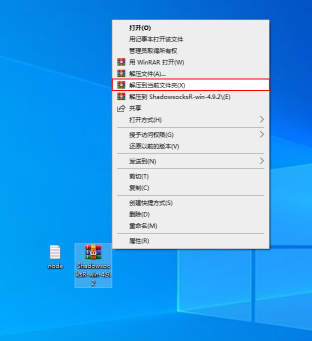接下来启动 shadowsocksr ，全选复制节点文件中的内容，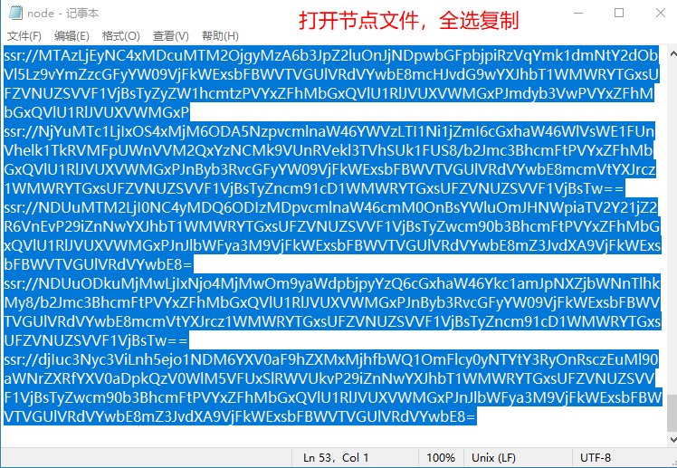右键小飞机，从剪切版批量导入节点，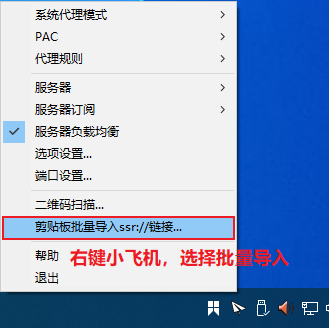选择可用的节点，需要亲自尝试，打不开 google 就换一个节点最后，成功打开 google ，翻墙成功。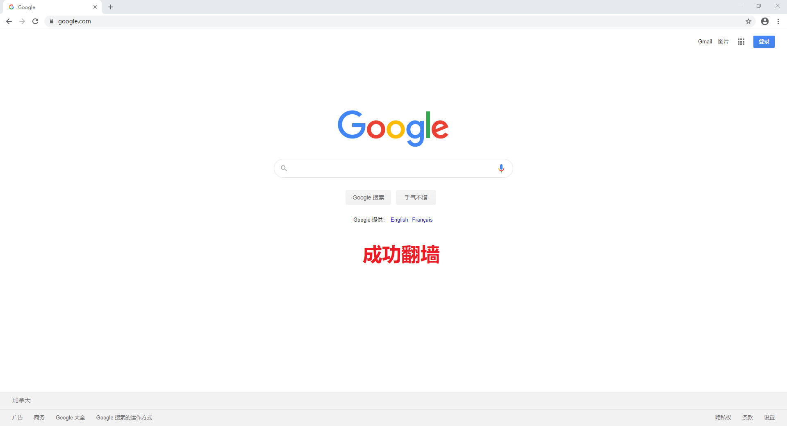值得注意的是，如果 shadowsocksr 异常退出，可能会导致浏览器上不了网，所以不用翻墙时，请右键小飞机，手动退出 shadowsocksr 。

如果已经上不了网了，请打开 Internet 属性，查看图中标 4 的位置，查看代理服务器是否被打 ✅️ ，如果打 ✅️ ，请把这个 ✅️ 去掉， 如果没有勾选，那么应该是其他原因导致不能上网，请自行搜索解决。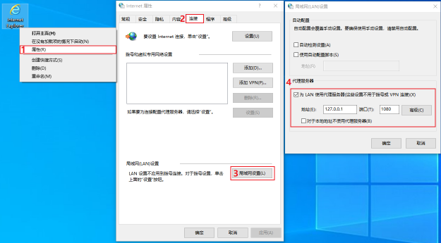

同样，这里我也不会介绍 shadowsocksrr-csharp 的高级设置选项，如果想了解高级设置，这里我分享一篇文章，翻墙后可以浏览 [ShadowSocksR(SSR)功能详细介绍及使用教程](https://www.quchao.net/ShadowsocksR.html)

## 2 其他

如果你想将此教程分享给其他墙内网友进行翻墙，那么请根据 [获取免费节点](#orgf778ca0) 将 nodes 文件夹内的节点文件替换成当天最新的，或者你有自己的节点，并且愿意分享出去，也将自己的节点文件放在 nodes 文件夹内，有了最新的节点文件，就可以直接从 [SSR 客户端使用方法](#org6297cd3) 开始操作了。