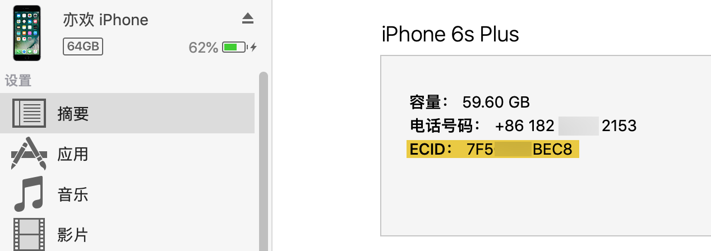
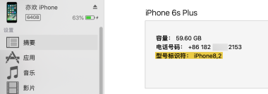
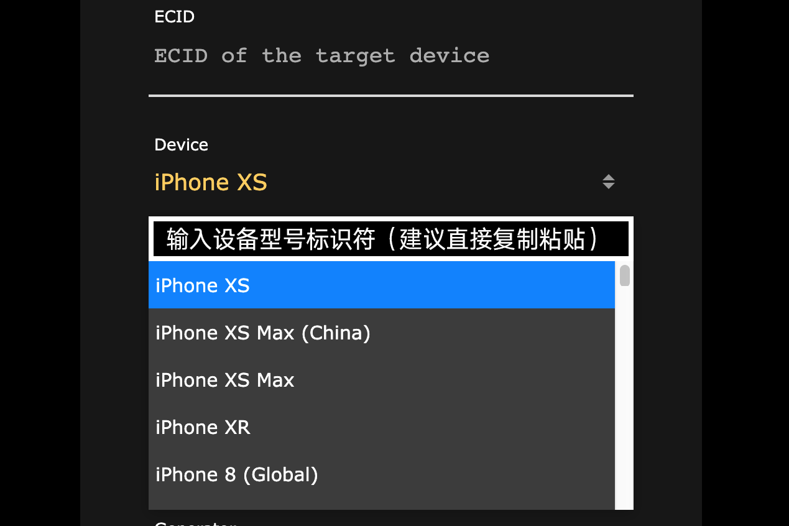
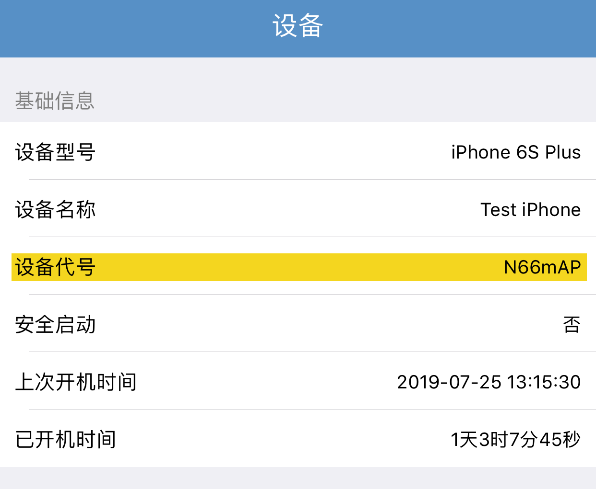
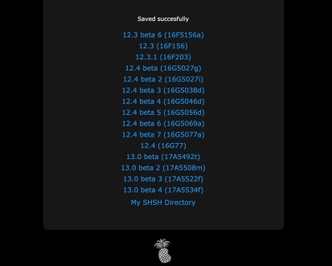
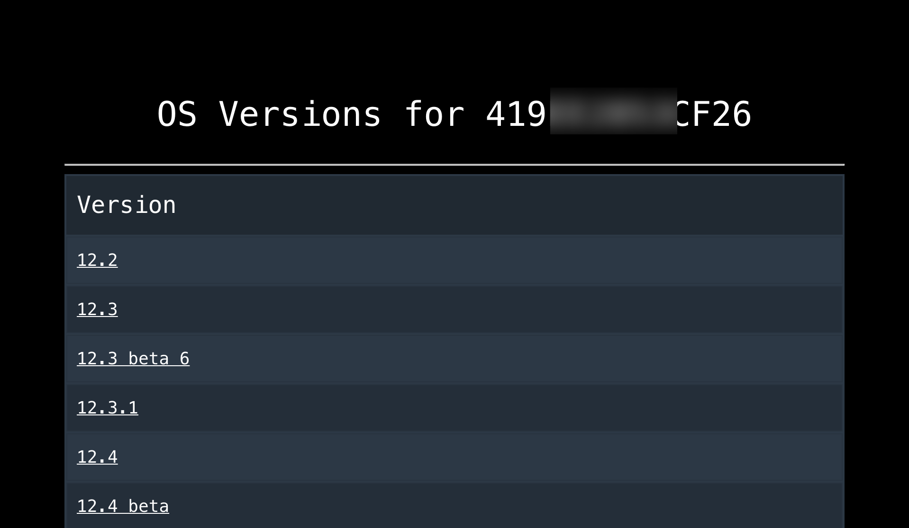
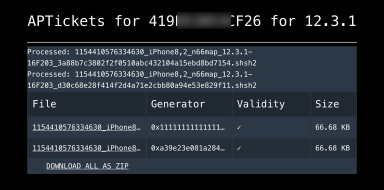
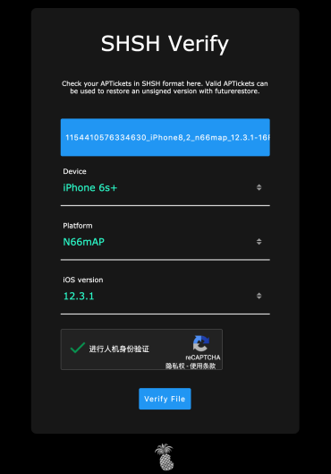
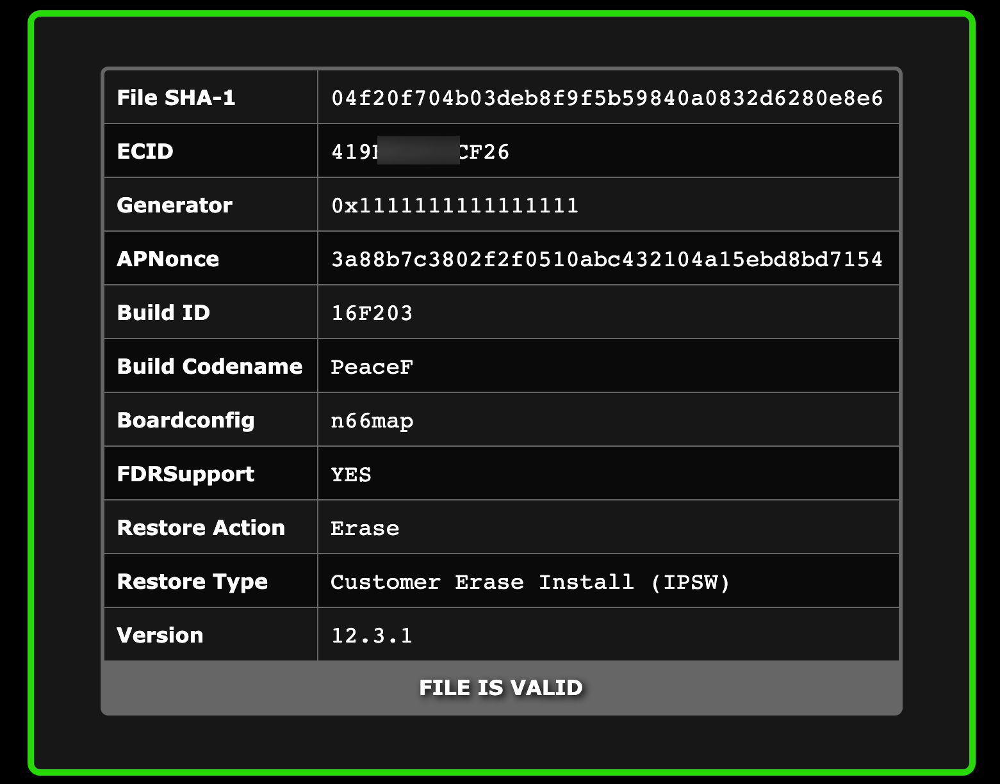
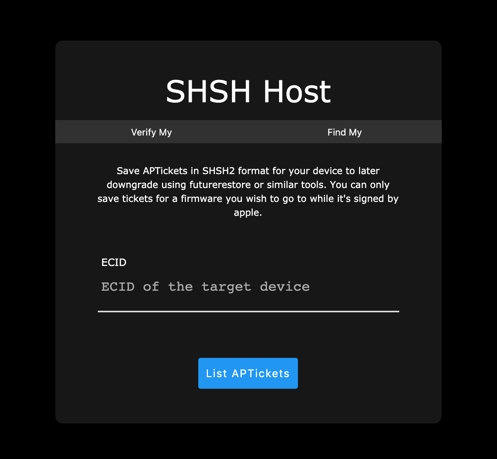

# [新版 SHSH2 备份网站，支持 A12 以上设备](https://twjacy.top/post/shsh-host/)

## 前言

之前都是使用 [tsssave 网页版](https://tsssaver.1conan.com/) 进行备份 SHSH2，但是 tsssave 一直无法保持 A12 以上设备的 SHSH2，虽然已经错过 iOS 12.2 有希望越狱的系统版本，但是谁知道 iOS 12.3 或者更高系统版本不能越狱呢？所以养成备份 SHSH2 的好习惯，说不定哪一天就派上用场了。

## 注意

目前仅能备份的 SHSH2 版本为当前开启 iOS 认证版本；

仅支持 64 位设备；

任何浏览器即可完成备份；

## 备份 SHSH2

### 步骤 1

将设备连接电脑，打开 iTunes 选择设备摘要，点击「电话号码」下方的信息，可切换查看「ECID」码以及「型号标识符」，将两个信息拷贝到文本文档，方便使用。

### 步骤 2

打开 [SHSH Host](https://shsh.host/) 网站

### 步骤 3

- **ECID**：可以使用 iTunes 、iMazing 或者爱思助手查询 ECID（建议直接复制粘贴）。
- **Device**：直接选择自己设备的机型，有些设备会分为 GSM、Global 、China 不知道怎么选？如果不知道请复制粘贴 iTunes 查到的设备型号标识符，会自动选择正确的设备型号。

- **Platform**：未出现该选项，说明设备 CPU 只有一家生产厂商。出现该选项，说明设备 CPU 非一家生产厂商，比如 iPhone 8/8 Plus/6s/6s+/SE 系列分为两种，如何查看设备代号，可以借助 [CPU Detector](https://apps.apple.com/cn/app/cpu-detector/id1357917957) 进行查看。

- **iOS version**：建议选择 All Signed，会一键备份正在开放认证的 iOS 正式版和测试版的 SHSH2。

- **APNonce (optional)、Generator (optional)**：自定义 APNonce、Generator 备份 SHSH2，除非知道需要使用 APNonce 备份，若不需要自定义 Generator 值建议维持空白选项。

  > 根据 xybp888 的 [A12以上设备正确备份SHSH2文件工具及教程](https://bbs.feng.com/forum.php?mod=viewthread&tid=12385734&fromuid=8133602) ，A12 及以上设备保存正确 SHSH2 需填入对应的 APNonce、Generator 信息。
  >
  > 非 A12 设备，APNonce 留空，Generator 值建议设置为 0x1111111111111111，方便以后固定。
  >
  > **第一步: 必须在越狱状态固定好G值(重要指数:★★★★★)**
  > **固定这个值,有很多办法,请大家自行搜索,可以直接在越狱工具里进行**
  > **第二步: 手机连接电脑,打开cmd->cd 运行至 工具包目录**
  > **输入:****noncestatistics -t 5 (-t = 测试 / 5=次数);**
  > **此步骤是校验固定的G值是否成功**
  > (注意: 敲回车运行命令后 会重启进入恢复模式 5 次,每次进入都会显示ApNonce=xxxxxxxxx) 这样的十六进制的值
  > 请记住ApNonce=XXXXXXXXXX一长串的值,这个才是真正刷机用到值,(后面必须用这个值进行备份SHSH2的)
  > 完成后运行如下
  >
  > ------
  >
  > > Version: da76d8296f7691e1512baf7b89991c1f76104aac - 44
  > > Identified device as d331pap, iPhone11,6 in normal mode... Trying to get in recovery...
  > > INFO: device serial number is XXXXXXXXX
  > > No ECID was specified. Checking if any device is connected.
  > > Getting ApNonce statistics for device with ECID: xxxxxxxx
  > > 000001 ApNonce=06521ff566bf005f306db31ec3bc6244845116c7eada622d6676a9dc7e0fb374
  > > 000002 ApNonce=06521ff566bf005f306db31ec3bc6244845116c7eada622d6676a9dc7e0fb374
  > > 000003 ApNonce=06521ff566bf005f306db31ec3bc6244845116c7eada622d6676a9dc7e0fb374
  > > 000004 ApNonce=06521ff566bf005f306db31ec3bc6244845116c7eada622d6676a9dc7e0fb374
  > > 000005 ApNonce=06521ff566bf005f306db31ec3bc6244845116c7eada622d6676a9dc7e0fb374
  > > Waiting for device to reboot...
  > > Resetting auto-boot...
  > > Done
  >
  > ------
  >
  > 如果ApNonce 获取到值完全一致,说明固定的G值成功
  > (因为我固定的是0x8888888888888888)
  > A12设备在此注意, 请不要直接使用G值备份SHSH2 ,因为这样获取到的是不一致的
  > 所以 你需要
  > 拷贝ApNonce=06521ff566bf005f306db31ec3bc6244845116c7eada622d6676a9dc7e0fb374
  > 06521ff566bf005f306db31ec3bc6244845116c7eada622d6676a9dc7e0fb374 这段代码进行备份
  >
  >
  > **第三步: 运行命令**
  > TssChecker 命令如下:
  > tsschecker -d iPhone11,6 -i 12.3 -e 你设备的ECID -s --apnonce 获取到真实的值ApNonce
  >
  > 你也可以将真实的值ApNonce拷贝 直接在国外的网页上备份也是可以的
  >
  > ------
  >
  > 
  >
  > A12设备比较特殊
  > 如果我固定G值是0x8888888888888888 常规来说ApNonce应该是:758322f52f4689bc3c41aa106ee2108459fcecd83418b217380433a0de4b6ed5
  > 但是在A12设备下就会进行混淆了就变成了: 06521ff566bf005f306db31ec3bc6244845116c7eada622d6676a9dc7e0fb374
  > 这才是真实的刷机使用的!
  > 所以你备份的时候务必确认你获取的是真实的ApNonce
  >
  > 建议都使用0x8888888888888888 对应A12在我的设备正确的应该是 06521ff566bf005f306db31ec3bc6244845116c7eada622d6676a9dc7e0fb374
  > 也许不一样,请根据自己获取到的真实ApNonce 进行备份
  >
  > 
  >
  > ------
  >
  > 下面是我实测备份的命令,成功后会在当前目录生成备份的shsh2文件
  > tsschecker.exe -d iPhone11,6 -i 12.3 -e 7349243969798202 -s --apnonce 06521ff566bf005f306db31ec3bc6244845116c7eada622d6676a9dc7e0fb374
  > tsschecker.exe -d iPhone11,6 -i 12.3.1 -e 7349243969798202 -s --apnonce 06521ff566bf005f306db31ec3bc6244845116c7eada622d6676a9dc7e0fb374
  >
  >
  > 上面命令都是我设备的信息,你们运行的时候一定要用自己的设备信息替换 具体格式上方已经提示过了
  >
  > 接下来,就是下载附件[A12备份SHSH2工具及验证.zip](https://feng-bbs-att-1255531212.file.myqcloud.com/2019/07/17/15158431_A12备份SHSH2工具及验证.zip),开始操作备份吧

- 全部输入后，点击「**Request APTicket**」即可立即备份。

### 步骤 4

最下面会显示已经备份好 SHSH2 的 iOS 版本，点击 iOS 版本号即可直接下载对应版本号 SHSH2 文件，该网站同时提供云储存，点击「My SHSH Directory」即可进入个人设备的 SHSH2 储存页面。

可以看到原来备份过的 SHSH2

点击对应 iOS 版本号查看当前保存的 SHSH2 是否有效，Validity 显示有效状态。同时可以查看 Generator 值，透过越狱工具或特定的工具固定，并且搭配 SHSH2 文件，使用 FutureRestore 对设备进行升级或重刷已关闭认证的系统版本。

## 验证 SHSH2 是否有效

切换至「Verify My」页面，选择设备型号（Device）与 iOS 版本（iOS version），iPhone 8/8 Plus/6s/6s+/SE 系列需选择对应的设备代号（Platform），点击「Select your APTickets」加载 SHSH2 文件，再点击「Verify File」进行查询。

验证后若显示「**FILE IS VALD**」表示该 SHSH2 有效。

## 查询已保存 SHSH2

切换至「Find My」页面，输入设备 ECID 码，点击「List APTickets」选项即可跳转至 SHSH2 云储存清单。

